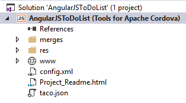

<properties
   pageTitle="Create Your First App Using Visual Studio Tools for Apache Cordova | Cordova"
   description="description"
   services="na"
   documentationCenter=""
   authors="Mikejo5000"
   tags=""/>
<tags
   ms.service="na"
   ms.devlang="javascript"
   ms.topic="article"
   ms.tgt_pltfrm="mobile-multiple"
   ms.workload="na"
   ms.date="09/10/2015"
   ms.author="mikejo"/>
# Create Your First App Using Visual Studio Tools for Apache Cordova

An app built using Visual Studio Tools for Apache Cordova uses Cordova to access native APIs by using web technologies like HTML and CSS. By reducing or eliminating the need for native code, apps work across multiple devices. Some tasks are common to most Cordova apps. These include:
* [Create a Cordova project](#Create)

* [Build and run the default “Hello” app](#BuildHello)

* [Choose a third-party JavaScript framework](#Framework)

* [Build a UI](#BuildUI)

* [Add native features](#Native) (plugins)

* [Add connected services](#Connected)

* [Add platform-specific resources](#Platform)

* [Test](debug-using-visual-studio.md), [package](./package-and-publish/package-app-built-with-visual-studio.md), and
 [publish](publish-app-built-with-visual-studio.md)

## Create a Cordova project

 Before you can create a new project, make sure that you’ve met all system requirements and installed the Visual Studio Tools for Apache Cordova extension for Visual Studio. For more information, see [Install Visual Studio Tools for Apache Cordova](install-vs-tools-apache-cordova.md).

### To create a new project

1. Open Visual Studio. On the menu bar, choose **File**, **New, Project**. 5. In the **New Project** dialog box, under **Templates**, choose **JavaScript**, **Apache Cordova Apps**, and then choose the **Blank App** template.

  **Note**
  A Blank App template for TypeScript is under **TypeScript**, **Apache Cordova** (If you intend to go through the complete ToDoList tutorial, choose JavaScript.)

12. Choose **Browse** to find a location for the project.

14. Give the app a name and then choose **OK**.

  >**Note:**
  If you intend to go through the complete tutorial, name the app AngularJSToDo.

  

17. Choose a source control option for the project, or choose **Cancel** to skip this for now. Visual Studio creates the new project and opens **Solution Explorer** in the right pane.

  

  The project structure in Visual Studio 2015 is updated to support third-party CLIs, and to match the Cordova project structure. Visual Studio 2013 uses the deprecated project structure. We recommend that you create Cordova apps using Visual Studio 2015.

  >**Caution:**
  If you are migrating a project from an earlier version of Visual Studio, see this [migration information](https://github.com/Microsoft/cordova-docs/blob/master/known-issues/known-issues-vs2015.md#known-issues—visual-studio-2015).

  The new Cordova project includes four top-level folders:

  * **merges** is used to add platform-specific code. For more information, see Configure Your App Built with Visual Studio Tools for Apache Cordova.
     * By default, the **Blank App** template includes commonly used platform-specific code for Windows and Android devices in the merges folder. (platformOverrides.js is used to specify the platform file.)

     * For Android devices, a .js file is included to provide support for the JavaScript Function.prototype.bind() function on Android 2.3 devices.

     * For Windows 8, Windows 8.1, and Windows Phone 8.1, a winstore-jscompat.js file is included in the merges\windows folder to enable support for a variety of JavaScript libraries. For more information, see the JavaScript Dynamic Content shim for Windows Store apps project site.

 * **plugins** is used for Apache Cordova plugins that provide access to native device features.

 * **res** is used for platform-specific visual assets (icons and splash screens), signing certificates, and (if needed) platform-specific configuration files. For more information, see Configure Your App Built with Visual Studio Tools for Apache Cordova.

 * **www** folder, which is used for your app code.

   The **www** folder contains several more folders:

   * **css** contains basic CSS style sheets that are included with the blank template.

   * **images** is the suggested location for images for your app.

   * **scripts** is the default location for all JavaScript or TypeScript files.

  In addition to CSS and JavaScript files, the new project also includes several more files:

  * **config.xml** contains configuration settings for your app. You can open this file from Solution Explorer in the configuration designer, an interface for config.xml, or you can edit it directly by selecting View Code from the shortcut menu for the file.

  * **taco.json** stores project metadata that enables Visual Studio to build on non-Windows operating systems like a Mac.

  * **www\index.html** is the default home screen for your app.

  * **Project_Readme.html** contains links to useful information.

For in-depth information on the Cordova build process in Visual Studio and on the Visual Studio project structure, see Deploy and Run your App.

## Build and run the default “Hello” app

 After you create a project using the default Blank App template, run a quick test to verify your installation and setup. For this initial test, run the default “Hello” app (the unmodified Blank App template) on either Windows or one of the Apache Ripple emulators, which have minimal setup requirements.

 If you prefer to test your app on another target, see the following topics: [Run Your Apache Cordova App on Android](./develop-apps/run-app-apache.md), [Configure the Visual Studio Tools for Apache Cordova](configure-vs-tools-apache-cordova.md), and [Run Your Apache Cordova App on Windows Phone](./develop-apps/run-app-windows-phone.md).

### To build and run the default “Hello” app

1. Choose Windows-x64, Windows-x86, or Android from the Solution Platforms list. The following illustration shows the Android platform.
    

    If the Solution Platforms list isn’t showing, choose **Solution Platforms** from the **Add/Remove Buttons** list, and then choose your platform (Windows-x64, Windows-x86, or Android).

    

  If you chose the Android platform, and if you have installed Chrome, choose one of the Apache Ripple emulators, as shown here.

  

  >**Note:**
  Chrome is not installed by default.

  If you are using Visual Studio 2015 and have Hyper-V enabled on your machine you can run the app on the Visual Studio Emulator for Android (select an option such as VS Emulator Android Phone).

  If you chose a Windows platform, you can run the app on the default deployment target, Local Machine.

2. Press F5 to start debugging, or Shift+F5 to start without debugging.

   Here’s what the default app looks like in one of the Ripple emulators.

   

   >**Tip:**
  If you are running on a Ripple simulator and you get an error that indicates you need to install a new version of the Android SDK, use the Android SDK Manager to install it. On Windows, open the SDK Manager from a command line by typing the following command: android sdk  

  If you see an error such as Cannot find module [modulename] or a build failure, see [Re-installing vs-tac](configure-vs-tools-apache-cordova.md#vstac).

  If clearing the Cordova cache (or re-installing vs-tac) does not resolve the issue, see [Known Issues](http://go.microsoft.com/fwlink/p/?linkid=398782).

3. Press Shift + F5 to stop debugging.

Next steps:

* To continue this tutorial by creating the ToDoList sample app using AngularJS, see Create the ToDoList Sample App.

* Check out our samples GitHub repo for samples. We have samples that demonstrate the use of different JavaScript frameworks and connected services like Azure and O365.

  JavaScript frameworks (AngularJS, Backbone, et al) with Azure back end

  * AngularJS sample

  * WinJS sample

  * Backbone sample

  UI frameworks

  * WinJS Navigation template

  * Ionic SideMenu starter template

  * For other samples that show the use of services like Azure Storage and O365, see Add connected services.

## Choose a third-party JavaScript framework

 Typically, when building a Cordova app, you’ll also want to include a third-party JavaScript framework to make application development easier or to follow best practices for designing apps. You’re not limited to just one framework! (Nor is one required. These frameworks are not part of Cordova.) Third-party JavaScript frameworks may include a variety of features and design characteristics, such as:

 * Model-View-Controller (MVC) design patterns to help separate application concerns. [AngularJS](https://angularjs.org/) and [Backbone](http://backbonejs.org/) are just two popular examples of this.

 * UI controls and styles. A UI framework (or library) typically includes specific controls, such as a grid control, and sometimes CSS style sheets. For more info, see [Build a UI](#BuildUI).

 * Navigation model. Frameworks like AngularJS and open source [WinJS](https://github.com/winjs/winjs/), and other frameworks provide a single-page navigation model to help enable app-like behavior.

## Build a UI

 Cordova apps run in a WebView control on all platforms except Windows and Windows Phone 8.1, so they will tend to look more like web apps. When planning a UX for customers, it is important to ask a couple of questions:

 * Do you want your app to look the same on different platforms? A UI framework typically provides a branded experience and is intended to look the same across platforms. A few examples of popular UI frameworks include [Ionic](http://ionicframework.com/) and [Bootstrap](http://getbootstrap.com/). For a sample that uses Ionic, see the [Ionic SideMenu Starter Template](https://code.msdn.microsoft.com/windowsapps/Ionic-SideMenu-Starter-8e905eb5).

 * If you want a native look-and-feel, are you targeting a particular platform more than others? Some UI frameworks may resemble a particular platform’s look-and-feel, such as iOS. If you are aiming for a native look-and-feel for each platform, development cost will be higher and a native look-and-feel may be difficult to achieve. It is important to follow the design guidelines for particular platforms to make sure that your app can pass the review process. Apps don’t necessarily need to look native to get approved for an app store, but they should behave more like an app than a web page. For more information. see [Get Your Apache Cordova App Approved by the App Stores](get-your-app-approved.md).

 For a sample that uses Ionic, see the [Ionic SideMenu Starter Template](http://go.microsoft.com/fwlink/p/?LinkID=544745).

 For a sample that uses open-source WinJS, see [WinJS Navigation template](http://go.microsoft.com/fwlink/p/?LinkID=544743). If your UI is relatively simple, or if you have the development resources on hand, you can create your own UI using best practices for cross-platform CSS, such as using CSS3 Flexbox and **@media** queries. There are many web resources that provide information about this.

 For a sample that shows some of these techniques, see [AngularJS Master-Detail Sample](http://go.microsoft.com/fwlink/p/?LinkID=544744). A few things to keep in mind if you build your own UI:

 * If you target Android 4.4 or later (Chromium-based browser), Windows, or Windows Phone, support for current CSS standards and other web technologies is better. See [caniuse.com](http://www.caniuse.com) for specific information on supported features.

 * If you target iOS or Android versions before 4.4, the browser is WebKit-based. (The Ripple simulator, which uses the installed version of Chrome, behaves more like Android 4.4.) Some WebKit browser behavior is different. For example, WebKit browsers don’t provide consistent support for [vw and vh units](http://caniuse.com/#feat=viewport-units), which are useful when designing a responsive UI.

  >**Tip:**
  Use the merges folder in your project to handle platform differences that can’t be coded in a more generic fashion.  

## Add native features (plugins)

One of the most important features that Cordova provides is support for plugins that enable access to native features, such as geolocation and battery. Using a plugin, you can program to a generic JavaScript API. Core plugins typically support all the main platforms, while third-party plugins may require more investigation. If plugin support is not available, you may need to customize an existing plugin or write your own, which will require native code. For more info, see [Manage Plugins for Apps Built with Visual Studio Tools for Apache Cordova](./develop-apps/manage-plugins.md)

## Add connected services

If your app is using Azure or Office365 services, see [Add Connected Services to App Built with Visual Studio Tools for Apache Cordova](./develop-apps/add-connected-services.md). A core plugin for Azure Mobile Services is available in the [Config Designer](./develop-apps/add-connected-services.md) in Visual Studio. For information on adding the Azure services in the task list sample app for Visual Studio Tools for Apache Cordova (AngularJS version), see [Create the ToDoList Sample App](create-to-do-list-app.md).

To get started creating apps using Azure or O365 services with Cordova, see the following articles and blog posts. Azure

* [Try it now](http://azure.microsoft.com/pricing/free-trial/)

* Azure Tables (using Azure Mobile Services)

* [AngularJS sample](http://go.microsoft.com/fwlink/p/?LinkID=398516)

* [WinJS sample](http://go.microsoft.com/fwlink/p/?LinkID=398518)

* [Backbone sample](http://go.microsoft.com/fwlink/p/?LinkID=398517)

* Azure Storage (using Azure Mobile Services)

* [Cordova Upload Images](https://github.com/Mikejo5001/mobile-services-samples/tree/master/CordovaUploadImages)

* [Push Notifications to Cordova Apps with Microsoft Azure](https://msdn.microsoft.com/magazine/dn879353.aspx) (MSDN Magazine) O365

* [Cordova Sample App with O365 Discovery Service and the Files API](https://msdn.microsoft.com/en-us/library/dn848423.aspx)

* [Create a Cordova app using O365 Outlook Services and Ionic](https://msdn.microsoft.com/en-us/library/dn911025.aspx)

## Add platform-specific resources

Platform-specific resources, like splash screens and store icons, are required to get apps approved for download from app stores. The res folder in your project contains these resources. You can also use the res folder to add custom configuration files. For more info, see [Configure Your App Built with Visual Studio Tools for Apache Cordova](configure-vs-tools-apache-cordova.md).

 [Get the Visual Studio Tools for Apache Cordova](http://aka.ms/mchm38) or [learn more](https://www.visualstudio.com/cordova-vs.aspx)

## See Also

**Other Resources**

[AngularJS sample](http://go.microsoft.com/fwlink/p/?LinkID=398516)  
[WinJS sample](http://go.microsoft.com/fwlink/p/?LinkID=39851)  
[Backbone sample](http://go.microsoft.com/fwlink/p/?LinkID=398517)
