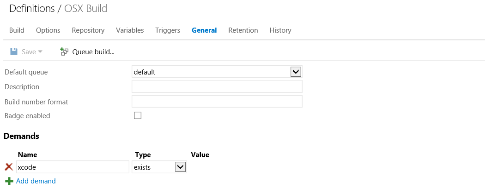

<properties pageTitle="Use the Visual Studio Tools for Apache Cordova with Visual Studio Online or Team Foundation Services 2015"
  description="Use the Visual Studio Tools for Apache Cordova with Visual Studio Online or Team Foundation Services 2015"
  services=""
  documentationCenter=""
  authors="bursteg" />

#Use the Visual Studio Tools for Apache Cordova with Visual Studio Online or Team Foundation Services 2015
Tools for Apache Cordova is designed to work with a number of different team build systems since the projects it creates are standard [Apache Cordova Command Line interface](http://go.microsoft.com/fwlink/?LinkID=533773) (CLI) projects. Team Foundation Services 2015 provides a new [cross-platform agent](http://go.microsoft.com/fwlink/?LinkID=533789) and [Gulp](../tutorial-gulp) based build capabilities that enables TFS to build directly on Windows or OSX which is a critical capability Cordova based development. In addition, Gulp also enables you to easily add in a large number of "[plugins](http://go.microsoft.com/fwlink/?LinkID=533790)" to perform useful build tasks in environments that you do not control directly like Visual Studio Online.

For these reasons, this tutorial will focus on the use of the cross-platform agent and Gulp rather than MSBuild as the primary build language for Cordova apps. If you still need to use the legacy XAML / MSBuild based approach, see the [TFS 2013](./tfs2013.md) tutorial for details on setup. The instructions generally still apply to TFS 2015.

**Troubleshooting Tip:** Be aware that we recommend against adding the "platforms" folder or the following json files in the "plugins" folder into source control: android.json, ios.json, remote_ios.json, windows.json, and wp8.json. See "What to Add to Source Control" in the [general team build tutorial](./general.md#whattoadd) for additional details.

###Visual Studio Online
As of this writing, you can build Cordova apps targeting Android, Windows, and Windows Phone using the Hosted Agent Pool in Visual Studio Online. This allows you to build without setting up a Windows build agent on premise. iOS builds are not yet available though you can use the VSO Cross-Platform Build agent with Visual Studio Online (see [below](#xplat)) and either your own Mac or a cloud provider like [MacInCloud](http://www.macincloud.com).

All Cordova pre-requisites should already be installed and configured when using the Hosted Agent Pool in Visual Studio Online (VSO). Cordova versions not already present will be dynamically downloaded during your build.

**See [agent setup](#agentsetup) for details on setting up a build agent if you are either not using Visual Studio Online or want to use the [crossplatform agent](#xplat) to build for iOS.**

##Project Setup & Build Definitions
###Adding Gulp to Your Project
Using Gulp in a team environment is fairly straight forward as you can see in the detailed [Gulp tutorial](../tutorial-gulp/gulp-ci.md). However, to streamline setup, follow these steps:

1.  Take the sample "gulpfile.js" and "package.json" file from the "samples/gulp" folder [from this GitHub repo](http://go.microsoft.com/fwlink/?LinkID=533736) and place them in the root of your project

2.  Check these two files into source control with your project

From here you can modify gulpfile.js and add other gulp plugins. The [Gulp tutorial](../tutorial-gulp/gulp-ci.md) provides additional detail on what the gulpfile does and how to wire Gulp tasks as "hooks" into Cordova build events.

###Creating Your Build Definitions
We'll assume for the purposes of this tutorial that we want to build our Cordova app for Android, iOS, and Windows. The Windows Cordova platform can only be built on Windows and iOS can only be built on OSX. As a result, we'll need the ability to be able to queue a build that can target one of these two operating systems.

There are two ways that this can be accomplished:

1.  Setting up separate build queues for OSX vs Windows machines and then queueing the same build definition in the appropriate build queue based on the desired platform

2.  Using the concept of a "demand" in two separate build definitions to route the work to the correct OS from the same queue

For the sake of this tutorial, we'll cover option 2. The sample "gulpfile.js" assumes you want to build Android, Windows, and Windows Phone on Windows and iOS on OSX. Technically you could also opt to have Android built on OSX but we will not cover that in detail in this tutorial.

#### Build Definition for Windows
Detailed instructions on creating build definitions in TFS 2015 can be found in [its documentation](http://go.microsoft.com/fwlink/?LinkID=533772), but here are the specific settings you will need to use to configure a build.

1.  Depending on the version of TFS 2015 you are using, you may need to click on the **BUILD.PREVIEW** menu option to access the next generation TFS build system.

	

2.  Create a new build definition and select "Empty" as the template. We'll start out targeting platforms that can be built on Windows so give the build definition a name that indicates that this is the case.

3.  Now we will configure the build definition to install any Gulp or npm package dependencies your build may have.
	1.  Under the "Build" tab, add a new build step and select **npm install** from the **Package** category
	2.  Use the following settings:
		- **Advanced =\> Working Directory**: Location of the Cordova project itself inside your solution (not the solution root).

	

4.  Next we'll configure Gulp itself.

    1.  Under the "Build" tab, add a new build step and select **Gulp** from the **Build** category.
	2.  Use the following settings:
		- **Gulp File Path**: Location gulpfile.js in your Cordova project (not the solution root).
		- **Advanced =\> Working Directory**: Location of the Cordova project itself inside your solution (not the solution root).

	

5.  Next we need to ensure that this particular build runs on Windows rather than OSX. Under the "General" tab, add a demand that "Cmd" exists.

	

6.  As an optional step, you can configure your build to upload the resulting build artifacts to your TFS or VSO instance for easy access. The sample gulpfile.js script places the resulting output in the "bin" folder to make configuration simple.

    1. Under the "Build" tab, add a new build step and select **Publish Artifact** from the **Build** category.
	2. Use the following settings:
		- **Copy Root**: Location of the Cordova project itself inside your solution (not the solution root).
		- **Contents:** bin/*
		- **Artifact Name:** bin
		- **Artifact Type:** Server

	

Finally, click the "Queue build..." button to validate your setup. You'll see a real-time console view of your build progressing so you can quickly fine tune your definition.

That's it for Windows! You're now able to build using the Android, Windows, and Windows Phone 8 (WP8) Cordova platforms.

#### Build Definition for OSX
Now let's create a version of this same build definition to target iOS that will run on a configured cross-platform agent on OSX.

1. Right click on the Windows build definition and select "Clone." Once you save you should give this definition a name that indicates it's the OSX build.

2. Now we need to add a demand that will route builds to OSX machines rather than Windows. Under the "General" tab, remove the "Cmd" demand and add a demand that "xcode" exists.

	

You are now all set! You can configure either of these build definitions further as you see fit including having them automatically fire off on check-in or adding other validations.

**Troubleshooting Tip:** See ["Troubleshooting Tips for Building on OSX" in the general CI tutorial](./general.md#osxgotcha) for tips on resolving common build errors that can occur when building Cordova projects on that operating system.

You are now ready to go in VSO!

##Agent Setup
If you are not using Visual Studio Online's (VSO) Hosted Agent Pool and are using your own locally hosted build agent, you'll need to install pre-requisites on your build server.

Since the build process we will describe here is not directly dependent on MSBuild or Visual Studio for Android, you have two options for installing pre-requisites on Windows:

1.  Install Visual Studio 2015 and select the Tools for Apache Cordova option and let it install the pre-requisites for you

2.  Manually install only the pre-requisites needed for the specific platforms you intend to build. For example, you do not need to install Visual Studio at all if you only intend to target Android. See "Installing Dependencies" in the [Building Cordova Apps in a Team / Continuous Integration Environment](./README.md#depends) tutorial for details.

3. Next you will need to install the Windows build agent to build Android, Windows, or Windows Phone, and the [VSO cross-platform build agent](http://go.microsoft.com/fwlink/?LinkID=533789) on an OSX machine if you intend to build iOS. See [TFS 2015 documentation](http://go.microsoft.com/fwlink/?LinkID=533772) for detailed instructions on configuring the agent for use with an on premise TFS 2015 instance or Visual Studio Online.

**Troubleshooting Tip:** See ["Internet Access & Proxy Setup" in the general CI tutorial](./general.md#proxy) if your build servers have limited Internet connectivity or require routing traffic through a proxy.

####Meet the Cross-Platform Build Agent
Since it is a new capability, let's pause and briefly highlight the new TFS [cross-platform build agent](http://go.microsoft.com/fwlink/?LinkID=533789) we will be using in this tutorial for building iOS on OSX since setup is different than traditional TFS build agents. The agent is a Node.js based service that uses a HTTPS connection to your TFS 2015 server to fetch work. As a result, your OSX machine only needs to have HTTP access to your TFS instance but not the other way around. This makes setup and configuration quite simple. The agent is for use with TFS 2015 and Visual Studio Online's [next generation build system](http://go.microsoft.com/fwlink/?LinkID=533772), not the legacy XAML/MSBuild based system.

The pre-requisites in this case are simple: Your Mac needs to have Node.js and Xcode installed. Simply open the OSX Terminal app and follow these [setup instructions](http://go.microsoft.com/fwlink/?LinkID=533789). The agent will automatically register itself with TFS when you start up the agent for the first time.

Because of its design, you can also easily use an **on-premise Mac or a cloud provider like [MacInCloud](http://www.macincloud.com) with Visual Studio Online.** The OSX machine simply needs to have HTTP access to your VSO domain URI. You do not need a VPN connection and VSO does not need access to the OSX machine. Simply enter the your VSO project's domain URI when prompted during agent setup (Ex: "https://myvsodomain.visualstudio.com"). All other setup instructions apply directly.

###Environment Variables
Note: All Cordova pre-requisites should already be installed and configured when using the Hosted Agent Pool in Visual Studio Online (VSO). Cordova versions not already present will be dynamically downloaded during your build. You can skip this section if you are only using the VSO Hosted Agent Pool.

You should set the following environment variables if they have not already been configured on each server you have configured a build agent. Note that you can also set these in the "Variables" section of your build definition if you would prefer.

| **Variable**       | **Required For**                         | **Purpose**                              | **Default Location (Visual Studio 2015)** |
|:-------------------|:-----------------------------------------|:-----------------------------------------|:------------------------------------------|
| **ANDROID\_HOME**  | Android                                  | Location of the Android SDK              | C:\\Program Files (x86)\\Android\\android-sdk |
|**JAVA\_HOME**     | Android                                  | Location of Java                         | C:\\Program Files (x86)\\Java\\jdk1.7.0\_55 |
| **ANT\_HOME**      | Android when building using Ant (not Gradle) | Location of Ant                          | C:\\Program Files (x86)\\Microsoft Visual Studio 14.0\\Apps\\apache-ant-1.9.3 |
| **GRADLE\_USER\_HOME**      | Optional | Overrides the default location Gradle build system dependencies should be installed when building Android using Cordova 5.0.0+ | If not specified, uses %HOME%\\.gradle on Windows or ~/.gradle on OSX |
| **CORDOVA\_CACHE** | Optional                                 | Overrides the default location used by the [sample build module](http://go.microsoft.com/fwlink/?LinkID=533736) to cache installs of multiple versions of Cordova. | If not specified, uses %APPDATA%\\cordova-cache on Windows and ~/.cordova-cache on OSX |

####Setting Your Path
The following will also need to be in your path:
- **Node.js** should already be in your path on OSX simply by the fact that you've setup the cross-platform build agent, but if it is not in your path on Windows you will want to be sure it is configured for use. The default location of Node.js on Windows is **%PROGRAMFILES(x86)%\nodejs**.
- **%ANT_HOME%\bin** should be added to your path if you are using a version of Cordova < 5.0.0 or have specified the "--ant" build option

## More Information
* [Learn about other Team Build / CI options](./README.md)
* [Read tutorials and learn about tips, tricks, and known issues](../Readme.md)
* [Download samples from our Cordova Samples repository](http://github.com/Microsoft/cordova-samples)
* [Follow us on Twitter](https://twitter.com/VSCordovaTools)
* [Visit our site http://aka.ms/cordova](http://aka.ms/cordova)
* [Read MSDN docs on using Visual Studio Tools for Apache Cordova](http://go.microsoft.com/fwlink/?LinkID=533794)
* [Ask for help on StackOverflow](http://stackoverflow.com/questions/tagged/visual-studio-cordova)
* [Email us your questions](mailto:/vscordovatools@microsoft.com)
