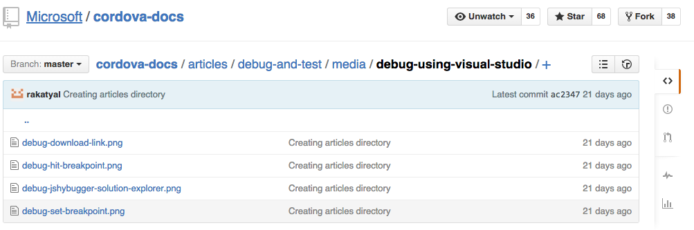

<properties pageTitle="How to contribute"
  description="How to contribute"
  services=""
  documentationCenter=""
  authors="bursteg" />

# How to Contribute

## Adding New Content

“New content” involves **adding a new section** to an article, or **adding a new article**. Changes and/or updates to any “Known Issues” or adding “Tips and Workarounds” do **not** count as new content. 

For now, our team is controlling new content contribution more strictly because we are currently undergoing information architecture revisions to pare down and organize VS Cordova documentation. 

To contribute new content, open an issue on Github. In that issue, please communicate **what specific task you want to help developers accomplish**.

In order to reduce content duplication and article fragmentation, our team will work with you to establish what information should be included in our content.

For any significant changes made to an existing article, please note that we are following Microsoft [style](https://worldready.cloudapp.net/StyleGuide/Read?id=1413) [guidelines](https://microsoft.sharepoint.com/teams/BrandCentral/Pages/How-we-talk-Microsoft.aspx).

## Editing Current Content

To edit documentation for errors or with updates to any known issues or tips and workarounds, follow the steps below:  

1)	[Submit a pull request](https://help.github.com/articles/using-pull-requests/) (PR) to our articles repo at [/Microsoft/cordova-docs](github.com/Microsoft/cordova-docs).

> **Note:**  All current articles are being published from within the "articles" folder. The top level folders are deprecated articles. Moreover, they will not update with your changes, as per exclude.gitignore.

### Adding Images
There is a specific file structure to follow for adding images into our articles, or publishing errors will result. At the level of the .md file, you are adding  a "/media" folder. Within that folder there must be another folder titled the same as the .md file. Add your media there. 

> **Note:** It is curently not possible to embed videos in Github-flavored markdown files.

2)	We will evaluate the PR—possibly making edits as needed to stay consistent with the style of our documentation. We may contact you with any questions before we merge the PR. 
