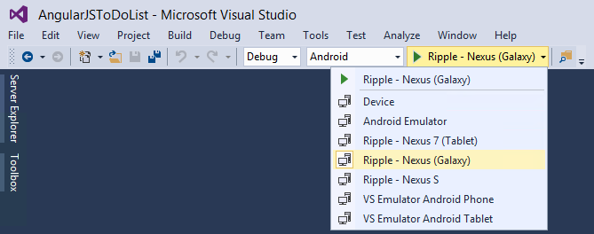
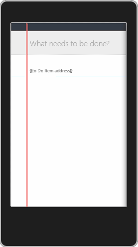

<properties
   pageTitle="Create the ToDoList sample app | Cordova"
   description="description"
   services="na"
   documentationCenter=""
   authors="Mikejo5000"
   tags=""/>
<tags
   ms.service="na"
   ms.devlang="javascript"
   ms.topic="article"
   ms.tgt_pltfrm="mobile-multiple"
   ms.workload="na"
   ms.date="09/10/2015"
   ms.author="mikejo"/>
# Create the ToDoList sample app

In this tutorial, you’ll learn how to create a task list sample app using AngularJS (AngularJSToDo). This app allows users to create new tasks, check them off, and remove them. The app also stores tasks using HTML5 Web Storage on the device. (The complete sample uses Microsoft Azure Mobile Services to store data, and also uses Bing Maps to provide valid addresses.) This sample uses JavaScript code, but you can also write your Cordova app in TypeScript.

>**Note**:
For an overview of tasks required to build a Cordova app, see [Create Your First App Using Visual Studio Tools for Apache Cordova](create-first-app-using-vs-tools-apache-cordova.md).

The task list sample app is available for multiple frameworks, and can be downloaded here:

* [AngularJS sample](http://go.microsoft.com/fwlink/p/?LinkID=398516)

* [WinJS sample](http://go.microsoft.com/fwlink/p/?LinkID=398518) (TypeScript sample)

* [Backbone sample](http://go.microsoft.com/fwlink/p/?LinkID=398517) To download other samples for Visual Studio Tools for Apache Cordova that demonstrate multi-page navigation and other features, see the [Ionic SideMenu Starter Template](https://code.msdn.microsoft.com/windowsapps/Ionic-SideMenu-Starter-8e905eb5), [AngularJS Master-Detail Page sample](http://code.msdn.microsoft.com/AngularJS-Detail-Sample-7a409e5e), and [WinJS Navigation App template](http://code.msdn.microsoft.com/WinJS-Navigation-Template-50112ea9)

## Pre-requisites

Before you can create a new project, make sure that you’ve met all system requirements and installed the Visual Studio Tools for Apache Cordova. For more information, see [Install Visual Studio Tools for Apache Cordova](install-vs-tools-apache-cordova.md).

## <a id="Create"></a>Create a project

Create a new Cordova project in Visual Studio by following the steps described in [Create Your First App Using Visual Studio Tools for Apache Cordova](create-first-app-using-vs-tools-apache-cordova.md). Alternatively, start with a new blank app by choosing **File**, **New**, and then **Project** in Visual Studio. In the **New Project** dialog box, choose **Installed**, **Templates**, **JavaScript**, **Apache Cordova Apps**, and then choose the **Blank App** template.

## <a id="UI"></a>Create the UI

The main UI in the task list sample app consists of the following elements:

* An element for new list items.

* An AngularJS template that will display each task in the task list. The element looks like this:

 ```html
  <input id="new-todo" placeholder="What needs to be done?"
       td-text-change="toDoCtrl.addToDo()" ng-model="toDoCtrl.newToDoText" autofocus>
 ```

When you first run the app, some of the attributes in the preceding code won’t do anything. For example, the AngularJS ng-model directive enables two-way data binding, and allows you to save the entered task when the addToDo() function runs. For the task list, we define a template using some nested elements that wrap several other elements. For example, the nested element shown here is used to display each task string.

```html
<div class="templateWrapper" ng-repeat="toDoItem in toDoCtrl.todos">
  <div class="templateContainer">
    <input class="templateTitle" ng-class="{crossedOut: toDoItem.done}" type="text"
        td-text-change="toDoCtrl.changeToDoText(toDoItem)" ng-model="toDoItem.text" />
    <!—- More list item HTML elements -->
  </div>
  <div class="templateBorder"></div>
</div>
```

In the preceding code, the AngularJS attribute, **ng-repeat**, allows you to define the top
element as a template to display task list items. Later, when you attach actual data and run the app, ng-repeat will add the child
element (templateContainer) and its child elements to the DOM for each stored task list item.

>**Note**: Because Cordova is not dependent on any particular JavaScript framework, we are not trying to provide in-depth information about [AngularJS programming](https://docs.angularjs.org/tutorial) in these steps. Instead, we are showing a good example of one way to create a cross-platform app using Visual Studio Tools for Apache Cordova.
Now, we will add the complete markup for index.html.

### Add markup for the list
* Open index.html, and replace the and element with the following code.

```html
  <head>
    <meta charset="utf-8" />
    <meta name="viewport" content="width=device-width, initial-scale=1.0, maximum-scale=1.0, user-scalable=0" />
    <title>CordovaToDoApp_AngularJS</title>

    <link href="css/index.css" rel="stylesheet" />
  </head>
  <body ng-app="xPlat">
      <section id="todoapp" ng-controller="ToDoCtrl as toDoCtrl">
        <header id="header">
            <div id="headerBand"></div>
            <input id="new-todo" placeholder="What needs to be done?" td-text-change="toDoCtrl.addToDo()" ng-model="toDoCtrl.newToDoText" autofocus>
        </header>
        <section id="main">
            <div id="todo-list">
                <div class="templateWrapper" ng-repeat="toDoItem in toDoCtrl.todos">
                    <div class="templateContainer">
                        <input class="templateTitle" ng-class="{crossedOut: toDoItem.done}" type="text" td-text-change="toDoCtrl.changeToDoText(toDoItem)" ng-model="toDoItem.text" />
                        <h3 class="templateAddress">{{toDoItem.address}}</h3>
                        <button class="templateLeft templateToggle" ng-class="{'checked': toDoItem.done, 'unchecked': !toDoItem.done}" ng-mousedown="toDoCtrl.toggleToDoDone(toDoItem)"></button>
                        <button class="templateLeft templateRemove" ng-click="toDoCtrl.removeToDo(toDoItem)"></button>
                    </div>
                    <div class="templateBorder"></div>
                </div>
            </div>
        </section>
    </section>

    <!-- Cordova reference, this is added to your app when it's built. -->
    <script src="cordova.js"></script>
    <script src="scripts/platformOverrides.js"></script>

  </body>
  ```

  When you add the AngularJS framework (in later steps), other AngularJS attributes specified in index.html will become meaningful, but for now they won’t have any effect when you run the app. Here are the other AngularJS attributes included in index.html:

  * **ng-app** directive to specify the root node of an AngularJS app.

  * **ng-controller** to specify the AngularJS controller to support MVC.

### Add CSS style information

* In the css folder, open index.css, and add the following CSS style information for HTML elements and templates.

 ```css
  /* reset layout*/
      html,
      body {
      margin: 0;
      padding: 0;
      width: 100%;
      height: 100%;
      }

      /* body*/
      body {
        background: #F7f7f7;
        color: #4d4d4d;
        margin: 0 auto;
      }

      /* no outline for buttons & checkboxes*/
      button,
      input[type="checkbox"] {
        outline: none;
      }

      /* style the todo app*/
      #todoapp {
        background: rgba(255, 255, 255, 0.9);
        position: relative;
        min-height: 86%;

        border: none;
        box-shadow: 0px 2px 6px 2px rgba(0,0,0,0.2), 0px 25px 50px 0px rgba(0,0,0,0.15);
      }

      /* section styles*/
      @media (min-width: 650px) {
          /* style the todo list to look better on larger screens*/
            #todoapp {
                width: 74%;
                left: 13%;
                top: 50px;

                border-top-left-radius: 2px;
                border-top-right-radius: 2px;
            }

            #headerBand {
                border-top-left-radius: 2px;
                border-top-right-radius: 2px;
            }
        }

        /* the two red rulers*/
        #todoapp:before {
            content: '';
            border-style: solid;
            border-left-color: rgba(242, 103, 103, 1);
            border-right-color: rgba(242, 103, 103, 1);
            border-width: 1px;
            border-top: 0;
            border-bottom: 0;
            z-index: 2;
            width: 2px;
            position: absolute;
            top: 0;
            left: 40px;
            height: 100%;
        }

        /* the header that contains the input*/
        header {
            height: 50px;
        }

        /* dark band on the header*/
        #headerBand {
            position: relative;
            height: 20%;
            max-height: 20px;
            border-bottom: 1px solid #6c615c;
            background: rgba(52, 59, 69, 1);
        }

        /* the new to-do entry*/
        #new-todo {
            background: rgba(237, 237, 237, 0.9);
            position: relative;
            margin: 0;
            height: 80%;
            max-height: 70px;
            font-size: 21px;
            font-family: "Arial";
            border: 0;
            outline: none;
            color: rgb(114, 115, 115);
            padding: 0 0 0 56px;
            width: 100%;
            box-sizing: border-box;
        }

        /* the main section that hosts the listview*/
        #main {
            position: relative;
            z-index: 1;
            border-top: 1px dotted #adadad;
        }

        /* todo list*/
        #todo-list {
            margin: 0px;
            overflow-y: auto;
        }

        /* the host template*/
        .templateWrapper {
            position: relative;
            overflow: hidden;
        }

        /* blue border under the template*/
        .templateBorder {
            height: 0;
            border-bottom: 2px solid #bfdbf2;
        }

        /* container for the todo-address div*/
        .templateContainer {
            margin: 4px 15px 0px 45px;
        }

        .templateContainer input[type="text"] {
            font-size: 18px;
            font-family: "Arial";
            background: none;
            color: #2d3239;
            border: 1px solid rgba(0, 0, 0, 0);
            line-height: 0.6em;
            margin: 0px;
            width: 100%;
            display: block;
            padding: 4px 0px 4px 10px;
            border-radius: 0;
            -webkit-appearance: none;
        }

        .templateContainer input[type="text"]:active,
        .templateContainer input[type="text"]:focus {
            color: #2d3239;
            border: 1px solid #b2b2b2;
            outline: none;
            margin-left: 2px;
            text-decoration: none !important;
            padding-left: 8px;
        }

        input[type="text"]:active ~ .templateRemove,
        input[type="text"]:focus ~ .templateRemove,
        .templateRemove:active,
        .templateRemove:focus {
            display: inline-block;
        }

        input[type="text"]:active ~ .templateToggle,
        input[type="text"]:focus ~ .templateToggle,
        .templateRemove:active ~ .templateToggle,
        .templateRemove:focus ~ .templateToggle {
            display: none;
        }

        .crossedOut.templateTitle {
            text-decoration: line-through;
        }

        .templateContainer .templateAddress {
            color: #727272;
            font-size: 12px;
            font-family: "Arial";
            padding-top: 0px;
            margin: 0px 0px 10px 11px;
            font-weight: normal;
        }

        .templateContainer p {
            margin: 0px 0px 4px 0px;
        }

        /* button on the templated item*/
        button.templateLeft {
            position: absolute;
            top: 6px;
            left: 5px;
            border: none;
            width: 29px;
            height: 29px;
            min-width: 0;
            min-height: 0;
            background-color: transparent;
        }

        /* button when the item is checked*/
        button.templateToggle.checked {
            background-image: url('http://go.microsoft.com/fwlink/?LinkID=403179');
        }

        /* button when the item is unchecked*/
        button.templateToggle.unchecked {
            background-image: url('http://go.microsoft.com/fwlink/?LinkID=403180');
        }

        /* button for removing the item*/
        button.templateRemove {
            display: none;
            background-image: url('http://go.microsoft.com/fwlink/?LinkID=403181');
  }
  ```

You can take a look at the empty task list in one of the emulators to verify that everything looks correct. In this step, you’ll run the AngularJSToDo list app on either Windows or on the Apache Ripple simulator, which have minimal setup requirements (although Ripple requires Chrome). If you prefer to test your app on another target, see the following topics: [Run your app on Android](../develop-apps/run-app-apache.md), [Run your app on iOS](../develop-apps/run-app-ios.md), and [Run your app on Windows Phone](../develop-apps/run-app-windows-phone.md).

### To build and run the app

1. Choose **Windows-x64**, **Windows-x86**, or **Android** from the Solution Platforms list.

2. If you chose the Android platform, choose one of the Ripple simulators, as shown here.

    

    If you chose a Windows platform, you can run the app on the default deployment target, **Local Machine**.

3. Press F5 to start debugging, or Shift+F5 to start without debugging.

    The following illustration shows an example of what the AngularJSToDo list app looks like in one of the Ripple simulators (with no actual data yet attached, and with some files missing at this stage).

    

    >**Tip**: If you are running on a Ripple simulator and you get an error that indicates you need to install a new version of the Android SDK, use the Android SDK Manager to install it. On Windows, SDK Manager.exe is in C: Program Files (x86) Android android-sdk.

    If you see an error such as Cannot find module [modulename], see [Re-installing vs-tac](configure-vs-tools-apache-cordova.md#vsmda).

    If you experience other problems, see [Known Issues](http://go.microsoft.com/fwlink/p/?linkid=398782).

## <a id="AddAngularJS"></a>Add the AngularJS framework to your project

Now that you’ve verified your setup, you can create the AngularJSToDo app. The app uses AngularJS to separate the view model (MVC), to provide data binding, and to support native UI for different platforms.

### To add AngularJS to your project

1. From the [AngularJS website](https://angularjs.org/), choose **Download**. In the **Download AngularJS** dialog box, make sure that the minified 1.4.x version of AngularJS (the default stable version) is selected, and then choose **Download** to save the angular.min.js script to your computer.

2. In the **Download AngularJS** dialog box, choose **Browse additional modules**, and download angular-resource.min.js. 5. In the Visual Studio Solution Explorer, add a new folder under the scripts folder of the project and name it frameworks.

    >**Note**: You cannot add this folder while the app is running. Press Shift + F5 to stop the debugger.

3. Open the shortcut menu for the frameworks folder, and then choose **Add**, **Existing Item**. Add the two AngularJS files from steps 1 and 2 to the project.

### Update the script references

1. In index.html, add the following AngularJS references in the element, after the Cordova and platformOverrides script references.

    ```html
    <!-- Angular JS -->
    <script src="scripts/frameworks/angular.min.js"></script>
    <script src="scripts/frameworks/angular-resource.min.js"></script>
    ```

    Your script references in the element should now look like this.

    ```html
    <!-- Cordova reference, this is added to your app when it's built. -->
    <script src="cordova.js"></script>
    <script src="scripts/platformOverrides.js"></script>

    <!-- Angular JS -->
    <script src="scripts/frameworks/angular.min.js"></script>
    <script src="scripts/frameworks/angular-resource.min.js"></script>
    ```

    >**Note**: cordova.js needs to load before the AngularJS framework files.

2. Add script references for your AngularJS modules at the end of the element, after the AngularJS references. Those additional references should look like this.

    ```html
    <!-- Initialize all the modules -->

    <script src="scripts/index.js"></script>

    <!-- Services -->
    <script src="scripts/services/localStorage.js"></script>
    <script src="scripts/services/storage.js"></script>
    <script src="scripts/services/guidGenerator.js"></script>
    <script src="scripts/services/maps.js"></script>
    <script src="scripts/services/cordova.js"></script>

    <!-- Directives -->
    <script src="scripts/directives/textChange.js"></script>

    <!-- Controllers -->
    <script src="scripts/controllers/toDoCtrl.js"></script>
    ```

## <a id="RegisterModules"></a>Register app modules

In this section, you’ll register AngularJS app modules to help separate application concerns. Modules in this app include the data model (`xPlat.services`), the AngularJS controller (`xPlat.controller`), and AngularJS directives (`xPlat.directives`) to support data binding. To register the modules, use the `angular.module` function.

### To register angular modules

1. In **Solution Explorer**, open the shortcut menu for the scripts folder, and then choose **Add**, **New Folder**. Use this command to add three folders under the scripts folder:

    * **controllers**

    * **directives**

    * **services**

2. In **Solution Explorer**, open the shortcut menu for the controllers folder, and then choose **Add**, **New Item**.

3. In the **Add New Item** dialog box, choose **JavaScript File**, and name it toDoCtrl.js.

4. Repeat the preceding step to add additional JavaScript files to the directives and services folders, respectively:

    * textChange.js (add it to the directives folder).

    * cordova.js, guidGenerator.js, localStorage.js, maps.js, and storage.js (add them to the services folder)

5. Open index.js, and replace the default code with the following code.

    ```javascript
    (function () {
      'use strict';

      angular.module('xPlat', ['xPlat.services', 'xPlat.controllers', 'xPlat.directives']);
      angular.module('xPlat.directives', []);
      angular.module('xPlat.controllers', []);
      angular.module('xPlat.services', ['ngResource']);
    })();
    ```

## <a id="DataModel"></a>Add the data model

The data model is represented by the `xPlat.services` module, which you’ll implement in the files in the services folder. This code includes a service that provides local storage of task list items using HTML5 Web Storage (localStorage.js). In this initial implementation, the app also provides placeholder code for Bing Maps services, which can be implemented fully later on. The [complete sample app](http://go.microsoft.com/fwlink/?LinkID=398516) also uses Azure to store data.

### To add code for the data model

1. In the **services** folder, open storage.js and add the following code. In this code, we provide a generic way to add storage service. In the initial implementation, we add the localStorage service. Later, we will add an Azure service using this code.

    ```javascript
    (function () {
      'use strict';

      angular.module('xPlat.services').factory('storage', ['$injector', storage]);

      /**
        * Storage service to abstract specific implementations.
        *
        * @params {!angular.Service} $inject*/
      function storage($injector) {
        // If Azure storage is available, use it. Otherwise, use local storage.
        //var azureService = $injector.get('azureStorage');
        //return azureService.isAvailable ? azureService : $injector.get('localStorage');
        return $injector.get('localStorage');
      }

    })();
    ```

2. In the **services** folder, open localStorage.js and add the following code. One thing to note here is the inclusion of the **q** service component in the service provider function. This object enables asynchronous programming,so that you can create a promise object using `q.when`. Using the promise object, you can resolve the asynchronous operation when it has completed.

    ```javascript
  (function () {
      'use strict';

      angular.module('xPlat.services').service('localStorage', ['$q', '$window', 'guidGenerator', LocalStorage]);

      /**
       * Local storage service.
       * @param {angular.Service} $q
       * @param {angular.Service} $window
       * @param {angular.Service} guidGenerator
       * @constructor*/
      function LocalStorage($q, $window, guidGenerator) {
          this.$q = $q;
          this.$window = $window;
          this.guidGenerator = guidGenerator;
      }

      /**
       * Key for storing todo items locally.
       * @type {string}
       * @const*/
      LocalStorage.prototype.LOCAL_STORAGE_KEY = 'toDoItems';

      /**
       * Load JSON data from the local storage.
       * @return {Object} Todo items*/
      LocalStorage.prototype.loadFromStorage = function () {
          return angular.fromJson(this.$window.localStorage.getItem(this.LOCAL_STORAGE_KEY)) || [];
      };

      /**
       * Save JSON data in the local storage.
       * @params {Object} items Todo items*/
      LocalStorage.prototype.saveToStorage = function (items) {
          this.$window.localStorage.setItem(this.LOCAL_STORAGE_KEY, angular.toJson(items));
      }

      /**
       * Retrieve all data from local storage*/
      LocalStorage.prototype.getAll = function () {
          return this.loadFromStorage();
      };

      /**
       * Create a new todo to local storage.
       * @param {string} text Text of the todo item.
       * @param {string} address Address of the todo item*/
      LocalStorage.prototype.create = function (text, address) {
          var item = {
              id: this.guidGenerator.get(),
              text: text,
              address: address,
              done: false
          }
          var items = this.loadFromStorage();
          items.push(item);

          this.saveToStorage(items);
          return this.$q.when(item);
      };

      /**
       * Update an existing todo in local storage.
       * @param {Object} item Todo item to modify*/
      LocalStorage.prototype.update = function (item) {
          var items = this.loadFromStorage();
          for (var i = 0; i < items.length; i++) {
              if (items[i].id === item.id) {
                  items[i] = item;
                  break;
              }
          }

          this.saveToStorage(items);
          return this.$q.when(item);
      };

      /**
       * Remove a todo from local storage.
       * @param {Object} item Todo item to remove from local storage*/
      LocalStorage.prototype.del = function (item) {
          var items = this.loadFromStorage();
          for (var i = 0; i < items.length; i++) {
              if (items[i].id === item.id) {
                  items.splice(i, 1);
                  break;
              }
          }

          this.saveToStorage(items);
          return this.$q.when(item);
      };
  })();
    ```

## <a id="ViewLogic"></a>Add the app’s view logic and implement data binding

In this section, you’ll implement the AngularJS controller module (`xPlat.controllers`) to handle view logic and manipulate the data model. The code implements declarative functions in the HTML such as addToDo, which adds a new task item to the list. In this section, you’ll also add an AngularJS directive to help implement two-way data binding.

### To add the controller

* In the controllers folder, open toDoCtrl.js and add the following code. The controller name, `ToDoCtrl`, is also referenced by the AngularJS `ng-controller` directive in index.html.

    ```javascript
  (function () {
      'use strict';

      angular.module("xPlat.controllers").controller('ToDoCtrl', ['maps', 'storage', ToDoCtrl]);

      /**
       * Controller for the todo list.
       *
       * @param {!angular.Service} maps
       * @param {!angular.Service} storage
       * @constructor
       * @export*/
      function ToDoCtrl(maps, storage) {
          this.maps = maps;
          this.storage = storage;
          this.todos = storage.getAll();

          this.updateAddress = function (toDoItem) {
              var _this = this;

              return this.maps.getCurrentPosition()
                  .then(_this.maps.getAddressFromPosition.bind(_this.maps), function (error) { return error.message; })
                  .then(function (address) {
                      toDoItem.address = address;
                      return _this.storage.update(toDoItem);
                  }, function (errorMessage) {
                      toDoItem.address = errorMessage;
                      return _this.storage.update(toDoItem);
                  });
          }
      }

      /**
       * Update the item location with an address.
       * @param toDoItem*/

      /**
       * Add a todo item to the list*/
      ToDoCtrl.prototype.addToDo = function () {
          var _this = this;

          var text = this.newToDoText;
          if (!text) {
              return;
          };

          this.newToDoText = '';
          this.storage.create(text, 'Getting location...')
              .then(function (todo) {
                  _this.todos.push(todo);
                  return todo;
              }).then(this.updateAddress.bind(this));
      };

      /**
       * Update the text of a todo item*/
      ToDoCtrl.prototype.changeToDoText = function (toDoItem) {
          this.storage.update(toDoItem)
              .then(this.updateAddress.bind(this))
      };

      /**
       * Check/uncheck a todo item*/
      ToDoCtrl.prototype.toggleToDoDone = function (toDoItem) {
          toDoItem.done = !toDoItem.done;
          this.storage.update(toDoItem);
      };

      /**
       * Remove a todo item from the list*/
      ToDoCtrl.prototype.removeToDo = function (toDoItem) {
          var _this = this;
          this.storage.del(toDoItem).then(function (todo) {
              var index = _this.todos.indexOf(todo);
              _this.todos.splice(index, 1);
          });
      };
  })();
    ```

  Next, you’ll implement the directives module. In this code, you’ll create a custom directive to specify behavior for the onchange DOM event. At runtime, this code associates the correct event handler (declared in HTML markup in index.html) with the element, either the `addToDoText` or `changeToDoText` functions. These are implemented in toDoCtrl.js.

### To add a directive for data binding

* In the directives folder, open textChange.js and add the following code.

    ```javascript
    (function () {
        'use strict';

        angular.module('xPlat.directives').directive('tdTextChange', tdTextChange);

        /**
         * Factory function for the directive for ng-text-change.
        *
         * @return {Object} td-text-change*/
        function tdTextChange() {
            return {
                restrict: 'A',
                link: function (scope, element, attr) {
                    element.on('change', function () {
                        scope.$apply(function () {
                            scope.$eval(attr.tdTextChange);
                        });
                    });
                }
            };
        }
    })();
    ```

## <a id="AppServices"></a>Add additional services

In this section, you’ll add additional service modules to support features such as GUID generation.

### To add other app services

1. In the services folder, open guidGenerator.js and add the following code. This code generates a unique ID to associate with each task list item.

    ```javascript
  (function () {
      angular.module('xPlat.services').service('guidGenerator', GuidGenerator);

      /**
       * Generates a GUID to use as an ID for the todos
       * @constructor*/
      function GuidGenerator() {
          // Generates a small part of a GUID
          this.generatePart = function () {
              var guidPartNumber = (Math.random() * 0x10000) | 0;
              return (guidPartNumber + 0x10000).toString(16).substring(1).toUpperCase();
          };
      }

      /**
       * Returns a new GUID.
       * @return {string} generated GUID*/
      GuidGenerator.prototype.get = function () {
          return this.generatePart()
              + '-'
              + this.generatePart()
              + '-'
              + this.generatePart()
              + '-'
              + this.generatePart()
              + '-'
              + this.generatePart()
              + this.generatePart()
              + this.generatePart();
      };
  })();
    ```

2. In the services folder, open maps.js and add the following code. We will use this code later to enable Bing Maps geolocation services. For now, it is used to associate the current location, if available, or a default location with the current task list item.

    ```javascript
  (function () {
      'use strict';

      angular.module('xPlat.services').service('maps', ['$rootScope', '$q', '$window', '$resource', 'cordova', Maps]);

      // Bing maps to retreive addresses from locations.
      function Maps($rootScope, $q, $window, $resource, cordova) {
          var BING_MAPS_API_KEY = 'API-KEY-GOES-HERE'; // TODO: Add your Bing Maps API key
          if (BING_MAPS_API_KEY === 'API-KEY-GOES-HERE') {
              console.warn("A Bing Maps API key was not provided, skipping the API call. Get an API key at https://msdn.microsoft.com/en-us/library/ff428642.aspx");
          }
          this.url = 'http://dev.virtualearth.net/REST/v1/Locations/:latitude,:longitude?key=' + BING_MAPS_API_KEY;

          this.$rootScope = $rootScope;
          this.$q = $q;
          this.$window = $window;
          this.$resource = $resource;
          this.cordova = cordova;
      }

      Maps.prototype.getCurrentPosition = function () {
          var _this = this;
          return this.cordova.ready.then(function () {
              var deferred = _this.$q.defer();
              _this.$window.navigator.geolocation.getCurrentPosition(function (successValue) {
                  _this.$rootScope.$apply(function () {
                      deferred.resolve(successValue);
                  }.bind(_this));
              }, function (errorValue) {
                  _this.$rootScope.$apply(function () {
                      deferred.reject(errorValue);
                  }.bind(_this));
              });

              return deferred.promise;
          });
      };

      /**
       * Gets an address from a position.
       * @params position
        */
      Maps.prototype.getAddressFromPosition = function (position) {
          var _this = this;
          return this.$resource(_this.url, {})
              .get({ latitude: position.coords.latitude, longitude: position.coords.longitude })
              .$promise.then(function (response) {
                  return response.resourceSets[0].resources[0].address.formattedAddress;
              }, function (error) {
                  return position.coords.latitude + ',' + position.coords.longitude
              });
      };
  })();
    ```

3. In the services folder, open cordova.js and add the following code. This code adds a handler for the Cordova **deviceready** event to help make sure that the event fires before the app runs plugin code.

```javascript
  (function () {
      'use strict';

      angular.module('xPlat.services').factory('cordova', ['$q', '$window', '$timeout', cordova]);

      /**
       * Service that allows access to Cordova when it is ready.
       *
       * @param {!angular.Service} $q
       * @param {!angular.Service} $window
       * @param {!angular.Service} $timeout
        */
      function cordova($q, $window, $timeout) {
          var deferred = $q.defer();
          var resolved = false;

          // Listen to the 'deviceready' event to resolve Cordova.
          // This is when Cordova plugins can be used.
          document.addEventListener('deviceready', function () {
              resolved = true;
              deferred.resolve($window.cordova);
              console.log('deviceready fired');
          }, false);

          // If the 'deviceready' event didn't fire after a delay, continue.
          $timeout(function () {
              if (!resolved && $window.cordova) {
                  deferred.resolve($window.cordova);
              }
          }, 1000);

          return { ready: deferred.promise };
      }
  })();
```

## <a id="BuildToDo"></a>Build and run your app

In this step, you’ll run the AngularJSToDo list app on either Windows or on the Apache Ripple simulator.

### To build and run the app

* Press F5 to run the app on the same target you specified previously.

    Windows and the Ripple simulator have minimal setup requirements, so we recommend initially targeting one of these two platforms. The following illustration shows an example of what the AngularJSToDo list app looks like in one of the Ripple simulators.

    

Now, you can add new task list items by typing text and pressing Enter (Ripple) or tapping outside of the input box (Windows). At this point, HTML 5 Web Storage stores the task list items locally.

## <a id="BingMaps"></a>Add Bing Maps services

The [complete sample](http://go.microsoft.com/fwlink/p/?LinkID=398516) includes a Bing Maps service to associate your current address with each task list item.

>**Tip**: If you are more interested in setting up Azure Mobile Services, you can skip these steps and go to the next section.

### To add Bing Maps support to the app:

1. Add the Cordova Geolocation plugin to the app by double-clicking config.xml in **Solution Explorer**, choosing the **Plugins** tab, and then choosing **Geolocation**.

    For more information, see [Manage Plugins for Apps Built with Visual Studio Tools for Apache Cordova](./develop-apps/manage-plugins.md).

2. Choose **Add** to add the plugin.

    * [Get a Bing Maps key](https://msdn.microsoft.com/library/ff428642.aspx) and include it where instructed in the in maps.js.

3. Press F5 to start the app.

    Now, Bing Maps will provide an address for your current location.

## <a id="Azure"></a>Add Azure Mobile Services

The complete sample includes additional code to store and retrieve task list items using Azure Mobile Services. This code is implemented as an additional service (named azureStorage) in azureStorage.js. You can obtain this code from the [complete sample app](http://go.microsoft.com/fwlink/p/?LinkID=398516), or you can follow the instructions here to add the service.

### To add Azure Mobile Services to the app

1. If you don’t already have one, create a [Microsoft Azure account](http://azure.microsoft.com/pricing/free-trial/).

2. In **Solution Explorer**, choose **Add**, **Connected Service** from the shortcut menu for the project, and then follow instructions in [add a connected service](./develop-apps/add-connected-services.md) to add Azure Mobile Services to your app and to create a free SQL database. When the service is added, your project gets the following updates:

    * A new services folder will be added to your project when you finish adding the connected service.
    The resulting code in will need to be replaced with code from the ToDoList sample app (code shown in the steps that follow).

    * The Azure Mobile Services plugin is added to the plugins folder.

    * The InAppBrowser plugin is added to the plugins folder.

3. Copy the Azure Mobile Service application key and URL from into Notepad. The key and URL are shown here.

    ```javascript
    var Zumo_MDHA_ServiceClient;
    document.addEventListener("deviceready", function () {
      Zumo_MDHA_ServiceClient = new WindowsAzure.MobileServiceClient(
        "https://applicationUrl/",
        "applicationKey");
    });
  ```

4. In Solution Explorer, remove the new services folder that was added when you chose **Add**, **Connected Services** and added the service. You won’t need this code or the services folder structure that was just added.

5. In storage.js, uncomment the following lines of code to allow use of Azure as the storage service.

    ```javascript
    // var azureService = $injector.get('azureStorage');
    // return azureService.isAvailable ? azureService : $injector.get('localStorage');
    ```

    And remove the next line of code:

    ```javascript
    return $injector.get('localStorage');
    ```

    After uncommenting the code and removing the specified code, the storage function in storage.js will look like this.

    ```javascript
    function storage($injector) {
      // If Azure storage is available, use it. Otherwise, use local storage.
      var azureService = $injector.get('azureStorage');
      return azureService.isAvailable ? azureService : $injector.get('localStorage');
    }
    ```

5. In azureStorage.js, add the following code for the Azure service. Where indicated in the code, add Azure Mobile Service **application key** and **URL** that you obtained when you added the Azure service.

    ```javascript
  (function () {
      'use strict';

      angular.module('xPlat.services').service('azureStorage', ['$resource', 'guidGenerator', AzureStorage]);

      /**
       * Azure Mobile Service Application Key.
       * TODO: Add your Azure Mobile Service Application Key.
       *
       * @type {string}
       * @const
        */
      var AZURE_MOBILE_SERVICES_KEY = '';

      /**
       * Azure Mobile Service Application URL.
       * TODO: Add your Azure Mobile Service Application URL.
       *
       * @type {string}
       * @const
        */
      var AZURE_MOBILE_SERVICES_ADDRESS = '';

      /**
       * Use the Azure Mobile Service to store todo items in the cloud.
       *
       * @param {angular.Service} $resource
       * @param {angular.Service} guidGenerator
       * @constructor
        */
      function AzureStorage($resource, guidGenerator) {
          this.isAvailable = AZURE_MOBILE_SERVICES_KEY && AZURE_MOBILE_SERVICES_ADDRESS;
          if (!AZURE_MOBILE_SERVICES_KEY || !AZURE_MOBILE_SERVICES_KEY) {
              console.warn("The Azure Mobile Services key and URL are not set up properly. Items will not be stored on Azure.");
          }

          // Generate the headers to access the Azure Mobile Services table.
          var azureMobileServicesInstallationId = guidGenerator.get();
          var headers = {
              'X-ZUMO-APPLICATION': AZURE_MOBILE_SERVICES_KEY,
              'X-ZUMO-INSTALLATION-ID': azureMobileServicesInstallationId,
              'X-ZUMO-VERSION': 'ZUMO/1.0 (lang=Web; os=--; os_version=--; arch=--; version=1.0.20218.0)',
              'Content-Type': 'application/json'
          };

          // Url of the Azure Mobile Services table to access.
          var azureMobileServicesTableAddress = AZURE_MOBILE_SERVICES_ADDRESS + 'tables/todoitem/:id';

          this.toDoItem = $resource(azureMobileServicesTableAddress, { id: '@id' }, {
              'query': {
                  method: 'GET',
                  params: { $top: '1000' },
                  isArray: true,
                  headers: headers
              },
              'delete': {
                  method: 'DELETE',
                  headers: headers
              },
              'save': {
                  method: 'POST',
                  headers: headers
              },
              'update': {
                  method: 'PATCH',
                  headers: headers
              }
          });
      }

      /**
       * Retrieve all data from Azure storage.
        */
      AzureStorage.prototype.getAll = function () {
          return this.toDoItem.query();
      };

      /**
       * Create a new todo to Azure storage.
       *
       * @param {string} text Text of the todo item.
       * @param {string} address Address of the todo item.
        */
      AzureStorage.prototype.create = function (text, address) {
          var item = new this.toDoItem({
              text: text,
              address: address,
              done: false
          });

          return item.$save();
      };

      /**
       * Update an existing todo in Azure storage.
       *
       * @param {Object} item Todo item to modify.
        */
      AzureStorage.prototype.update = function (item) {
          return item.$update();
      };

      /**
       * Remove a todo from Azure storage.
       *
       * @param {Object} item Todo item to remove from local storage.
        */
      AzureStorage.prototype.del = function (item) {
          return item.$delete();
      };
  })();
  // To support Azure, add Azure storage service
  // code here ("azureStorage").

  .factory("azureStorage", ["$q", "$resource", "$rootScope", "guidGenerator", function ($q, $resource, $rootScope, guidGenerator) {
      var azureMobileServicesInstallationId = guidGenerator();
      var azureMobileServicesKey = ''; // Add your Azure Mobile Service Application Key
      var azureMobileServicesAddress = ''; // Add your Azure Mobile Service Application URL
      var azureMobileServicesTableAddress = azureMobileServicesAddress + 'tables/todoitem/:id';
      var headers = {
          'X-ZUMO-APPLICATION': azureMobileServicesKey,
          'X-ZUMO-INSTALLATION-ID': azureMobileServicesInstallationId,
          'X-ZUMO-VERSION': 'ZUMO/1.0 (lang=Web; os=--; os_version=--; arch=--; version=1.0.20218.0)',
          'Content-Type':'application/json'
      };

      var toDoItem = $resource(azureMobileServicesTableAddress, { id: '@id' }, {
          'query': {
              method: 'GET',
              params: { $top: '1000' },
              isArray: true,
              headers: headers
          },
          'delete': {
              method: 'DELETE',
              headers: headers
          },
          'save': {
              method: 'POST',
              headers: headers
          },
          'update': {
              method: 'PATCH',
              headers: headers
          }
      });

      var azureStorage = {
          getAll: function () {
              return toDoItem.query();
          },

          create: function (text, address) {
              var item = new toDoItem({
                  text: text,
                  address: address,
                  done: false
              });

              return item.$save();
          },

          update: function (item) {
              return item.$update();
          },

          del: function (item) {
              return item.$delete();
          },
      };

      Object.defineProperty(azureStorage, "isAvailable", {
          enumerable: false,
          get : function(){ return azureMobileServicesKey && azureMobileServicesAddress; },
      });

      return azureStorage;
  }])
    ```

6. Press F5 to re-run the app. Now, task list items will be stored in Azure.

 [Get the Visual Studio Tools for Apache Cordova](http://aka.ms/mchm38) or [learn more](https://www.visualstudio.com/cordova-vs.aspx)
