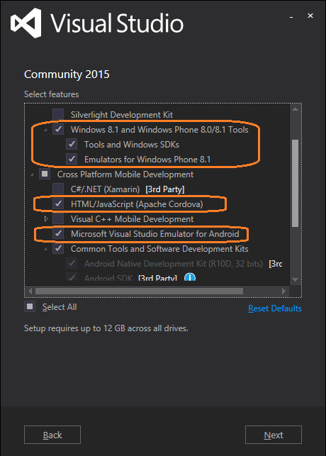
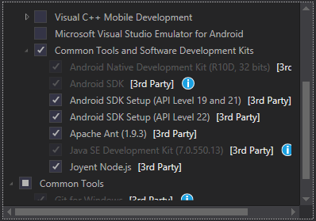
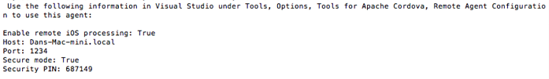
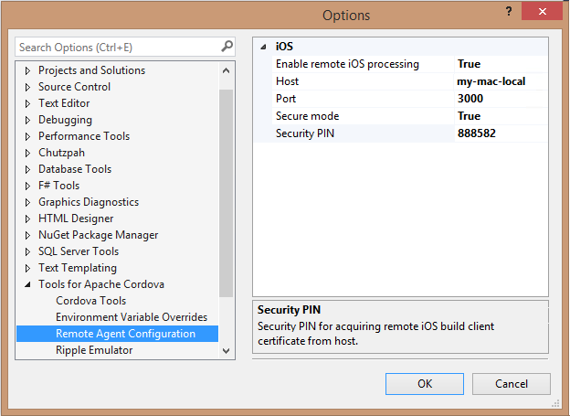

<properties
   pageTitle="Install Visual Studio Tools for Apache Cordova | Cordova"
   description="description"
   services="na"
   documentationCenter=""
   authors="normesta"
   tags=""/>
<tags
   ms.service="na"
   ms.devlang="javascript"
   ms.topic="article"
   ms.tgt_pltfrm="mobile-multiple"
   ms.workload="na"
   ms.date="09/10/2015"
   ms.author="normesta"/>
# Install Visual Studio Tools for Apache Cordova

Take advantage of the easy-to-use installer to build cross-platform apps with Visual Studio and Apache Cordova. With the installer, you don’t have to identify the required SDKs, tools, and libraries (or which versions).

## Requirements <a name="req">

Operating system requirements:

* Windows 7, Windows 8, Windows 8.1, Windows 10, or Windows Server 2012 R2.

    > **Important:** If you are using Windows 7, you can develop apps for Android and iOS, but not for Windows or Windows Phone.
To build apps for specific device platforms, there are a few additional requirements:

* iOS and the iOS Simulator require a Mac computer capable of running [Xcode 5](https://developer.apple.com/xcode/) (Xcode 6 is recommended). For additional information and installation steps, see [Install tools for iOS](#ios).

    >**Tip:** If you want to build iOS on a cloud service instead of Mac hardware, see [Build and Simulate iOS in the Cloud](build_ios_cloud.md).
* Android emulators work best on computers that [can run either Hyper-V](https://msdn.microsoft.com/en-us/library/mt228280.aspx) or the Intel HAXM driver. See [Run Your Apache Cordova App on Android](./develop-apps/run-app-apache.md).

* Windows Phone emulators require a computer that can run Hyper-V.

* Building a Windows 10 Universal Platform app requires the installation of the [Windows 10 Tools for Visual Studio](http://go.microsoft.com/fwlink/p/?LinkId=617471). Note that Windows 8.1/Phone 8.1 apps may also be deployed to Windows 10.

## Get the tools <a name="InstallTools"></a>
[Get the Visual Studio Tools for Apache Cordova](http://aka.ms/mchm38), which are included as an optional component in Visual Studio 2015. Follow the steps in the next section to install the tools.

  > **Important:** Visual Studio 2015 is recommended for developing Apache Cordova apps. If you previously installed Visual Studio 2015 Preview, a Visual Studio 2015 CTP, or Visual Studio 2015 RC, you must first uninstall it using Control Panel, Programs and Features, before installing Visual Studio 2015.

## Install the tools <a name="InstallTools"></a>

When you choose to install Visual Studio Tools for Apache Cordova, the installer for Visual Studio 2015 selects additional third-party software to install. Most of these are open-source software required by specific platforms or by Apache Cordova. You can override the default selections, and deslect software that you don’t want to install.

If not already installed, the following software will be selected by default:

* Android SDK is required for the Android build process and Ripple.

* Apache Ant 1.8.0 or later is required for the Android build process.

* 32-bit Oracle Java JDK 7 is required for the Android build process.

* Joyent Node.js enables Visual Studio to integrate with the Apache Cordova Command Line Interface (CLI) and Apache Ripple simulator.

    > **Note:** The installer does not install Google Chrome, which is required if you want to run the Apache Ripple simulator for iOS and Android, and it does not install Apple iTunes, which is required for deploying an app to an iOS device connected to your Windows PC.

* Git CLI is required only if you need to manually add Git URIs for specific Cordova plug-ins.

    > **Important:** When using Cordova 5.0.0+, you may need to add a **_JAVA_OPTIONS** environment variable that contains at least **-Xmx512M** to avoid out of memory issues when building Android. For more info, see the known issue [here](./known-issues/known-issues-android.md#strongcould-not-create-the-java-virtual-machine-errorstrong-when-building-for-android-you-may-encounter-a-set-of-errors-in-the-errors-list-like-the-following).

### To install Visual Studio Tools for Apache Cordova
1. Run the installer that you found in [Get the tools](#GetTools).

2. Follow the instructions to install Visual Studio 2015, and make sure you install the following optional features:
   * HTML/JavaScript (Apache Cordova), under Cross Platform Mobile Development.

        > **Note:** If you are installing Visual Studio 2013 instead of Visual Studio 2015 (we recommend Visual Studio 2015), the Cordova tools are installed as a [separate extension](http://go.microsoft.com/fwlink/p/?LinkId=397606).

   * Windows 8.1 and Windows Phone 8.0/8.1 Tools.

   * Microsoft Visual Studio Emulator for Android, if your development machine [supports Hyper-V](https://msdn.microsoft.com/en-us/library/mt228280.aspx).

       

     > **Note:** You can add these features to an existing installation of Visual Studio 2015\. In Control Panel, choose Programs and Features. Select Visual Studio 2015 from the list, and then choose **Change**. In the Visual Studio setup window, choose **Modify**. In the features list, select the optional features as shown in the illustration.

    If you don’t want to accept the third-party dependencies selected by default under Common Tools and Software Development Kits, you can clear the software selections and manually install the dependencies you need later.

    

    > **Important:** If the third-party dependencies are already on your system or you choose to install them manually, you might have to update your system path. See [install the dependencies manually](configure-vs-tools-apache-cordova.md#ThirdParty).

3. Reboot your computer to make sure everything is installed correctly.
4. Open Visual Studio, choose Tools, then Extensions and Updates, and then Updates. If there is a Visual Studio update available for Visual Studio Tools for Apache Cordova, install it.

    > **Note:** The first time you build an app after installing the tools, Visual Studio will download and install the Cordova tools. As a result, the first build takes extra time to complete. Check the Output window to see progress. If you see an error such as Cannot find module [modulename], you may need to clean the solution and rebuild. For more information, see [Re-installing vs-tac](configure-vs-tools-apache-cordova.md#vstac).

    If you are migrating a project from an earlier version of Visual Studio, see this [migration information](migrate-to-vs2015.md).

## Install tools for iOS <a name="ios"></a>

To build and run iOS apps on the iOS Simulator or on an iOS device using Visual Studio, you must install and configure the remote agent, [remotebuild](http://go.microsoft.com/fwlink/?LinkId=618169), on a Mac computer that meets the requirements specified below. (Currently, iOS apps can’t be built on Windows.) In Visual Studio on your PC, you must also configure the remote agent as described in this topic.

   > **Note:** For information on using cloud-hosted Mac services instead of a Mac, see [Build and Simulate iOS in the Cloud](build_ios_cloud.md). If you are running Windows on a Mac using virtualization technology, you can build and run iOS locally. For more information, see [Build a Cordova app for iOS using Parallels](./debug-and-test/run-android-emulator-on-osx-using-parallels.md).


Before you install the remote agent, make sure you have [installed the Visual Studio Tools for Apache Cordova](#InstallTools).

You can configure the agent to handle build requests and run the app on an iOS device or the iOS Simulator. To host the remote agent, the Mac computer must have the following installed:

* Mac OS X Mavericks **Xcode6** Xcode command-line tools (from Terminal app, use `xcode-select –install`)

* [Node.js](http://nodejs.org/)
  >**Note**: See known issues for updated information on Node.js.

* [Git command line tools](http://go.microsoft.com/fwlink/?LinkID=396870), if you are using a CLI from a Git repository. If the CLI version is pointed to a Git location, Git is required to build the app for iOS.

You must also have the following:

* An active iOS Developer Program account with Apple

* An iOS provisioning profile configured in Xcode (download the provisioning profile and run the downloaded `*.mobileprovision` file).

    > **Note:** For detailed information, read the [Maintaining Your Signing Identities and Certificates](https://developer.apple.com/library/ios/documentation/IDEs/Conceptual/AppDistributionGuide/MaintainingCertificates/MaintainingCertificates.html) in the iOS Developer Library.

* A signing identity configured in Xcode (choose **XCode**, **Preferences**)

    > **Note:** Visual Studio 2015 has an updated remote agent called **remotebuild**. vs-mda-remote, the previous agent, is for use with Visual Studio 2015 RC and earlier versions.

### To download and install the remote agent

1. From the Terminal app on your Mac, type:

    ```
  sudo npm install -g remotebuild
  ```

  The first command updates npm, the second command installs the remote agent, and the third command is only required if you will be using the iOS Simulator from Visual Studio.

2. If you have an older version of Node.js and npm, you may need to type the following commands before you start the remote agent, or you will encounter a permissions error when building. From the Terminal app on your Mac, type:

    ```
  sudo chown -R `whoami` ~/.npm
  ```

  This command makes sure that permissions of the npm package cache in your home directory are correctly configured (newer versions of Node.js and npm will do this for you automatically.)

  When you first start the remote agent (remotebuild), developer mode will be activated on your Mac. [Homebrew](http://brew.sh/) will also be installed, along with ideviceinstaller and ios-webkit-debug-proxy, to allow automatically running apps on devices, and to allow debugging apps on devices and on the simulator.

   > **Caution:** To install Homebrew, you need sudo (administrator) access. If you need to install remotebuild without sudo, you can install Homebrew manually in a usr/local location and add its bin folder to your path. For more information, see the [Homebrew documentation](https://github.com/Homebrew/homebrew/wiki/Installation). If you need to manually enable developer mode, type the following in the Terminal app: DevToolsSecurity –enable
If you updated your computer to a new version of Visual Studio, you must update to the current version of the remote agent as well.

### To update the remote agent
* Repeat the installation step from the previous section.

### To start the remote agent
* From the Terminal app on your Mac, type:

    ```
  remotebuild
    ```

    > **Note:** In Visual Studio 2013, the preceding command is vs-mda-remote.

  This will start the agent with a default build directory of *~/.taco\_home/remote-builds/taco-remote/builds*. Additional configurations options for the agent are described in [Configure the remote agent](configure-vs-tools-apache-cordova.md#IosConfig).

  The first time you start the agent, you will be provided with the required information to configure the agent in Visual Studio, including the host, the port, and the security PIN.

  

   > **Important:** The remote agent has been designed to securely transfer build payloads to and from Visual Studio using SSL certificates.

* If you intend to configure the remote agent in Visual Studio using the host name, ping the Mac using the host name to verify that it is reachable. Otherwise, you may need to use the IP address instead.
* If the mac is externally visible under one hostname, but internally assigns itself another hostname, you may specify the host name using the following command in the Terminal app:

    ```
  remotebuild certificates reset --hostname=my.external.hostname.com
  remotebuild certificates generate --hostname=my.external.hostname.com
    ```

  to regenerate certificates that will work with the given hostname.

  Before you can use the remote agent, you must specify the remote configuration in Visual Studio.

### To configure the remote agent for use with Visual Studio

1. If the agent is not already running on your Mac, start the remote agent.

2. On your Mac, get the host name or IP address of your Mac.

    You can get the IP address by using the **ifconfig** command.

3. On the Visual Studio menu bar, choose **Tools**, **Options**.

4. In the **Options** dialog box, open **Tools for Apache Cordova**, and then choose **Remote Agent Configuration**.

5. Set **Enable remote iOS processing** to **True**.

6. Set **Secure Mode** to **True**.

7. In the **Host**, **Port**, and **Security PIN** fields, type the values specified by the remote agent when you started it the first time. The host can be the name or IP address of your Mac. The default port is 3000.

  

  > **Note:** If you cannot ping the Mac using the host name, you may need to use the IP address.

  When you click **OK**, Visual Studio will connect to the remote agent (the agent must be running to connect).

  If you want to disable secure mode and enable simple HTTP-based connections, choose **False** as the **Secure mode** setting and start remotebuild with secure mode disabled:

    remotebuild --secure false

  If secure mode is disabled, you can leave the **Security PIN** field blank when configuring the agent in Visual Studio.

  The security PIN is for one-time use. If you need to pair a new client with the remotebuild server, see [Generate a new security PIN](configure-vs-tools-apache-cordova.md#IosPin).

#### To stop the agent

* From the Terminal app on your Mac, press Ctrl+C.

## Additional Tasks <a name="AdditionalTasks">

In some circumstances, additional steps may be required to update and configure the tools.

* If you choose not to install one or more dependencies with Visual Studio Tools for Apache Cordova, you may need to [install the dependencies manually](configure-vs-tools-apache-cordova.md#ThirdParty)

* If you need to verify the path for a third-party dependency or if you have multiple versions of a dependency installed, see [Override system environment variables](configure-vs-tools-apache-cordova.md#env-var)

* If you are running Visual Studio behind a proxy, see [Configure tools to work with a proxy](configure-vs-tools-apache-cordova.md#Proxy).

* To use and configure the remotebuild agent for building iOS apps, see the following:

    * [Generate a new security PIN](configure-vs-tools-apache-cordova.md#IosPin)
    * [Configure the remote agent](configure-vs-tools-apache-cordova.md#IosConfig)
    * [Generate a new server certificate](configure-vs-tools-apache-cordova.md#IosCert)
    * [Verify the remote agent configuration](configure-vs-tools-apache-cordova.md#IosVerify)

* If you see unexpected errors when trying to build the Blank App template, see [Re-installing vs-tac](configure-vs-tools-apache-cordova.md#vstac).

 [Get the Visual Studio Tools for Apache Cordova](http://aka.ms/mchm38) or [learn more](https://www.visualstudio.com/cordova-vs.aspx)
