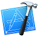
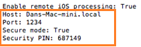
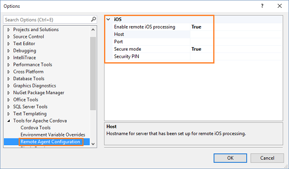
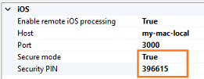
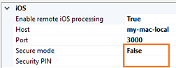
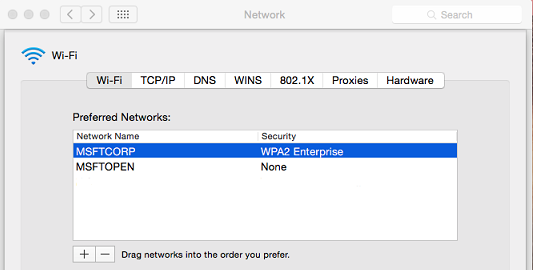
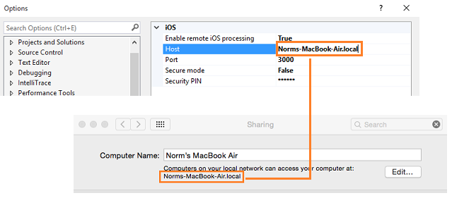

<properties
   pageTitle="Setup guide: Target iOS mobile devices in a Visual Studio Tools for Apache Cordova project | Cordova"
   description="description"
   services="na"
   documentationCenter=""
   authors="normesta"
   tags=""/>
<tags
   ms.service="na"
   ms.devlang="javascript"
   ms.topic="article"
   ms.tgt_pltfrm="mobile-multiple"
   ms.workload="na"
   ms.date="11/19/2015"
   ms.author="normesta"/>

# Setup guide: Target iOS mobile devices in a Visual Studio Tools for Apache Cordova project

If you want to build an iOS version of your app, you'll need a Mac to do it. Currently, there is no way to build an iOS app without one. You can use a physical Mac or a cloud-hosted one. Just make sure that it's running Mac OS X Mavericks or later.

In this guide, we'll help you get everything setup right so that you can build, run, and debug your app. We'll stop a few times to check and see if everything is working as expected. If something isn't behaving, we'll propose a few ideas that have worked for others.

Let's help you set things up.

## Step 1: Install a few things onto your Mac

1. Install [Node.js](http://nodejs.org/).

2. Install [Xcode](https://developer.apple.com/xcode/download/).

3. In the **Launchpad**, open **Xcode**.

   

4. Accept the license agreement and then close Xcode.

   This seems like a strange step, but our tools depend on Xcode and it won't run until you this license.

4. Open a Terminal app, and type this command.

   ```
    xcode-select -–install
   ```
   This installs the Xcode command-line tools.

4. In the Terminal app, type this command.

   ```
    sudo npm install -g remotebuild
   ```

   This installs the *remote agent*. It's a secure build server that you run on your mac. You'll connect to it from your Windows computer so that you can build, run, and debug iOS apps in Visual Studio.

## Step 2: Connect Visual Studio to the Mac

### Start the remote agent

Put the information that you got from Chuck here. If you choose to use secure mode, you'll get a pin that you'll use in Visual Studio.

#### Option 1: Start the remote agent (secure mode)

To start the remote agent in secure mode, type this command.

   ```
   remotebuild
   ```

   The agent installs [Homebrew](http://brew.sh/), and then starts. The host name, port number, and security pin appear in the Terminal app.  

   

   You'll use those pieces of information in the next section. In fact, you'll want to do that part fairly soon because the security pin is active for only 10 minutes.

#### Option 2: Start the remote agent (without secure mode)

 To start the remote agent **without** secure mode, type this command

   ```
   remotebuild --secure false
   ```

   The agent installs [Homebrew](http://brew.sh/), and then starts. The host name, and port number appear in the Terminal app.  

   You'll use those pieces of information in the next section.

### <a id="getInfo"></a>Connect Visual Studio to the remote agent

1. On your Windows computer, open Visual Studio.

2. On the Visual Studio menu bar, choose **Tools**->**Options**.

4. In the **Options** dialog box, open **Tools for Apache Cordova**, and then choose **Remote Agent Configuration**.

   

5. Add the host name and port number to the appropriate fields in this dialog box.

6. If your using secure mode, set the **Secure mode** field to **True**, and then add the security pin.

   

   If your not using secure mode, set the **Secure mode** filed to **False**, and then leave the **Security PIN** field blank.

     

5. Choose the **OK** button to close this dialog box.

   Visual Studio connects to the remote agent. If you don't receive any errors, you've successfully connected. If you do receive an error, continue to the next section and let's try a few things.

### <a id="errors">Troubleshooting: Let's fix it

[Did you receive an error that relates to your certificate?](#certificates)

[Is the host name of your Mac not resolving?](#hostname)

[Have you been told that your security PIN invalid or has expired?](#securitypin)

[Have you been told to verify that your server is running in secure mode?](#securemode)

[Are you experiencing a symptom that does not appear in this list?](#stack)

## Step 3: Build, run, and debug your app

If your coming to this topic after having building your app for a while. Start testing with a brand new blank app to make sure baseline scenarios work. If they do. It's possible that your app contains sizable plugins or some other aspect that is causing issues.

In this section we'll test a number of scnearios just to make sure your environment is setup right.
We'll test on an emulator, test on a device connected to your mac, and test on a device connected to your windows machine.

### Try an emulator

### Try a device connected to your mac

Connect to mac. With XCode 7, you should be able to do this without a developer account and provisioning profile.

### Try a device connected to your Windows computer

Put Leo's cool stuff in here.

### Did something go wrong? Try these things

- Check to see that you have XCode installed. If you accepted the blah prompt, you'll install the command-line tools but not XCode. Go to blah and install it. Then, open XCode to accept the license agreement and restart remoteBuild.

- If you install XCode from this prompt. exit remoteBuild, open XCode and accept the license agreement. Then restart remotebuild.

- Your computer went to sleep and the network that your PC has connected to is different than your corporate network. Change the preferred networks

- Still not working? Let us know? add a DISCUSS comment below.

- Ensure that you are targetting a version of Cordova that is supported by remoteBuild. The earliest version you can use is 4.3. Open your Config.xml and make sure that your CLI version is higher. Link folks to the CLI upgrade topic that I plan to write so that they can evaluate the risks. Link to stack question where I learned about this - http://stackoverflow.com/questions/33844896/vs-2015-tools-for-apache-cordova-ios-remote-build-not-using-buildserver

If build hangs or does not execute - make sure that your node.js version and Cordova version are compatable. Here is link to the known issues article - http://taco.visualstudio.com/en-us/docs/known-issues-general/#strongbuild-hangs-or-does-not-execute-when-building-for-ios-with-cordova-lt-533-and-nodejs-400strong and a link to the stack article - http://stackoverflow.com/questions/33791687/ios-remote-build-fails-in-visual-studio-taco

## Step 4: Stop the remote agent

In the Terminal app on your Mac, press Ctrl+C.

#### Build and run your iOS app

When you're ready to build and run your iOS app, see any of these guides:

* [Run your Apache Cordova app on iOS](./develop-apps/run-app-ios.md).

* [Build and Simulate iOS in the Cloud](build_ios_cloud.md).

* [Build a Cordova app for iOS using Parallels](./debug-and-test/run-android-emulator-on-osx-using-parallels.md)

## Troubleshooting: Let's fix it

### <a id="certificate">Did you receive an error that relates to your certificate?

This can happen when Visual Studio has trouble finding your Mac on the network.

On your Windows computer, open a **Command Prompt**, and *ping* the IP address of your Mac. For example, if the IP address of your mac is 10.83.51.174, you'd type ```ping 10.83.51.174```.

If you don't receive any return messages in the **Command Prompt** window, your Mac and your Windows computer might be connected to different networks.

This can happen sometimes when your company has more than one Wi-Fi network.  When a Mac wakes from a sleep, it connects to the first available Wi-Fi network. That might not be the network of your Windows computer.

This image shows a preferred order of Wi-Fi networks.



The **MSFTCORP** Wi-Fi network appears first. When this Mac wakes from a sleep, it will to it.

The network that is used by your Windows Computer should appear first in this list. Otherwise, you'll experience these issues intermittently.

Still not working? Reach out to us [here](http://stackoverflow.com/questions/tagged/visual-studio-cordova).

If you've resolved this problem another way, please share it in a comment.

[Go back up](#errors)

### <a id="hostname">Is the host name of your Mac not resolving?

First, make sure that the **Host** name in Visual Studio matches computer name in the in the **Sharing** settings of your Mac.



Alternatively, you can set the **Host** name in Visual Studio to the IP address that appears in the **Network** settings of your Mac.

-- show image here - need to get that from work.

Still not working? Reach out to us [here](http://stackoverflow.com/questions/tagged/visual-studio-cordova).

If you've resolved this problem another way, please share it in a comment.

[Go back up](#errors)

### <a id="securitypin">Have you been told that your security PIN is invalid or has expired?

This can happen the first time you set things up. When you first start the remote agent, your security PIN is good for only 10 minutes. then it expires. Just generate a new one.

1. First, stop the remote agent. On your Mac, open a Terminal app, and type CTRL+C to stop it.

2. In the Terminal app, type ```remotebuild certificates generate```.

    Your new security PIN appears in the Terminal app window. Add that PIN to the **Security PIN** field in Visual Studio.

    If this doesn't work, return to your Mac and in the Terminal app, type ```remotebuild certificates reset``` and then type ```remotebuild certificates generate``` to get another PIN number.

Still not working? Reach out to us [here](http://stackoverflow.com/questions/tagged/visual-studio-cordova).

If you've resolved this problem another way, please share it in a comment.

[Go back up](#errors)

### <a id="securemode">Have you been told to verify that your server is running in secure mode?

Restart Visual Studio. Seems ridiculous, but some have reported that this issue disappears after restarting Visual Studio.

Still not working? Reach out to us [here](http://stackoverflow.com/questions/tagged/visual-studio-cordova).

If you've resolved this problem another way, please share it in a comment.

[Go back up](#errors)

### <a id="stack">Are you experiencing a symptom that does not appear in this list?

Please reach out to us [here](http://stackoverflow.com/questions/tagged/visual-studio-cordova) or start a discussion at the bottom of this topic.

[Go back up](#errors)

## Not sure I need bucket

# Install these things on your Mac


* [Apple iTunes](http://www.apple.com/itunes/).

You'll also need these things.

* An active [Apple Developer Program](https://developer.apple.com/programs/enroll/).

* An [iOS provisioning profile](https://developer.apple.com/library/ios/documentation/IDEs/Conceptual/AppDistributionGuide/MaintainingProfiles/MaintainingProfiles.html#//apple_ref/doc/uid/TP40012582-CH30-SW61) that you [download ](https://developer.apple.com/library/ios/documentation/IDEs/Conceptual/AppDistributionGuide/MaintainingProfiles/MaintainingProfiles.html#//apple_ref/doc/uid/TP40012582-CH30-SW26) in Xcode.

* A signing identity that you [configure ](https://developer.apple.com/library/ios/documentation/IDEs/Conceptual/AppDistributionGuide/MaintainingCertificates/MaintainingCertificates.html#//apple_ref/doc/uid/TP40012582-CH31-SW4) in Xcode.

### Configure npm package cache permissions

If you have an older version of Node.js and npm, type this command:

```
sudo chown -R `whoami` ~/.npm
```

Newer versions of Node.js and npm will automatically configure the permissions of the npm package cache in your home directory.

If you pass this don't worry, you can reinstall the command-line tools by doing this:

To install these, open a Terminal app on your Mac, and type this command: ```xcode-select -–install```.
