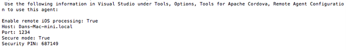
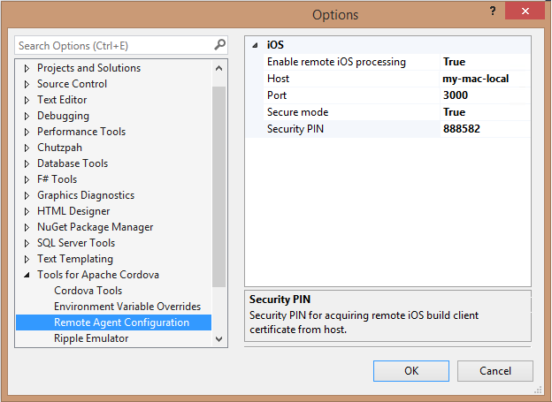

<properties
   pageTitle="Setup guide: Target iOS mobile devices in a Visual Studio Tools for Apache Cordova project | Cordova"
   description="description"
   services="na"
   documentationCenter=""
   authors="normesta"
   tags=""/>
<tags
   ms.service="na"
   ms.devlang="javascript"
   ms.topic="article"
   ms.tgt_pltfrm="mobile-multiple"
   ms.workload="na"
   ms.date="11/19/2015"
   ms.author="normesta"/>

# Setup guide: Target iOS mobile devices in a Visual Studio Tools for Apache Cordova project

If you want to build a version of your app for iOS devices, you'll need a Mac to do it. Currently, there is no way to build an iOS app without one. You can use a physical Mac or a cloud-hosted one. Just make sure that it's running Mac OS X Mavericks. Then, on your Mac, install these things.

* [Xcode](https://developer.apple.com/xcode/download/).

* The Xcode command-line tools.

    To install these, open a Terminal app on your Mac, and type this command: ```xcode-select -–install```.

* [Node.js](http://nodejs.org/).

* [Apple iTunes](http://www.apple.com/itunes/).

You'll also need these things.

* An active [Apple Developer Program](https://developer.apple.com/programs/enroll/).

* An [iOS provisioning profile](https://developer.apple.com/library/ios/documentation/IDEs/Conceptual/AppDistributionGuide/MaintainingProfiles/MaintainingProfiles.html#//apple_ref/doc/uid/TP40012582-CH30-SW61) that you [download ](https://developer.apple.com/library/ios/documentation/IDEs/Conceptual/AppDistributionGuide/MaintainingProfiles/MaintainingProfiles.html#//apple_ref/doc/uid/TP40012582-CH30-SW26) in Xcode.

* A signing identity that you [configure ](https://developer.apple.com/library/ios/documentation/IDEs/Conceptual/AppDistributionGuide/MaintainingCertificates/MaintainingCertificates.html#//apple_ref/doc/uid/TP40012582-CH31-SW4) in Xcode.

### Install the remote agent

The *remote agent* is a secure build server that you can use to build, run and debug apps on your Windows PC by connecting to a Mac.

In the Terminal app, type this command:

```
  sudo npm install -g remotebuild
```

### Configure npm package cache permissions

If you have an older version of Node.js and npm, type this command:

```
sudo chown -R `whoami` ~/.npm
```

Newer versions of Node.js and npm will automatically configure the permissions of the npm package cache in your home directory.

### Start the remote agent

In the Terminal app, type this command:

  ```
  remotebuild
  ```
This starts the agent with a default build directory of *~/.taco\_home/remote-builds/taco-remote/builds*.

If you want to change this, see [Configure the remote agent](configure-vs-tools-apache-cordova.md#IosConfig).

This command also activates the developer mode on your Mac, and installs all of the software that you need to run and debug your iOS app.

One of those items is [Homebrew](http://brew.sh/) and it'll install only if you're running the Terminal app with sudo (administrator) access.

If you had to install and start the remote agent without using sudo, you'll have to install Homebrew manually. See the [Homebrew documentation](https://github.com/Homebrew/homebrew/wiki/Installation) for guidance.

### <a id="getInfo"></a>Get the information that you need to configure Visual Studio

After you start the remote agent, some information such as the host, port, and security pin appear in the Terminal app. You'll add this information to configuration settings in Visual Studio so that Visual Studio use SSL certificates to securely transfer build payloads to and from Visual Studio.



If you want to use the host name instead of the IP address, open a Command Prompt on your Windows computer and "ping" the Mac by using that host name.  If you're unable to reach the Mac by using that host name, consider using the IP address instead.

Sometimes a Mac is externally visible under one hostname, but internally assigns itself a different hostname. If this is the case with your Mac, you can regenerate certificates that  work with the externally visible hostname by using these commands in the Terminal app of your Mac:

```
  remotebuild certificates reset --hostname=my.external.hostname.com
  remotebuild certificates generate --hostname=my.external.hostname.com
```
> **Note** These commands aren't supported with older versions of the remote agent. If you're using an older version of the remote agent, install the remote agent again to get the most recent version.

### Configure the remote agent for use with Visual Studio

1. On the Visual Studio menu bar, choose **Tools**, **Options**.

4. In the **Options** dialog box, open **Tools for Apache Cordova**, and then choose **Remote Agent Configuration**.

4. Set the values of each field. The following table describes each field.

    <table>

     <tbody>
       <tr>
           <th><strong>Field</strong></th>
           <th><strong>Value</strong></th>
       </tr>
       <tr>
           <td><strong>Enable remote iOS processing</strong></td>
           <td><strong>True</strong></td>
       </tr>
       <tr>
           <td><strong>Secure Mode</strong></td>
           <td><strong>True</strong>
           <p>If you'd rather use simple HTTP-based connections, you can leave the <strong>Security PIN</strong> field blank and set <strong>Secure mode</strong> to <strong>False</strong>.
           <p>If you do this, you'll have to start remotebuild again to disable secure mode. In the Terminal app on your Mac, type:
           <i>remotebuild --secure false</i>.
           </p>
           </p></td>
       </tr>
       <tr>
           <td><strong>Host</strong></td>
           <td>Use the host name that you obtained in the [Get the information that you need to configure Visual Studio](#getInfo) section, or use the IP address of your Mac.</td>
       </tr>
       <tr>
           <td><strong>Port</strong></td>
           <td>Use the port that you obtained in the [Get the information that you need to configure Visual Studio](#getInfo) section.</td>
       </tr>
       <tr>
           <td><strong>Security PIN</strong></td>
           <td>Use the security pin that you obtained in the [Get the information that you need to configure Visual Studio](#getInfo) section.
           <p>
           You can use the security PIN for only one client. If you want to pair another client with the remotebuild server on your Mac, see [Generate a new security PIN](configure-vs-tools-apache-cordova.md#IosPin).
           <p></td>
       </tr>
     </tbody>
    </table>

    Your fields will look something like this:

    

8. Choose the **OK** button.

   Visual Studio connects to the remote agent (the agent must be running to connect).

### Stop the remote agent

In the Terminal app on your Mac, press Ctrl+C.

#### Build and run your iOS app

When you're ready to build and run your iOS app, see any of these guides:

* [Run your Apache Cordova app on iOS](./develop-apps/run-app-ios.md).

* [Build and Simulate iOS in the Cloud](build_ios_cloud.md).

* [Build a Cordova app for iOS using Parallels](./debug-and-test/run-android-emulator-on-osx-using-parallels.md)

## Did something go wrong with your installation? <a name="AdditionalTasks">

Perhaps you're running Visual Studio behind a proxy or you have multiple versions of a third-party components installed on your computer, and you need to take a closer look at the environment variables to see what path is being used for these components.

For a more comprehensive guide to configuring Visual Studio Tools for Apache Cordova and all of the third-party dependencies, see [Configure the Visual Studio Tools for Apache Cordova](configure-vs-tools-apache-cordova.md).
