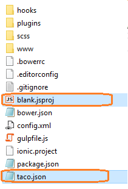
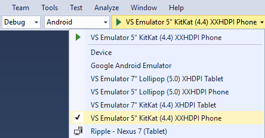
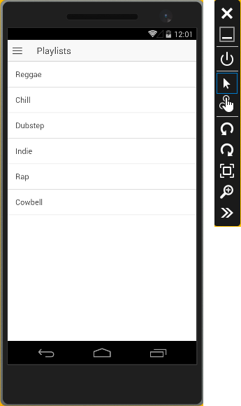
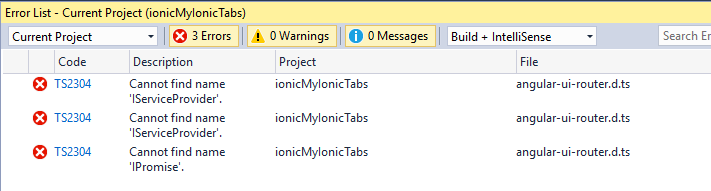
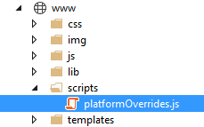
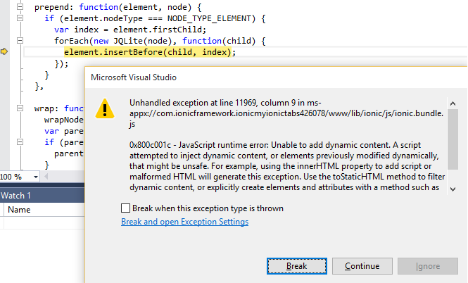

<properties pageTitle="Getting started with Ionic apps in Visual Studio"
  description="This is an article on ionic tutorial"
  services=""
  documentationCenter=""
  authors="mikejo5000" />
  <tags
     ms.service="na"
     ms.devlang="javascript"
     ms.topic="article"
     ms.tgt_pltfrm="mobile-multiple"
     ms.workload="na"
     ms.date="09/10/2015"
     ms.author="mikejo"/>

# Get started with Ionic apps in Visual Studio
[Ionic](http://www.ionicframework.com) is a popular front-end JavaScript framework for developing cross-platform mobile apps using Cordova. You can use Visual Studio 2015 and the Ionic CLI to easily create and debug cross-platform apps.

>**Note**: For a video walkthrough that shows similar steps, see the [Video tutorial] (http://go.microsoft.com/fwlink/p/?LinkID=534728).

## Set up your machine for Ionic with VS <a name="getStarted"></a>

To follow these steps, you must:

1. [Install Visual Studio 2015] (http://go.microsoft.com/fwlink/?LinkID=533794) with Visual Studio Tools for Apache Cordova.
2. Make sure your Visual Studio setup is correct by creating and running the default Blank App template.
    * In Visual Studio, choose **File**, **New**, **Project**, **JavaScript**, **Apache Cordova Apps**, **Blank App** and name the new project "blank".
    * Choose **Windows** > **Local Machine** and press F5 to run the app (make sure the app loads correctly). If any issues occur, see [Configure the Tools] (configure-vs-tools-apache-cordova.md).  
3. [Install the Ionic CLI] (http://ionicframework.com/docs/cli/install.html).

  ~~~~~~~~~~~~~~~~~~~~~~~~~~~~
  npm install -g ionic
  ~~~~~~~~~~~~~~~~~~~~~~~~~~~~

## Get the Ionic starter app templates <a name="getTemplates"></a>

1. Make sure you installed the Ionic CLI, then open a command line.
2. Go to the directory where you want to install the Ionic starter app templates, such as the Documents folder.

  ~~~~~~~~~~~~~~~~~~~~~~~~~~~~
  C:\\Users\<username>\Documents\ionicMySideMenu>
  ~~~~~~~~~~~~~~~~~~~~~~~~~~~~

3. In the command line, type

  ~~~~~~~~~~~~~~~~~~~~~~~~~~~~
  ionic start ionicMySideMenu sidemenu
  ~~~~~~~~~~~~~~~~~~~~~~~~~~~~

  Ionic creates the project in your current folder.
4. Use the same command to install more templates, such as:

  ~~~~~~~~~~~~~~~~~~~~~~~~~~~~
  ionic start ionicMyView view
  ionic start ionicMyTabs tabs
  ionic start ionicMySlide slide
  ~~~~~~~~~~~~~~~~~~~~~~~~~~~~

## Modify the project to work with VS <a name="configTemplates"></a>

For each of the Ionic starter app templates that you installed and want to run, do this:

1. In Windows, open the folder where you created the Blank App project (which you named "blank" in the previous steps).
2. Copy blank.jsproj and taco.json from this folder to the Ionic starter template folder (for example, ionicMySideMenu).

  

    >**Note**: You may want to rename blank.jsproj to ionicMySideMenu.jsproj (or to the name of your starter template project).

3. In the Ionic starter template folder, open the .jsproj file. It will open in Visual Studio 2015.
  Wait for Bower/NPM updates to the project to finish, if necessary.
4. Save the project to create a Visual Studio solution File (.sln).

## Get your app running on Android <a name="configAndroid"></a>

1. If you want to use the Ionic CLI to add the Android platform, use this command in the command line:

  ~~~~~~~~~~~~~~~~~~~~~~~~~~~~
  ionic platform add Android
  ~~~~~~~~~~~~~~~~~~~~~~~~~~~~

  Or, you can add the platform by building in VS (choose **Build** > **Build Solution**).
2. Choose **Android** as a debug target (Solution Platforms list), and to get the app running choose a target such as Ripple (Chrome required) or the **VS Emulator 5" KitKat (4.4)** (Hyper-V required).

  

3. Press F5, and the app should load correctly.

  

  >**Note**: If you have previously run the VS Emulator for Android and you have errors, try deleting the emulator VM instance in Hyper-V Manager. Otherwise, if you have errors see [Troubleshooting] (https://msdn.microsoft.com/en-us/library/mt228282(v=vs.140).aspx).

4. In some of the Ionic starter app templates, you may need to replace this line in app.js:

  ~~~~~~~~~~~~~~~~~~~~~~~~~~~~
  if (window.cordova && window.cordova.plugins.Keyboard) {
  ~~~~~~~~~~~~~~~~~~~~~~~~~~~~

  with this line, to prevent a runtime error:

  ~~~~~~~~~~~~~~~~~~~~~~~~~~~~
  if (window.cordova && window.cordova.plugins &&
    window.cordova.plugins.Keyboard) {
  ~~~~~~~~~~~~~~~~~~~~~~~~~~~~

5. In some of the Ionic starter app templates, you may also need to remove the TypeScript file, angular-ui-router.d.ts, for the angular-ui-router module, or you may see this error.



  > **Note** If you are using TypeScript, you need to get updated d.ts files or an updated version of the template to support the routing module.

## Get your app running on iOS <a name="configiOS"></a>

  You can run initially on the Ripple Emulator after selecting iOS as a debug target, but for detailed info on setting up the remotebuild agent for iOS, see [this topic] (install-vs-tools-apache-cordova.md#ios).

  The Ionic starter app should run correctly on iOS when the remotebuild agent is running on a Mac, and when VS is configured to connect to it. (The complete steps are outside the scope here.)

## Get your app running on Windows <a name="configWindows"></a>

1. Open the folder for the Blank App project and copy the merges folder (and its contents) to your Ionic project. Copy the folder under the top level folder (e.g., under ionicMySideMenu folder). When you complete the next few steps, you will resolve errors loading partial pages by using the winstore-jscompat.js shim.
2. In the Ionic project, create a **scripts** folder under www, and copy platformOverrides.js from the Blank App project's `www\scripts` folder to the new scripts folder.

  

3. In the Ionic project, add the following script reference to index.html, just before the Ionic Framework reference (before the ionic.bundle.js reference):

  ```
  <script src="scripts/platformOverrides.js></script>
  ```

  >**Note**: You can use the js folder instead of scripts, but the folder and path will need to be updated in several other files.

4. Select **Windows** or **Windows Phone (Universal)** as a debug target (Solution Platforms list).
  * For Windows, choose **Local Machine** as the deployment target.
  * For Windows Phone 8.1, choose one of the Emulator 8.1 options.
5. Press F5 to start debugging.

  > **Note**: If you see the TypeScript error or the Keyboard plugin error, see the previous steps for Android to resolve.

## Having issues trying to run on Windows? <a name="win10tips"></a>

When debugging on a Windows 8.1 dev machine, you may get a WWAHost runtime error when navigating between pages in Ionic apps. You can work around this by:
* Closing DOM Explorer before navigating pages.
* Upgrading to Windows 10 on your dev machine (issue is fixed in Win10).

To target Windows 10 in the app, you need to:
* Use VS install program to install the **Universal Windows App Development Tools** (optional software).
* In the configuration designer, select Cordova 5.1.1 and, in the Windows tab, choose **Windows 10**.

However, if you target Windows 10 in the app, note that you may get errors loading partial pages in Ionic apps, such as this unhandled exception.



If you see this error when targeting Win/WinPhone 8.1, follow the earlier steps to call platformOverrides.js to fix this issue. When targeting Windows 10, this fix currently requires another update to the compatibility shim or a platform bug fix.
