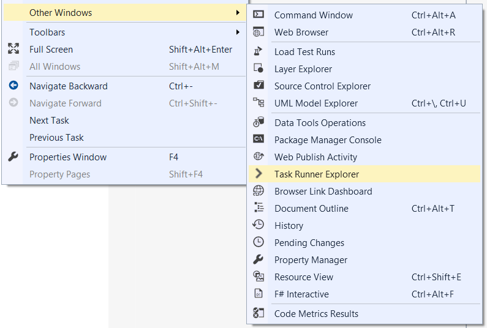
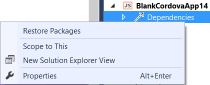

<properties pageTitle="Build a Cordova project by using Gulp"
  description="Build a Cordova project by using Gulp"
  services=""
  documentationCenter=""
  authors="clantz" />

#<a name="ci"></a>Build a Cordova project by using Gulp
[Gulp](http://go.microsoft.com/fwlink/?LinkID=533803) is an increasingly popular JavaScript based task runner with a large number of [useful plugins](http://go.microsoft.com/fwlink/?LinkID=533790) designed to automate common tasks for everything from compilation, to packaging, deployment, or simply copying files around. Both Gulp and the [Apache Cordova Command Line interface](http://go.microsoft.com/fwlink/?LinkID=533773) (CLI) are Node.js based which makes the two highly complementary technologies.

Because it can run on Windows or OSX, Gulp can be extremely useful as a unified cross-platform build language for automating and testing your builds in a team / continuous integration (CI) environment such as Team Foundation Services 2015 or Visual Studio Online. You might also prefer to use a Gulp-based workflow rather than using the Cordova CLI itself.

For specifics on using Gulp with TFS 2015, see the  [abridged tutorial on specifics building Cordova apps using Gulp and TFS 2015 or Visual Studio Online](http://go.microsoft.com/fwlink/?LinkID=691186). Be aware that [TFS 2013 requires a different approach](./tutorial-team-build/tfs2013.md) because MSBuild must be the primary build language.

##Using cordova-lib from Gulp
The Cordova CLI internally uses a node module called cordova-lib that encapsulates all of the CLI's core functionality in a series of JavaScript APIs. This module is also released as an npm package at the same time the Cordova CLI is released. It is therefore relatively straight forward to use cordova-lib directly from a Gulp script.

For example, this is a sample **gulpfile.js** that you can place in the root of your Cordova project that will build a release version of the Android platform:

```typescript
var gulp = require("gulp"),
    cordova = require("cordova-lib").cordova;

gulp.task("default", function (callback) {
	cordova.build({
    	"platforms": ["android"],
    	"options": ["--release","--gradleArg=--no-daemon"]
    }, callback);
});
```

Note that cordova-lib functions **are asynchronous** and so you need to include the Gulp callback function passed into your task as an argument to your last API call. Note that "--gradleArg=--no-daemon" above should be added in for build automation scenarios since Cordova starts up a daemon process by default that can cause your build to appear to hang.

To see the example above in action you will need to install some additional npm packages. Create a simple [package.json](http://go.microsoft.com/fwlink/?LinkID=533781) file with a minimum of the following in it that is in the root of your Cordova project:

```json
{
    "devDependencies": {
        "gulp": "latest",
        "cordova-lib": "4.3.1"
    }
}
```

Next, execute following commands in the command line at the your project root:

```
npm install -g gulp
npm install
gulp
```

The "npm install -g gulp" command will install the Gulp command line interface and add it to your path while the "npm install" command will install the "devDepenencies" listed above in a node_modules folder for use in your gulp script. These two commands are only required if you need to install new dependencies that were added to package.json by hand or are installing Gulp globally for the first time.

You can also quickly execute Gulp tasks from the Task Runner Explorer right from Visual Studio. Simply go to View \> Other Windows \> Task Runner Explorer to bring it up for use.



Even better, all you need to do to install dependencies you add to package.json is to right-click on the Dependencies node in the Solution Explorer and select "Restore Packages".



Note that the **"cordova" and "cordova-lib" npm package version numbers do not match for CLI 3.6.3 or earlier**. If you need to target these older Cordova versions, you can instead reference the "cordova" npm package in your package.json file and edit the require statement in the above Gulp script as follows:

```javascript
var gulp = require("gulp"),
    cordova = require("cordova");
```

It is important to note that there are a number of additional considerations to bear in mind when trying to create a complete automated build script that are covered broadly [in this tutorial](./tutorial-team-build/tutorial-team-build-readme.md). Rather than focusing on these details, we'll go over how to use Gulp to build a number of different platforms at once using a fairly simple helper node module. You can find the module along with a sample gulpfile.js and package.json in [this Git repository](http://go.microsoft.com/fwlink/?LinkID=533736).

##The taco-team-build Node Module
The [taco-team-build](http://go.microsoft.com/fwlink/?LinkID=533736) node module is designed to help alleviate [common problems](./tutorial-team-build/tutorial-team-build-readme.md) when building Cordova projects from the command line particularly in a team or CI environment. It can be used with any number of build systems including Jake, Grunt, and Gulp or even a command line tool. Here we will focus on how to set it up and use it with Gulp. You can see documentation on the module's methods in [its Git repository](http://go.microsoft.com/fwlink/?LinkID=533736).

The easiest way to get started is to simply place the contents of the **samples/gulp** folder in the repository in the root of your Cordova project. No other files in the repository are required.

Otherwise you can follow these steps:

1.  Add a package.json to the root of your project with at least the following
    contents:
```json
    {
        "devDependencies": {
	        "gulp": "latest",
	        "taco-team-build": "latest"
        }
    }
```

     This will install the taco-team-build npm package from the GitHub repository when "npm install" is executed. Note that you may also opt to use the node module from inside your project so you can modify it. To do this, you can simply add taco-team-build.js to the root of your project and require “./taco-team-build” instead of “taco-team-build” in gulpfile.js.

2.  Create a gulpfile.js file in the root of your project if you do not already have one. We'll cover what goes in it in the next section.

Next, use the Visual Studio Task Runner Explorer to run your newly created task or execute the same command line operations described previously:
```
npm install -g gulp
npm install
gulp
```

###The Gulp Script
As described in the previous section, you will need to include a gulpfile.js file in your project. At its simplest, this is all you need to do to use Gulp to build and package your app using this module.

```javascript
var gulp = require("gulp"),
cordovaBuild = require("taco-team-build");

gulp.task("default", function () {
    return cordovaBuild.buildProject("android", ["--release", "--gradleArg=--no-daemon"])
        .then(function() { return cordovaBuild.packageProject("android"); });
});
```

Underneath the covers, the script will do the following:

1.  First, it check **taco.json** to see if a Cordova version is specified. If not, it assumes you want Cordova 5.1.1.

2.  Next, it checks to see if this version of cordova-lib has already been installed at a location set in the **CORDOVA\_CACHE** environment variable. If no CORDOVA_CACHE environment variable is set, the cache location will default to %APPDATA%\\cordova-cache on Windows and ~/.cordova-cache on OSX. You can also set this location programmatically using the module's configure method.

3.  If the correct version of cordova-lib is not present in the cache location, it download and installs it.

4.  It then performs the following operations:
    1.  Adds the sample [Visual Studio Tools for Apache Cordova CLI Support Plugin](http://go.microsoft.com/fwlink/?LinkID=533753) to the project if it is not already present.
	2.  Adds the specified platform to the project.
    3.  Builds the project.
    4.  Packages the project.

Each method returns a promise so that you can chain the steps or run them concurrently.

You may find it useful to create a script that will automatically build all of the platforms your project supports across OSX and Windows. This is extremely useful for team build scenarios where you want to be able to check in a single script that automates all of your build steps including TypeScript compilation.

Here is an enhanced script that provides you with this flexibility:

```javascript
var gulp = require("gulp"),
	cordovaBuild = require("taco-team-build");

var winPlatforms = ["android", "windows", "wp8"],
	osxPlatforms = ["ios"],
	buildArgs = {
		android: ["--release", "--device", "--gradleArg=-no-daemon"],
		ios: ["--release", "--device"],
		windows: ["--release", "--device"],
		wp8: ["--release", "--device"]
	}

// "Darwin" is the platform name returned for OSX.
var platformsToBuild = process.platform == "darwin" ? osxPlatforms : winPlatforms;

gulp.task("default", ["package"], function () {
	// Copy results to bin folder
	gulp.src("platforms/android/ant-build/*.apk").pipe(gulp.dest("bin/release/android"));
	gulp.src("platforms/android/bin/*.apk").pipe(gulp.dest("bin/release/android"));
	gulp.src("platforms/windows/AppPackages/**/*").pipe(gulp.dest("bin/release/windows/AppPackages"));
	gulp.src("platforms/wp8/bin/Release/*.xap").pipe(gulp.dest("bin/release/wp8"));
	gulp.src("platforms/ios/build/device/*.ipa").pipe(gulp.dest("bin/release/ios"));
});

gulp.task("build", function () {
	return cordovaBuild.buildProject(platformsToBuild, buildArgs);
});

gulp.task("package", ["build"], function () {
	return cordovaBuild.packageProject(platformsToBuild);
});
```

Again, note that "--gradleArg=--no-daemon" above should be added in for build automation scenarios since Cordova starts up a daemon process by default that can cause your build to appear to hang. You may also wish to update the script with TypeScript compilation if you are using the language in your app.  See the [Gulp TypeScript tutorial](http://go.microsoft.com/fwlink/?LinkID=533769) for details.

##Configuring a Team / CI Build Server
If you haven't already, you'll need to set up your build server with all of the necessary native dependencies for the platforms you intend to build. See “Installing Dependencies” in the [Building Cordova Apps in a Team / Continuous Integration Environment](./tutorial-team-build/tutorial-team-build-readme.md) tutorial for details.

While each build server is slightly different in terms of how you configure tasks, all you will need to do is configure it to run the following two commands:

```
npm install
./node_modules/.bin/gulp
```

You should then set an environment variable called **CORDOVA_CACHE** that points to the location on your build server that you would like to use to cache multiple versions of cordova-lib and Cordova platforms.

See the [Team Foundation Services 2015](./tutorial-team-build/tfs2015.md) tutorial for a specific example.

##Adding Other Dependencies
Adding additional dependencies is simple from Visual Studio. VS will also **automatically** install any package added to the "devDependencies" list in package.json when you save the file.

You can also install any additional dependencies and update package.json using the “--save” flag when calling "npm install" from the command line. For example, this command will add the [uglify Gulp plugin](http://go.microsoft.com/fwlink/?LinkID=533793) as a dependency:

```
npm install --save-dev gulp-uglify
```

## More Information
* [Learn more about using Gulp with your Cordova projects](tutorial-gulp-readme.md)
* [Read tutorials and learn about tips, tricks, and known issues](../cordova-docs-readme.md)
* [Download samples from our Cordova Samples repository](http://github.com/Microsoft/cordova-samples)
* [Follow us on Twitter](https://twitter.com/VSCordovaTools)
* [Visit our site http://aka.ms/cordova](http://aka.ms/cordova)
* [Ask for help on StackOverflow](http://stackoverflow.com/questions/tagged/visual-studio-cordova)
