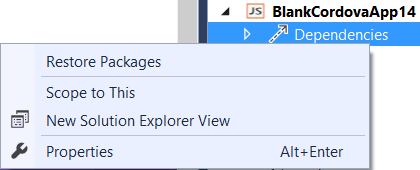

<properties pageTitle="Compile TypeScript by using Gulp"
  description="Compile TypeScript by using Gulp"
  services=""
  documentationCenter=""
  authors="Chuxel" />

#<a name="ts"></a>Compile TypeScript by using Gulp
> **Important:** This tutorial is part of a series on [using Gulp with Tools for Apache Cordova projects](http://go.microsoft.com/fwlink/?LinkID=533767) in Visual Studio 2015 and does not apply to Visual Studio 2013 CTPs.

[Gulp](http://go.microsoft.com/fwlink/?LinkID=533803) is an increasingly popular JavaScript based task runner with a large number of [useful plugins](http://go.microsoft.com/fwlink/?LinkID=533790) designed to automate common "tasks" for everything from compilation, to packaging, deployment, or simply copying files around.

If you're using TypeScript in your Cordova app project, you'll want to compile it in your team / CI build environment. You also might want to compile your TypeScript code from the command line rather than Visual Studio. Fortunately this is straight forward to do with a Gulp plugin.

See the ["Using Gulp to Build Cordova Projects" tutorial](gulp-ci.md) for the basics on using Gulp with Cordova. Next, follow these steps:

1.  Add [gulp-typescript](http://go.microsoft.com/fwlink/?LinkID=533748) as a devDependency in a [package.json](http://go.microsoft.com/fwlink/?LinkID=533781) file in the root of you project. If you already have a package.json file, type the following from the command line in your project folder:
```
    npm install --save-dev gulp-typescript
```

    This will install the "gulp-typescript" plugin and update package.json. For example:
```json
    {
        "devDependencies": {
            "gulp": "latest",
            "gulp-typescript": "latest"
            "taco-team-build": "http://aka.ms/tacoteambuild-rel"
    	}
    }
```

    You can also manually edit package.json from Visual Studio and then install the dependency by right-clicking on the Dependency node in the Solution Explorer and selecting "Restore Packages."

    

2.  Add the following task to gulpfile.js:

    ```javascript
      var ts = require("gulp-typescript");

      gulp.task("scripts", function () {
        // Compile TypeScript code
        gulp.src("scripts/**/*.ts")
        	.pipe(ts({
            	noImplicitAny: false,
                noEmitOnError: true,
                removeComments: false,
            	sourceMap: true,
                out: "appBundle.js",
                target: "es5"
    		}))
    		.pipe(gulp.dest("www/scripts"));
    });
    ```    

    You could also use a tsconfig.json file (like the default VS template) and add the following instead:


    ```javascript
    var ts = require("gulp-typescript"),
        fs = require("fs"),
        tsconfigPath = "scripts/tsconfig.json";

    gulp.task("scripts", function () {
        // Compile TypeScript code
        if (fs.existsSync(tsconfigPath)) {
            gulp.src("scripts/**/*.ts")
                .pipe(ts(ts.createProject(tsconfigPath)))
                .pipe(gulp.dest("."));
        }
    });

    ```

    Either of these code snippets will compile anything that is in the **scripts** folder in the root of your Cordova project, and then copy them as a single JavaScript file called *appBundle.js* under the **www/scripts** folder. You should update this with the location of all of the TypeScript files you want compiled. You can add an array of locations to compile as follows:

    ```
	gulp.src(["scripts/**/*.ts","www/typescript/**/*.ts"])
    ```

4.  You should also update "build" related tasks to run the "scripts" task is first.

```javascript
    gulp.task("build", ["scripts"], function () {

    ...
```

The **samples/gulp** folder in [this Git repository](http://go.microsoft.com/fwlink/?LinkID=533736) contains a sample gulpfile.js and package.json with TypeScript that is already configured for you to use.

##TypeScript Command Line File Watcher
You might find it useful to set up a "file watcher" that automatically compiles your TypeScript code whenever you make an edit and save the file. Gulp's "watch" feature makes this easy to do.

```javascript
gulp.task("watch", ["scripts"], function () {
    gulp.watch("scripts/**/*.ts", ["scripts"]);
});
```

You then can start up the watcher by simply typing the following from the command line if you have installed Gulp globally (npm install -g gulp):

```
gulp watch
```

## More Information
* [Learn more about using Gulp with your Cordova projects](tutorial-gulp-readme.md)
* [Read tutorials and learn about tips, tricks, and known issues](../cordova-docs-readme.md)
* [Download samples from our Cordova Samples repository](http://github.com/Microsoft/cordova-samples)
* [Follow us on Twitter](https://twitter.com/VSCordovaTools)
* [Visit our site http://aka.ms/cordova](http://aka.ms/cordova)
* [Ask for help on StackOverflow](http://stackoverflow.com/questions/tagged/visual-studio-cordova)
