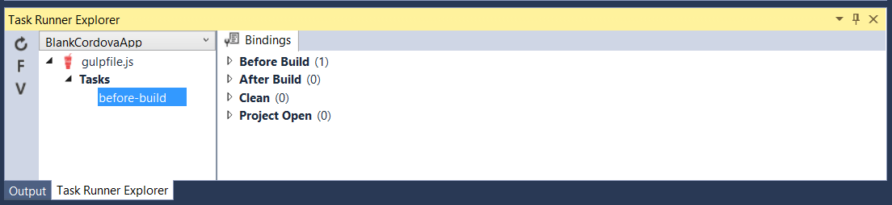
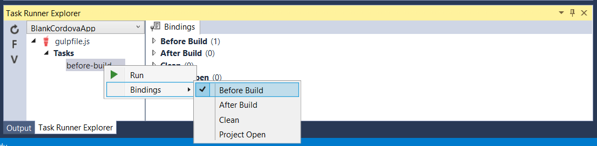

<properties pageTitle="Use Gulp to automate tasks in a Cordova project"
  description="Use Gulp to automate tasks in a Cordova project"
  services=""
  documentationCenter=""
  authors="clantz" />

#Automate tasks for your Cordova project by using Gulp
[Gulp](http://go.microsoft.com/fwlink/?LinkID=533803) is an increasingly popular JavaScript based task runner with a large number of [useful plugins](http://go.microsoft.com/fwlink/?LinkID=533790) designed to automate common “tasks” for everything from compilation, to packaging, deployment, or simply copying files around. Both Gulp and the [Apache Cordova Command Line interface](http://go.microsoft.com/fwlink/?LinkID=533773) (CLI) are Node.js based which makes the two highly complementary technologies. In this tutorial we will cover a few ways Gulp can be used with Cordova:
# Use Gulp to automate tasks in a Cordova project

[Gulp](http://go.microsoft.com/fwlink/?LinkID=533803) is an increasingly popular JavaScript based task runner with a large number of [plugins](http://go.microsoft.com/fwlink/?LinkID=533790) that are designed to automate common “tasks” such as compiling, packaging, deployment, or simply copying files around. Both Gulp and the [Apache Cordova Command Line interface](http://go.microsoft.com/fwlink/?LinkID=533773) (CLI) are Node.js-based which makes them highly complementary technologies.

## <a name="invoke"></a>Invoke a task as part of a Cordova build

You might find it useful to start a Gulp task from Visual Studio every time that you build your project, particularly when using a Gulp to minify your JavaScript code or when compiling languages like [TypeScript](http://go.microsoft.com/fwlink/?LinkID=533748), [LESS](http://go.microsoft.com/fwlink/?LinkID=533791), or [SASS](http://go.microsoft.com/fwlink/?LinkID=533792). The "Task Runner Explorer"
makes this easy. It's a convenient way to run Gulp tasks right from Visual Studio.

### Invoke a task by using the Visual Studio Task Runner Explorer
First, let's install Gulp globally so that it's convenient to use from the command line as well as from Visual studio.

1. Open a **Command Prompt**, and type this command:

    ```
    npm install -g gulp
    ```

2. Create a [package.json](http://go.microsoft.com/fwlink/?LinkID=533781) file inside of your project (if you don't have one already).

    This will be the location that you'll use to reference Gulp or any [Gulp plugins](http://go.microsoft.com/fwlink/?LinkID=533790) that you want to use.

    ```json
    {
      "devDependencies": {
     	"gulp": "latest"
       }
    }
    ```

3. Update this file with any other dependencies that you want to add.

    You do this manually in Visual Studio, or use the npm ```--save-dev``` flag from a Command Prompt. For example, the following command will install the [uglify Gulp plugin](http://go.microsoft.com/fwlink/?LinkID=533793), and add that plugin as a dependency:

    ```
    npm install --save-dev gulp-uglify
    ```

3. Install package dependencies. You can do this in Visual Studio, and thanks to Visual Studio's command line interoperability, you can also update the package.json file outside of VS, and then use the Command Prompt to install dependencies. Let's look at each approach.

    **Install dependencies by using Visual Studio:**

    In **Solution Explorer**, right-click the **Dependencies** node, and then select **Restore Packages**.

    

    **Install dependencies by using the Command Prompt:**

    In a Command Prompt, type the following:

    ```
    npm install
    ```

    This command is what the Task Runner Explorer execute under the covers when you select **Restore Packages** in Visual Studio.  

    > **Note**: In general, you should not add the generated **node_modules** folder into source control. For that reason, the **node_modules** file doesn't even appear in the Visual Studio **Solution Explorer**.

4. Create a file named **gulpfile.js**, and add that file to the root of your project. Then, add a task to it.

    For example, here is a basic Gulp task.

    ```javascript
    var gulp = require("gulp");
    gulp.task("before-build", function() {
 	   // Add anything you want to do before the build here
    });
    ```

5. In Visual Studio, choose **View**->**Other Windows**->**Task Runner Explorer** to open the Task Runner Explorer.

    

6. Choose the **Refresh** button. Then, you'll see the Task Runner Explorer with the before-build task that we created.

    

7. Attach this to the ```Before Build``` event, right-click, and then select **Bindings**->**Before Build**.

    

    The next time that you run a build, this task runs too. You can also run tasks without binding them to an event by selecting **Run** from the same context menu.

### Use bindings in command-line or CI builds

By default, bindings in the Task Runner Explorer only work inside of Visual Studio. If you work outside of Visual Studio, we generally recommend that you run Gulp tasks directly from the command line. For example, this command runs the Gulp task that we created above:

```
gulp before-build
```

You might want to assign bindings in Visual Studio, and have them apply to builds that you initiate from the command line or in a team / Continuous Integration (CI) environment. Fortunately this is fairly straight forward to do via a [Cordova "hook"](http://go.microsoft.com/fwlink/?LinkID=533744).

To do so, [follow these directions to add a pre-built Cordova hook to your project](hook-task-runner-binding/tutorial-gulp-hook-task-runner-binding-readme.md). You can then modify it as you see fit to meet your needs.

## <a name="ci"></a>Use Gulp to build an app

Because it can run on Windows or OSX, Gulp can be extremely useful as a unified cross-platform build language for automating and testing your builds in a team / continuous integration (CI) environment such as Jenkins or Team Foundation Services 2015. You might also prefer to use a Gulp-based workflow rather than using the Cordova CLI itself.

### Use Cordova-lib with Gulp

Internally, the Cordova CLI uses a node module called **cordova-lib**. This module encapsulates all of the CLI's core functionality in a series of JavaScript APIs, and it's released as an npm package at the same time the Cordova CLI is released.

You can use cordova-lib directly from a Gulp script.

For example, this is a sample **gulpfile.js** that you can place in the root of your Cordova project for **Cordova 5.3.3 and below**. It builds a release version of the Android platform:

```typescript
var gulp = require("gulp"),
    cordova = require("cordova-lib").cordova;

gulp.task("default", function (callback) {
	cordova.build({
    	"platforms": ["android"],
    	"options": ["--release","--gradleArg=--no-daemon"]
    }, callback);
});
```

For **Cordova 5.4.0 and up** the syntax is slightly different.

```typescript
var gulp = require("gulp"),
    cordova = require("cordova-lib").cordova;

gulp.task("default", function (callback) {
	cordova.build({
    	"platforms": ["android"],
    	"options": {
            argv: ["--release","--gradleArg=--no-daemon"]
        }
    }, callback);
});
```

cordova-lib functions **are asynchronous** so you need to include the Gulp callback function that you pass into your task as an argument to your last API call.

Add the ```--gradleArg=--no-daemon``` line above for build automation scenarios. That's because by default, Cordova starts up a daemon process that can cause your build to appear to hang.

To see the previous example in action, you'll have to install some additional npm packages. Create a simple [package.json](http://go.microsoft.com/fwlink/?LinkID=533781) file in the root of your project. Make sure that this file contains at least the following content.

```json
{
    "devDependencies": {
        "gulp": "latest",
        "cordova-lib": "5.3.3"
    }
}
```

Next, open a **Command Prompt**. On the command line, change directories to the root of your project, and run these commands:

```
npm install -g gulp
npm install
gulp
```

The ```npm install -g gulp``` command installs the Gulp command line interface and adds it to your path.

The ```npm install``` command installs the ```devDepenencies``` listed above to a **node_modules** folder so that your gulp script can use it.

You only need these commands if you have to install new dependencies that you've manually added to **package.json** file or if you are installing Gulp globally for the first time.

You can also quickly execute Gulp tasks from the Task Runner Explorer right from Visual Studio. To open it, go to **View**->**Other Windows**->**Task Runner Explorer**.


Even better, all you have to do to install dependencies that you add to **package.json** file is right-click on the **Dependencies** node in the **Solution Explorer** and then select **Restore Packages**.


The **cordova** and **cordova-lib** npm package version numbers do not match for CLI 3.6.3 or earlier. If you need to target these older Cordova versions, reference the **cordova** npm package in your **package.json** file and edit the require statement in the above Gulp script as follows:

```javascript
var gulp = require("gulp"),
    cordova = require("cordova");
```

If you're creating an automated build script, you can find a more complete list of considerations by reviewing this topic: [in this tutorial](./tutorial-team-build/tutorial-team-build-readme.md).

That said, we'll go over how to use Gulp to build a number of different platforms at once by using a fairly simple helper node module. You can find this module along with a sample **gulpfile.js** and **package.json** file in [this Git repository](http://go.microsoft.com/fwlink/?LinkID=533736).

### Use the taco-team-build node module with Gulp

The [taco-team-build](http://go.microsoft.com/fwlink/?LinkID=533736) node module helps to alleviate [common problems](./tutorial-team-build/tutorial-team-build-readme.md) when you build a Cordova project from the command line, and particularly when you build a Cordova project in a team or CI environment. It can be used with any number of build systems including Jake, Grunt, and Gulp or even a command line tool.

We'll focus on how to set up the taco-team-build node module, and then use it with Gulp. You can find documentation about the module's methods in [its Git repository](http://go.microsoft.com/fwlink/?LinkID=533736).

The easiest way to get started is to place the contents of the **samples/gulp** folder inside of your project root in your repository. You don't need any other files in the repository.

Alternatively, you can follow these steps:

1.  Add a **package.json** file to the root of your project.  

    Make sure that this file contains at least the following content.

    ```json
        {
            "devDependencies": {
	            "gulp": "latest",
	            "taco-team-build": "latest"
            }
        }
    ```

     When ```npm install``` is executed, this script installs the taco-team-build npm package from the GitHub repository. You might also opt to use the node module from inside your project so that you can modify it. To do this, add the **taco-team-build.js** file to the root of your project and require ```./taco-team-build``` instead of ```taco-team-build``` in the **gulpfile.js** file.

2. If you don't already have one, create a file named **gulpfile.js** file and add that file to the root of your project.

3. Add this script to that file. It's all you need to build and package your app by using this module.

    ```javascript
    var gulp = require("gulp"),
    cordovaBuild = require("taco-team-build");

    gulp.task("default", function () {
       return cordovaBuild.buildProject("android", ["--release", "--gradleArg=--no-daemon"])
           .then(function() { return cordovaBuild.packageProject("android"); });
    });
    ```

   This script does the following things.

   1. Checks to see that a Cordova version is specified in the **taco.json** file. If there is no version specified in that file, it first checks for a CORDOVA_DEFAULT_VERSION environment variable and finally falls back on the latest version of Cordova.
   
   2. Checks to see if this version of cordova-lib has already been installed at a location set in the **CORDOVA\_CACHE** environment variable. If no **CORDOVA_CACHE** environment variable is set, the cache location will default to ```%APPDATA%\\taco_home\\node_modules``` on Windows and ```~/.taco_home/node_modules on OSX```. If CORDOVA\_CACHE is not specified it will also see if TACO\_HOME (used by the taco-cli) is set.

      >**Note**: You can also set this location programmatically using the module's configure method.

   3. Downloads and installs the correct version of cordova-lib if it is not present in the cache location.

   4. Adds the [Cordova CI Support Plugin](http://go.microsoft.com/fwlink/?LinkID=533753) to the project if it is not already present.

   5. Adds the specified platform to the project.

   6. Builds the project.

   7. Packages the project.

    Each method returns a *promise* so that you can chain the steps or run them concurrently.

3. Use the Visual Studio Task Runner Explorer to run your task. Alternatively, run the same command line operations that were described previously:

      ```
      npm install -g gulp
      npm install
      gulp
      ```

#### Create a script that builds all platforms across OSX and Windows

You might find it useful to create a script that automatically builds all of the platforms that your project supports across OSX and Windows.

This is extremely useful for team build scenarios where you want to be able to check in a single script that automates all of your build steps including TypeScript compilation.

Here is an enhanced script that gives you with this flexibility:

```javascript
var gulp = require("gulp"),
	cordovaBuild = require("taco-team-build");

var winPlatforms = ["android", "windows", "wp8"],
	osxPlatforms = ["ios"],
	buildArgs = {
		android: ["--release", "--device", "--gradleArg=-no-daemon"],
		ios: ["--release", "--device"],
		windows: ["--release", "--device"],
		wp8: ["--release", "--device"]
	}

// "Darwin" is the platform name returned for OSX.
var platformsToBuild = process.platform == "darwin" ? osxPlatforms : winPlatforms;

gulp.task("default", ["package"], function () {
	// Copy results to bin folder
	gulp.src("platforms/android/ant-build/*.apk").pipe(gulp.dest("bin/release/android"));
	gulp.src("platforms/android/bin/*.apk").pipe(gulp.dest("bin/release/android"));
	gulp.src("platforms/windows/AppPackages/**/*").pipe(gulp.dest("bin/release/windows/AppPackages"));
	gulp.src("platforms/wp8/bin/Release/*.xap").pipe(gulp.dest("bin/release/wp8"));
	gulp.src("platforms/ios/build/device/*.ipa").pipe(gulp.dest("bin/release/ios"));
});

gulp.task("build", function () {
	return cordovaBuild.buildProject(platformsToBuild, buildArgs);
});

gulp.task("package", ["build"], function () {
	return cordovaBuild.packageProject(platformsToBuild);
});
```

The ```--gradleArg=--no-daemon``` above should be added in for build automation scenarios because by default, Cordova starts up a daemon process that can cause your build to appear to hang.

You might also want to update the script with TypeScript compilation if you are using the language in your app. Let's take a look at that now.

### <a name="ts"></a>Build a Typescript project

If you're using TypeScript in your Cordova app project, you'll want to compile it in your team / CI build environment. You also might want to compile your TypeScript code from the command line rather than Visual Studio. You can use a Gulp plugin to do this.

1. Add [gulp-typescript](http://go.microsoft.com/fwlink/?LinkID=533748) as a ```devDependency``` in a [package.json](http://go.microsoft.com/fwlink/?LinkID=533781) file that is in the root of your project.

2. If you already have a **package.json** file, open a **Command Prompt**, change directories to your project folder, and then type the following command:

    ```
     npm install --save-dev gulp-typescript
    ```

    This installs the **gulp-typescript** plugin and updates the **package.json** file. For example:

    ```json
    {
        "devDependencies": {
            "gulp": "latest",
            "gulp-typescript": "latest",
            "taco-team-build": "latest"
     }
    }
    ```

    You can also manually edit the **package.json** file from Visual Studio and then install the dependency by right-clicking on the **Dependency** node in the **Solution Explorer** and then selecting **Restore Packages**.

   

2.  Add the following task to the **gulpfile.js** file:

    ```javascript
      var ts = require("gulp-typescript");

      gulp.task("scripts", function () {
        // Compile TypeScript code
        gulp.src("scripts/**/*.ts")
        	.pipe(ts({
            	noImplicitAny: false,
                noEmitOnError: true,
                removeComments: false,
            	sourceMap: true,
                out: "appBundle.js",
                target: "es5"
    		}))
    		.pipe(gulp.dest("www/scripts"));
    });
     ```    

    You could also use a **tsconfig.json** file (like the default VS template) and add the following code instead:

    ```javascript
    var ts = require("gulp-typescript"),
        fs = require("fs"),
        tsconfigPath = "scripts/tsconfig.json";

    gulp.task("scripts", function () {
        // Compile TypeScript code
        if (fs.existsSync(tsconfigPath)) {
            gulp.src("scripts/**/*.ts")
                .pipe(ts(ts.createProject(tsconfigPath)))
                .pipe(gulp.dest("."));
        }
    });

    ```

    Either of these code snippets will compile anything that is in the **scripts** folder in the root of your Cordova project, and then copy them as a single JavaScript file called *appBundle.js* under the **www/scripts** folder. You should update this with the location of all of the TypeScript files you want compiled. You can add an array of locations to compile as follows:

    ```
	   gulp.src(["scripts/**/*.ts","www/typescript/**/*.ts"])
    ```

4.  You should also update build related tasks to run the scripts task first.

    ```javascript
        gulp.task("build", ["scripts"], function () {
        ...
    ```

    The **samples/gulp** folder in [this Git repository](http://go.microsoft.com/fwlink/?LinkID=533736) contains a sample **gulpfile.js** and **package.json** file with TypeScript that is already configured for you to use.

### Automatically compile Typescript when you edit or save a file in your project

You might find it useful to set up a *file watcher* that automatically compiles your Typescript code whenever you make an edit and save the file. Gulp's *watch* feature makes this easy to do.

```javascript
   gulp.task("watch", ["scripts"], function () {
       gulp.watch("scripts/**/*.ts", ["scripts"]);
   });
```

If you've installed Gupl globally (*npm install -g gulp*), then you then can open a **Command Prompt** and run the following command:

```
gulp watch
```

### Add build dependencies

In the gulp-typescript as a *devDependency* the previous section. Adding additional dependencies is simple from Visual Studio. VS will also **automatically** install any package added to the ```devDependencies``` list in the **package.json** file when you save it.

You can also install any additional dependencies and update the **package.json** file by using the ```--save``` flag when calling ```npm install``` from the command line. For example, this command will add the [uglify Gulp plugin](http://go.microsoft.com/fwlink/?LinkID=533793) as a dependency:

```
npm install --save-dev gulp-uglify
```

## Use Gulp in a team build / CI environment

Before you use Gulp in a team build / CI environment, you'll need to set up your build server with all of the necessary native dependencies for the platforms you intend to build.

See the “Installing Dependencies” section of the [Comperhensive CI tutorial](./tutorial-team-build/general.md).

While each build server is slightly different in terms of how you configure tasks, all you'll have to do is configure build server to run the these two commands:

```
npm install
./node_modules/.bin/gulp
```

Then, set an environment variable named **CORDOVA_CACHE** so that it points to the location on your build server that you want to use to cache multiple versions of cordova-lib and Cordova platforms.

See the [Jenkins](./tutorial-team-build/Jenkins.md) tutorial for a specific example.
