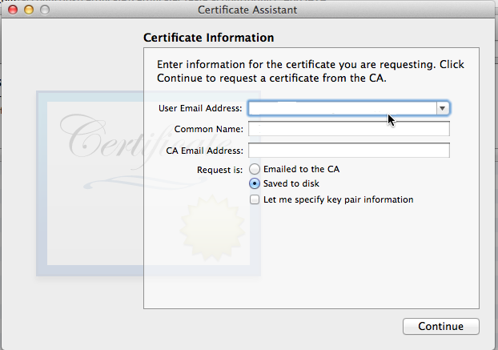

<properties pageTitle="Package your Cordova app so that you can publish it"
  description="Package your Cordova app so that you can publish it"
  services=""
  documentationCenter=""
  authors="subhagpo" />
  <tags
     ms.service="na"
     ms.devlang="javascript"
     ms.topic="article"
     ms.tgt_pltfrm="mobile-multiple"
     ms.workload="na"
     ms.date="11/13/2015"
     ms.author="Subhag.Oak"/>

# Package your Cordova app so that you can publish it

Create a package for each platform that you want to target. Then you can publish each package to a store.

## <a id="General"></a>First, configure the general settings of your app package

Provide details such as the package ID and version number of your app by using the *configuration designer*. To open it, double-click the **config.xml** file.


You'll need to configure these settings

*   **Display Name**, which specifies the name of the application that appears in an app store.

    > **Note**: The Windows Store display name and package ID are specified in a different way. See the  [Package and sign a Windows 8, Windows 8.1, and Windows Phone 8.1 app](#Windows) section later in this article.

*   **Package Id**, which specifies a unique string that identifies your app on each platform (except Windows 8) when you publish your app to a store.

*   **Version**, which specifies your app’s version number.  Some app stores may have independent versioning that is assigned when the app is published. However, for platforms like iOS, you should keep this number in sync with the version you configure in iTunes Connect.

*   **Domain Access**, which specifies the set of domains your app can access content from. During development, we recommend using the default value, ```*```, which provides access to all content. However, before releasing your app, use this setting to restrict your app to specific domains required by your app. (Windows 8 doesn’t currently use this configuration setting.)

For information about preferences you can manually set in config.xml, see [The config.xml File](http://go.microsoft.com/fwlink/p/?LinkID=510632&clcid=0x409) in the Apache Cordova documentation.

## Package the Android version of your app

Sign your app, build it, and then publish it.

### Sign your app

To sign your app, create a *keystore*. A keystore is a binary file that contains a set of private keys. Here's how you create one.

1. Open a **Command Prompt** in administrator mode.

2. Change directories to the **%JAVA_HOME%\bin** folder (For example: C:\Program Files (x86)\Java\jdk1.7.0_55\bin).

3. Run the following command.

    ```
    keytool -genkey -v -keystore c:\my-release-key.keystore -alias johnS
    -keyalg RSA -keysize 2048 -validity 10000**
    ```

    You'll be asked to provide a password for the keystore and private key, and to provide the *Distinguished Name* fields for your key.  the following series of responses gives you an idea of the kinds of information you'll provide for each prompt.

    ```
    Enter keystore password: pwd123
    Re-enter new password: pwd123
    What is your first and last name?
    [Unknown]= John Smith
    What is the name of your organizational unit?
    [Unknown]= ABC
    What is the name of your organization?
    [Unknown]= XYZ
    What is the name of your of your City or Locality?
    [Unknown]= Redmond
    What is the name of your State or Province?
    [Unknown]= WA
    What is the two-letter country code for this unit?
    [Unknown]= US
    Is CN=John Smith, OU=ABC, O=XYZ, L=Redmond, ST=WA, C=US correct??
    [no]=  y

    ```

    After you provide this information, you'll see output like the following.

    ```
    Generating 2,048 bit RSA key pair and self-signed certificate (SHA256withRSA)
    with a validity of 10,000 days for: CN= John Smith, OU= ABC, O= XYZ,
    L=Redmond, ST=WA, C=US

    Enter key password for <johnS>
        (RETURN if same as keystore password):
    ```

    The SDK then generates the keystore as a file named **my-release-key.keystore** and places that file in the *C:\* drive. The keystore contains a single key, valid for 10000 days.

    This process is documented more thoroughly in the Android developer content: [Signing your applications](http://developer.android.com/tools/publishing/app-signing.html).

### Create a signed package for projects that use Cordova CLI versions less than 5.0

1. In **Solution Explorer**, open the **res\native\android** folder and find the **ant.properties** file.

    

2. In the **ant.properties** file, add the information from your keystore.

    ```
    key.store=c:\\my-release-key.keystore
    key.alias=johnS
    key.store.password= pwd123
    key.alias.password= pwd123
    ```

### Create a signed package for projects that use Cordova CLI versions greater than 5.0

1. In **Solution Explorer**, find the **build.json** file in the root of your project.

    

2. In the **build.json** file, add the information from your keystore.

    ```
    {
     "android": {
         "release": {
             "keystore":"c:\\my-release-key.keystore",
         "storePassword":"pwd123",
         "alias":"johnS",
       "password":"pwd123",
               "keystoreType":"",
           }
       }
    }
   ```

3. Build your app for the release configuration.

    To publish your app, see [Publish your app](./package-and-publish/publish-app-built-with-visual-studio.md).

## Package the iOS version of your app

To distribute your app for testing or submit it to the store, you'll need to configure your mac with proper certificates and provisioning profiles.

A distribution certificate identifies your team or organization in a distribution provisioning profile and allows you to submit your app to the store.

You'll also have to build your app and generate a signed IPA package.

A signed package lets users trust that your app was created by a source known to Apple and that the app hasn’t been tampered with.

### Generate a distribution certificate:
1. In a browser, go to [Apple Dev Portal](https://developer.apple.com).

2. Choose **Member Center** and login with your developer account credentials.

3. Choose **Certificates, Identifiers & Profiles**.

    

4. Choose **Certificates**, click the “+” sign to create a new Certificate & choose the App Store and Ad Hoc radio button.

    

5. Scroll to the bottom of the page and choose **Continue**.

6. The next screen explains the process of creating a **Certificate Signing Request (CSR)**. Click **Continue** at the bottom of the page.

    

    > **Note:** For more detailed information, see [Detailed steps to generate the Certificate Signing Request (CSR)](#detailed).

7. Navigate to the CSR file & choose that file.

    

8. Choose **Generate**. Once you refresh your browser, you can download the developer certificate by choosing **Download**.

    The certificate will download into your **downloads** folder & double-clicking this will install this file into Keychain.  This is what the Development Certificate looks like in Keychain Access.

    

#### <a id="detailed"></a>Detailed steps to generate the Certificate Signing Request (CSR) [step 6, above]:

In order for you to generate a certificate you must request a certificate using keychain access.

1. Launch **Keychain Access**. Keychain Access is located in Macintosh HD/Applications/Utilities.

    

2. Once Keychain Access is launched, choose **Keychain Access**, **Certificate Assistant**, **Request a Certificate from a Certificate Authority**.

    

3. Enter your Apple Developer Account email address, Common Name (your name),CA (Certificate Assistant) [optional] & Choose: Request is **Saved to disk**.

    

4. Choose **Continue**, save the file to your hard drive and choose **Done**.

    Now you can go back to the distribution certificate section still active in your browser [step 7, above] and choose **Choose File**.

    

### Generate a distribution provisioning profile:

1. In a browser, go to [Apple Dev Portal](https://developer.apple.com).

2. Choose **Member Center** and login with your developer account credentials.

3. Choose **Certificates, Identifiers & Profiles**.

    

4. Choose **Provisioning**, click the “+” sign to add a new provisioning profile & choose **App Store** as shown in the figure below and choose **Continue**.

    

5. Select the correct App ID and choose **Continue**.

    

6. Select the certificates you wish to include in this provisioning profile. Choose **Continue** after you have selected the certificates.

    

7. Name the profile and choose “Generate” and download the provisioning profile.
 
    

8. Double-click that file to install it and then add it to the **Code signing section of *Build Settings* for Xcode**.

    

9. Add the provisioning profile:

    

10. Add the distribution certificate:

    

    > **Note:** While creating the developer provisioning profile [after step 6], you will have to select the devices you wish to include in this provisioning profile. To install an app signed with this profile on a device, the device must be included.

    
 
    Once you have installed the distribution certificates and the matching provisioning profiles in XCode’s build settings on the remotebuild agent, you are now ready to build a release package for iOS from VS.

    > **Note**: A signing identity is valid if the provisioning profile identifier matches the package ID specified in the Visual Studio configuration designer. For example, a provisioning profile of `com.msft.multidevice.*` matches a package ID of <span class="code">com.msft.multidevice.someName</span>. In many cases, you can use a wildcard provisioning profile that matches all package IDs, in which case validity isn’t a concern.

11. On your host Windows machine, in Visual Studio, change the platform to **iOS**, build configuration to **Release** and target to **Remote (or Local) Device**, as shown below:

    

    This starts a build on the remotebuild agent and uses the distribution certificate and the matching provisioning profile to build a release signed iPhone Application package (.ipa) which is then available at *projectroot*\bin\iOS\Release** folder on the host machine after the build completes.

    Once you've built your iPhone Application (.ipa) file, you'll need to fill out the required forms on the iTunes Connect site to submit the app to Apple. In filling out the information, be as transparent as possible to Apple, including any demo accounts that might be needed to run your app. Because the Apple reviewers must be able to verify your app, providing the information required ahead of time will help your app get through the review process more quickly. Note that Apple's policy stipulates that your app's keywords cannot contain your app name.

### Submit your application to the store

1. Navigate to the iTunes Connect area of the [iOS Dev Center](http://developer.apple.com/devcenter/ios/).

2. Go to the **Manage Your Apps** page and then click **Add New App**.

3. Fill out the forms describing your company and application.

4. On the appropriate form, upload the 512 × 512 pixel icon and your application screenshots.

5. Save the app description.

6. Back on the **Manage Your Apps** page, select the app description you just created and click the **Ready to Upload Binary** button.

7. Fill out the Export compliance form.

    Your app should now be in a *Waiting for upload* state. Complete the rest of the process with the Application Loader utility.  

    > **Note:** The Application Loader utility is available only for Mac OS X 10.5.3 or later. In Windows, you can run Mac OS X inside a virtual machine.

8. Unzip the app IPA file (change the extension to .zip).

9. Locate the APP file within the Payload folder and compress the APP file to create a new ZIP archive.

10. Use the Application Loader to upload the compressed APP file to iTunes Connect.

    The Manage Your Apps page of iTunes Connect should now list an updated status for your application. See the [iTunes Connect Developer Guide](http://itunesconnect.apple.com/docs/iTunesConnect_DeveloperGuide.pdf), available from the iTunes Connect website, for information about the application statuses.

## Package the Windows version of your app

1. In the Solution Platforms dropdown list, choose the platform you want to target.

    

2. Choose **Project**->**Store**->**Create App Packages** to start the packaging wizard.

    

3. Complete the wizard. It will build a release version of the package and generate a Package.StoreAssociation.xml file in the **res\native\windows** folder:

    

    Visual Studio creates a test certificate under the **res\native\windows** folder when the project you create the project, but you can also use an existing certificate to sign your package by replacing the default certificate with yours.

    The final APPX resides in the *<ProjectRoot>*\AppPackages folder.

### <a id="WindowsPhone"></a>Package a Windows Phone 8 version of your app

Windows Phone 8 apps are automatically packaged and don’t have to be signed at build time. Therefore, if you choose that platform, the **Create App Packages** option will be disabled.

You can submit the generated XAP file to the store as described in [Submit your app](https://msdn.microsoft.com/library/windowsphone/help/jj206724.aspx) in the Windows Dev Center.

> **Note**: If you configure Windows Phone 8.1 as the build target, the generated package is an APPX. For more information, see the preceding section.

If you need to change the default language in a Windows Phone 8 package, locate the WMAppManifest.xml file in bld/Debug/platforms/wp8, modify the `<DefaultLanguage code="en-US" xmlns="" />` tag, and include the file into your Visual Studio project in the following folder: /res/native/wp8/Properties. In this way, you can include the custom XML file in your generated project.
