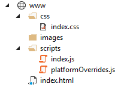
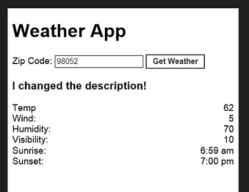
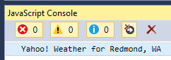

<properties
   pageTitle="Get started with Visual Studio Tools for Apache Cordova | Cordova"
   description="Get started with Visual Studio Tools for Apache Cordova"
   services="na"
   documentationCenter=""
   authors="normesta"
   tags=""/>
<tags
   ms.service="na"
   ms.devlang="javascript"
   ms.topic="article"
   ms.tgt_pltfrm="mobile-multiple"
   ms.workload="na"
   ms.date="09/10/2015"
   ms.author="normesta"/>

# Get started with Visual Studio Tools for Apache Cordova

You can use Visual Studio Tools for Apache Cordova to build apps that run on iOS, Android, and Windows devices and share nearly 100% of your code ([learn more](https://www.visualstudio.com/explore/cordova-vs)).

In this guide, we'll help you install these tools, and give you a tour of what you can do with it. Along the way, you'll build a basic app that looks like this.


It's not much, but when you're done, this process won't seem so mysterious. In fact, it's fun and relatively simple. Where you take things from there is up to you and your imagination. So let's get started!

## <a id="install"></a>First, install Visual Studio Tools for Apache Cordova

Choose the Apache Cordova feature when you install Visual Studio. You can always add the feature later on.

1.	In the Visual Studio installer, choose the **Custom** option, and then select the **HTML/JavaScript (Apache Cordova) Update 2** feature.

    

    After you’ve installed Visual Studio, [create a project](#get-started).

### Choose the Apache Cordova feature after you install Visual Studio
If you've already installed Visual Studio, just modify it to include the tools.

1.	Open **Control Panel** -> **Programs and Features**, choose the **Visual Studio 2015** item, and then choose the **Change** button.

    

2.	In the setup wizard for Visual Studio, choose the **Modify** button.

3. In the list of optional features to install, select the **HTML/JavaScript (Apache Cordova) Update 2** checkbox, choose the **Next** button, and then choose the **Update** button.

    

## <a id="get-started"></a>Create a project

1.	In Visual Studio, create a new **Blank App** project and name it *WeatherApp*.

    You can find this template under **JavaScript**->**Apache Cordova Apps** in the **New Project** dialog box.

    

    > **Note:** If you like TypeScript, there's a template for that under **TypeScript**->**Apache Cordova Apps**. Later, I'll point you to some guidance for using it.

    After you create the project, your solution should resemble the following:

    

## <a id="tour-project"></a>Quick tour of the project

Most of the files in the root of the project are metadata files, but pay special attention to the **config.xml** file. It contains the settings of your app and we’ll open it later on.

The **www** folder is where you’ll add HTML, JavaScript, style sheets, and any images you want to use.



It already contains some files, so you can run this app right out of the box if you want. You can modify these files or add more as you build your app.

The *platformOverrides.js* file is blank. We’ll revisit that file in a moment.

The **merges** folder is where you add HTML, JavaScript, and style sheet files that apply to specific platforms. You’ll find some in there already. The following image shows the contents of the **android** sub-folder of the **merges** folder.


Notice the file named *platformOverrides.js*. It's no coincidence that it shares the same name as a file in the **www** folder. When you build your app for Android, this file replaces the *platformOverrides.js* file in the **www** folder.

Use this pattern to add other platform-specific code, styles, or layout. In fact, we’ll do exactly that later on.

The **res** folder is where you add icons, splash screens, signing certificates and any other platform-specific files.


But before we get bogged down on all of these details, let’s run the app now.

## <a id="run"></a>Run your app

1. On the Standard toolbar, choose the **Ripple – Nexus (Galaxy)** button.

    

    Your app opens in Apache Ripple.

    Apache Ripple is a free mobile simulator. If you haven’t used it before, try a few things while you have it open. For example, change the device orientation or the platform and see how your app appears. Apache Ripple is probably the easiest way to see the effect of your changes as you develop.

2. Stop the app. You'll find the button to stop it in the Standard Toolbar.

    

    You can also run your app in Android, iOS, and Windows device emulators. An emulator gives you a bit more of a realistic device experience.

3. Find the platform list on the Standard toolbar. Then, choose a platform and an emulator.

    

    Run your app in other emulators if you want, but don't use any of the iOS emulators yet. That's a little more advanced. At the end of this article, I'll point you to some guidance for doing that.

## <a id="settings"></a>Find app settings

Most likely, you'll want to give your app a name, increment the version number or even choose which page appears when users start your app.

These options and many more are captured in the **config.xml** file of your project. Let's open it now.

1. In **Solution Explorer**, double-click the **config.xml** file.

    A designer appears so you won't have to edit xml directly unless you want to.

    

2. Choose any tab on this designer to view a group of settings.

    For example, choose the **Plugins** to tab to add or remove *plugins*. You can use *plugins* to  access a device capability such as the camera on a phone. We'll discuss plug-ins a bit later.

    When you're done exploring, close the designer and we'll build a basic app to get an idea of how things flow.

## <a id="build-something"></a>Start Small: Build a basic app

Apps can be as complicated or as simple as you want them to be. The goal of this section is to build a very basic single page app that shows the weather conditions of any area in the United States.

You can find the complete sample [here](https://github.com/Microsoft/cordova-samples/tree/master/weather-app).

### Add a package

First, we'll add the [JQuery](https://jquery.com/) NuGet package to your project. If you're not familiar with JQuery, it's a just a JavaScript library that makes certain tasks easier such as changing the properties of a control or handling it's events, and that's exactly what we'll use it for.

> **Tip**: There is more than one way to add packages like this one to your project. After you've got a little experience, check out Bower. Bower is a bit advanced for this discussion, but when you're ready to explore more advanced features, we've created a topic that helps you use it.

1. Choose **Tools** -> **NuGet Package Manager** -> **Manage NuGet Packages for Solution**, and add the **jQuery** NuGet package to your solution.

    

    NuGet adds files to the **Scripts** folder of your project, but that's not really where we need them so we'll have to fix that.

2. Drag those files to **scripts** subfolder of your **www** folder

    

    Now they're in the correct location.

3. Add these script references to the ```<body>``` tag of your [index.html](#tour-project) file:

```html
  <script src="scripts/index.js"></script>
  <script src="scripts/jquery-2.1.4.min.js"></script>
```

### Design a page

**index.html** is the first page that appears when users run your app. So we'll add our HTML to that file. Of course, this the default setting and you can change that at any time in the [configuration designer](#settings).

1. Open the **index.html** file and add this style to the ```<head>``` of the page.

  ```
  <style type="text/css">
      body {
          font: 1em Sans-Serif;
      }

      .flex {
          display: -webkit-box;
          display: flex;
      }

          .flex > div:nth-child(2) {
              -webkit-flex-grow: 1;
              flex-grow: 1;
              text-align: right;
          }
  </style>
  ```
1. Open the **index.html** file and remove this line.

```html
  	 <p>Hello, your application is ready!</p>
```

2. Add this HTML to the ```<body>``` of the page to give users a way to search for the weather see the results.

```html
    <h1 id="app-title">Weather App</h1>

    <div>
        <label for="zip-code">Zip Code:</label>
        <input type="text" id="input-box" />
        <button id="get-weather">Get Weather</button>
    </div>

    <h3 id="description">Get the Weather</h3>

    <div class="flex">
        <div>Temp</div>
        <div id="temp"></div>
    </div>

    <div class="flex">
        <div>Wind:</div>
        <div id="wind"></div>
    </div>

    <div class="flex">
        <div>Humidity:</div>
        <div id="humidity"></div>
    </div>

     <div class="flex">
         <div>Visibility:</div>
         <div id="visibility"></div>
     </div>

     <div class="flex">
         <div>Sunrise:</div>
         <div id="sunrise"></div>
     </div>

    <div class="flex">
        <div>Sunset:</div>
        <div id="sunset"></div>
    </div>
```

### Handle a button event

1. Open the [index.js](#tour-project) file and add the following line of code to the ```onDeviceReady``` function.

	```javascript
	    $('#get-weather').click(getWeather);
	```

    This code refers to the ID of the following button on the HTML page.

	```html
	  <button id="get-weather">Get Weather</button>
	```

    The code handles the ``click`` event by passing in the name of a function (*getWeather*). You'll add that function shortly.

#### A quick look at index.js
This is a good time to quickly look at the ```index.js``` file. This file loads when the user runs the app.  Why? Because the ```index.html``` page contains this reference to it:

```javascript       
  <script src="scripts/index.js"></script>
```

You'll notice a few things about the ```index.js``` file. First, all the code in that file is enclosed within an *anonymous self-invoking function*. This is a fancy way of saying that this function executes automatically when the file loads.

```javascript      
	(function () {
	    "use strict";
	  // all the stuff is in this function.
	})();
```

Enclosed in this function, you'll see an event handler that runs when the Cordova device APIs are fully loaded.  

```javascript      
   function onDeviceReady() {

      // TODO: Cordova has been loaded. Perform any initialization that requires Cordova here.
   };
```

So what exactly do we mean by *Cordova device APIs*? These are APIs that you'd use to interact with device capabilities such as the camera or accelerometer. If you want to run any code like this when the app first starts, make sure you add that code or call those functions from inside of this event handler. In fact, later on, we'll do just that.

### Add code to get the weather

Now we'll add the *getWeather* function that we're using to handle button's ``click`` event. But first, let's add a JavaScript file for that function.

1. In **Solution Explorer**, find the **scripts** sub-folder in your **www** folder.

    

2. In the shortcut menu of the **scripts** folder, choose **Add** -> **New JavaScript file**.

3. Name the file *weather.js*, and then choose the **Add** button.

4. Open the **weather.js** file and add the following function.

	```javascript       
		function getWeather() {

		  var zipcode = $('#input-box').val();
		  var queryString =
		      "https://query.yahooapis.com/v1/public/yql?q=" +
		      "select+*+from+weather.forecast+where+location=" +
		       zipcode + "&format=json";

		  $.getJSON(queryString, function (results) {
		      if (results.query.count > 0) {
		          var weather = results.query.results.channel;

		          console.log(weather);

		          $('#description').text(weather.description);

		          var wind = weather.wind;
		          $('#temp').text(wind.chill);
		          $('#wind').text(wind.speed);

		          var atmosphere = weather.atmosphere;
		          $('#humidity').text(atmosphere.humidity);
		          $('#visibility').text(atmosphere.visibility);

		          var astronomy = weather.astronomy;
		          $('#sunrise').text(astronomy.sunrise);
		          $('#sunset').text(astronomy.sunset);
		      }

		  });
		}
	```

    This function gets a zip code from the input box, and uses a free service to get the weather for that zip code. The rest of this code uses JQuery syntax to populate controls on the page with data from the service.

    Now we're still missing a step. We have to refer to this new JavaScript file in our HTML page so let's do that now.

4. Open the **index.html** page, and add this reference to the ```<body>``` of the page.

	```html   
		<script src="scripts/weather.js"></script>
	```

    When you're done, your script reference should look like the following.

	```html   
		<body>
		<script src="cordova.js"></script>
		<script src="scripts/platformOverrides.js"></script>
		<script src="scripts/index.js"></script>
		<script src="scripts/jquery-2.1.4.min.js"></script>
		<script src="scripts/weather.js"></script>
	```

## Run your app in an Emulator

Let's run the app, but this time let's use an emulator.

2. In the list of Android emulators, choose the one of the **VS Emulator 5** to run your app.

    

3. In the Android emulator, type a valid United States zip code into the edit box (for example: 98052), and then press the **Get Weather** button.

    Weather data for that region appears in the controls.

    

    What's great here is that this app is completely cross platform. If you have a little extra time, run this app in a Windows emulator. You can use an iOS emulator, but that's a little more advanced. At the end of this article, I'll point you to some guidance for doing that.

## <a id="find-fix"></a>Find and fix problems

A big benefit of Visual Studio is its powerful debugger. If you're already familiar with it, you can skip this section. If you're not, let's try a few basic things.

### Breakpoints and conditional breakpoints

Run your app. This time, try a Windows emulator.

1. In the platforms list, choose **Windows Phone (Universal)**.

    

2. In the list of Windows emulators, choose the first one to run your app.

    

2. After your app starts, open the **weather.js** file, and set a *breakpoint* by clicking the margin next to this line:

	```javascript        
	  $('#description').text(weather.description);
	```

3. In the running app, type a valid United States zip code into the edit box, and then press the **Get Weather** button.

    Execution stops at your breakpoint.  Hover over objects to explore their values.

    

    Set *conditional breakpoints* if you only want to explore objects only when an object has a specific value. Let's try that.

4. Right-click the breakpoint and choose **Conditions**.

    

5. Select the **Conditions** checkbox, choose **Condition Expression**, **is true**, and **weather.description=="Yahoo! Weather for Redmond WA"**.

    

6. In the running app, type the zip code **98052** into the edit box, and then press the **Get Weather** button.

    Execution stops at your breakpoint, but only because you retrieved the weather for Redmond, WA. If you use any other zip code, execution won't stop.

    

### Edit and Continue

You can also change values on the fly while your app is running.

7. With execution stopped at the breakpoint, hover over the ``description`` property, highlight the value of that property, change it to any string you want, and then press the ENTER key.

    

8. Press F5 to continue execution and you'll see your string in the page.

    

9. Stop the debugger. You'll find the button to stop it in the Standard Toolbar.

    

    That was just a small sampling of things you can do with the Visual Studio debugger. At the end of this topic, I'll point you to a guide that gives you many more examples.

### Use the Javascript Console

While the JavaScript Console is not specific to Visual Studio, it's a handy way to find and fix problems. This console appears when you start your app.

Most likely, you'll see messages logged by scripts that your app consumes. It's a common practice to add code that logs messages and then view those messages in the console. Let's do that now.

1.  Open the **weather.js** file and add the following code to the ``getWeather`` function.

	```javascript
	  console.log(weather.description);
	```

2. Run your app, provide a zip code, and then choose the **Get Weather** button.

    In the JavaScript Console window, you'll see the description of your location.

    

    Of course, this is a very basic example. You can also do more advanced things such as inspect the contents of objects, measure execution times, count execution statements to name a few. [Learn more about the JavaScript Console](https://developers.google.com/web/tools/javascript/console/).

### Use the Document Object Model (DOM) Explorer

Use the DOM Explorer to find and fix layout issues in your pages.

You can examine the structure of your pages as they render and tweak them while your app is running. Let's do that now.

1. With the app running, choose **Debug** -> **Windows** -> **DOM Explorer**.

    The DOM Explorer opens.

2. In the elements pane, expand the ``<body>`` tag, find the page title, and change it.

    

    The title in your running app is now **How do I like this title?** and you didn't have to modify the source or reload the page. [Learn more about the DOM Explorer](https://msdn.microsoft.com/library/dn255008.aspx).


## <a id="capability"></a>Access a device capability

Most likely you'll want your app to do more than just show web pages on a mobile device. You might want your app to store files, receive push notifications, or capture images by using the device's camera. This is where a **plugin** becomes handy. Let's add a plug-in that gives us access to the device's geolocation system. That way, we can get the weather of a user's current location.

1. Open the [configuration designer](#settings), and choose the **Plugins** tab.

2. Choose the **Geolocation** plugin, and then choose the **Add** button.

    

    This adds the plug-in to your project but you still have to know how to consume it in your app. To do that, open the **Readme.md** file. You'll find it in the **plugins** folder as shown in this image.

    

    Let's add some code that consumes this plugin.

3. In the **weather.js** file add the following code:

	```javascript        
		function getLocation() {

		    navigator.geolocation.getCurrentPosition(onSuccess, onError, { enableHighAccuracy: true });

		 }

		 var onSuccess = function (position) {

		 var latitude = position.coords.latitude;
		 var longitude = position.coords.longitude;

		 }

		function onError(error) {
		   console.log('code: ' + error.code + '\n' +
		       'message: ' + error.message + '\n');
		 }
	```

    This code uses the device's geolocation capability to get the latitude and longitude of the device's location.

    Now let's use the latitude and longitude to get a zip code for that location and then populate the input box of your app with that zip code.

4. Replace the ``getLocation`` function with this complete function.

	```javascript
		function getLocation() {

		    navigator.geolocation.getCurrentPosition(onSuccess, onError, { enableHighAccuracy: true });

		      $('#description').text("Determining your current location ...");
		      $('#get-weather').prop("disabled", true);
		   }

		   var onSuccess = function (position) {

		   var latitude = position.coords.latitude;
		   var longitude = position.coords.longitude;

		   // Get zipCode by using latitude and longitude.

		   var queryString = "https://query.yahooapis.com/v1/public/yql?q=" +
		      "select%20*%20from%20geo.placefinder%20where%20text%3D%22" + latitude +
		      "%2C" + longitude + "%22%20and%20gflags%3D%22R%22" + "&format=json";

		   $.getJSON(queryString, function (results) {

		      if (results.query.count > 0) {

		          // Put the zip code into the input box for the user.
		          var zipCode = results.query.results.Result.uzip
		          $('#input-box').val(zipCode);

		       }

		   });

		      $('#description').text("Get the Weather");
		      $('#get-weather').prop("disabled", false);
		   }

		   function onError(error) {
		    console.log('code: ' + error.code + '\n' +
		      'message: ' + error.message + '\n');
		   }
	```

5. Open the **index.js** file, and add the following code to the ``onDeviceReady`` function.

	```javascript  
	  getLocation();
	```

    The ``onDeviceReady`` function should look like this.

	```javascript
		function onDeviceReady() {
		    // Handle the Cordova pause and resume events
		    document.addEventListener( 'pause', onPause.bind( this ), false );
		    document.addEventListener('resume', onResume.bind(this), false);
		    $('#get-weather').click(getWeather);

		    getLocation();

		};
	```

6. Run the app.

    When your app starts, the label *Determining your current location ...* appears. After a brief period of time, the input box shows the zip code of your current location.

    > **Note**: If you use the Apache Ripple emulator, you’ll have to configure it with your location.


## <a id="tailor"></a>Tailor the app to a platform

The code that you used to get the device's location works pretty well across all platforms, but what if it didn't? What if you had to write extra code to get the location of a iOS device?

This is where the **merges** folder becomes useful. We touched on that folder earlier in this article. Now let's try a few basic things.

### Tailor the behavior of your app

1. In **Solution Explorer**, expand the **www** folder, and then the **scripts** folder.

3. In the shortcut menu of the **weather.js** file, choose **Copy**.

1. In **Solution Explorer**, expand the **android** sub-folder in your **merges** folder.

2. In the shortcut menu of the **scripts** folder, choose **paste**.

    You now have a copy of the **weather.js** in the **android** folder.

    

4. In the **weather.js** file, add the following code to the ``geolocation`` method.

	```javascript
		$('#app-title').text("Android Weather App");
	```

5. Run your app in the Apache Ripple Simulator.

    The app now has the title **Android Weather App** because the **index.js** file in the **android** folder replaces the **index.js** file in the **www** folder for the Android version of your app.

    

    Making a copy of a file this large to change one line of code is an extreme example, but you can begin to imagine the possibilities, and you can always refactor your code in ways that leverage the **merges** folder more efficiently.

    The readme file of each plug-in will tell you what sort of device-specific code you'll have to write.

### Tailor the appearance of your app

In some cases, you'll have to tweak the layout of your pages so that they appear correctly for one type of device or another.

1. Return to the **android** sub-folder in your **merges** folder.

2. In the shortcut menu of the **css** folder, choose **Add** -> **New CSS file**.

3. Name the file *index.css*, and then choose the **Add** button.

    You now have a file named **index.css** in both the **android** folder and the **www** folder.

    

4. Replace the contents of the new **index.css** file with the following.

	```css
		body {

		  background-color:blue;   
		  color:white;
		}
	```
5. Run your app in the Apache Ripple Simulator.

    The app has a blue background and white foreground because the **index.css** file in the **android** folder replaces the **index.css** file in the **www** folder for the Android version of your app.

    


## <a id="next-steps"></a>Next steps

Congratulations on building your first cross-platform mobile app. Although this topic gets you started, there’s so much more to learn.

Here are a few ideas about what you can explore next on your journey to build mobile apps with HTML and Javascript and Visual Studio.

**Explore the plug-in registry**

see [Search Cordova Plugins](http://plugins.cordova.io/npm/index.html).

> **Tip:** If find a plugin that doesn't appear in the **Plugins** tab of configuration designer, you can still use it. [Learn more](./develop-apps/manage-plugins.md##AddOther).

**Try using Bower to add a package to your project**

see [Add packages by using Bower](./develop-apps/tutorial-using-bower,md).

**Learn about other great ways to leverage the Visual Studio debugger**

see [Debugger Basics](https://msdn.microsoft.com/library/k0k771bt.aspx).

**Explore the many JavaScript frameworks out there**

Search online. They're everywhere! Here's a couple of them: [AngularJS](https://angularjs.org/), and [ionic](http://ionicframework.com/).

**Get a mac and run your app in an iOS emulator**

see [Install the tools for iOS](install-vs-tools-apache-cordova.md#ios).

**Tack on an Azure backend - it's free to try**

see [Connect a cloud service](./develop-apps/add-connected-services.md).

**Take a look at TypeScript - it's fully supported in your project**

see [Use TypeScript](./develop-apps/tutorial-typescript.md).
