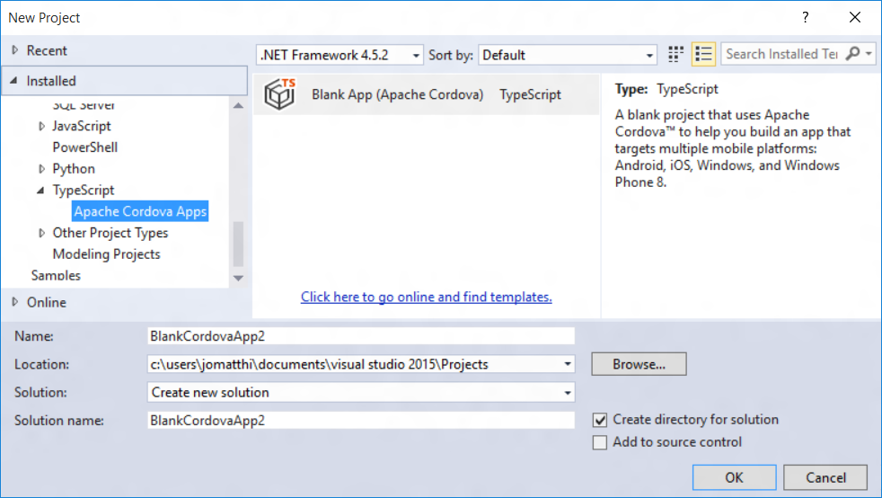

<properties pageTitle="Use TypeScript in a Cordova project"
  description="This is an article on bower tutorial"
  services=""
  documentationCenter=""
  authors="bursteg" />


# **NOTE:** This article is depreciated. Current articles can be found in the [Articles folder](/articles/).

# Use TypeScript in a Cordova project
[TypeScript](http://www.typescriptlang.org) is a programming language that is a superset of JavaScript - offering classes, modules, and interfaces. You can use these features while developing your Cordova app and TypeScript will compile into simple JavaScript that will be deployed as part of your app.

The Visual Studio Tools for Apache Cordova provide templates to help you get started with TypeScript and the TypeScript editor in Visual Studio. 

> **Note:** You need to know that for the current version of the Tools for Apache Cordova, you can only work with TypeScript files in the /scripts folder of a project. Ideally, you're free to arrange files into any folder. This is a known issue being worked on for a later update.

##<a name="getStarted"></a>How do I start a TypeScript application?
Visual Studio provides a blank app template using TypeScript. To use it:

1. In Visual Studio, use the **File** > **New** > **Project** menu.
2. Select the **Templates** > **TypeScript** > **Apache Cordova Apps** category and click on the **Blank App (Apache Cordova)** template.  
   
3.  Enter a name and file location for your project, then click OK.

    Here's what the new project looks like:

    

    In the scripts folder you see typings, index.ts, and tsconfig.json files. These files are used by TypeScript:

    * typings - a collection of [typing definition files](http://www.typescriptlang.org/Handbook#writing-dts-files) that define the APIs for common Cordova plugins.
    * index.ts - a TypeScript file. In this project, index.ts is the default file.
    * tsconfig.json - a configuration file that you can use to customize the TypeScript build options. [Learn more about tsconfig.json](https://github.com/microsoft/typescript/wiki/tsconfig.json) on the TypeScript project site.

If you open the index.ts file, you'll see the TypeScript source with the default behavior for this application.

```typescript
module BlankCordovaApp {
    "use strict";

    export module Application {
        export function initialize() {
            document.addEventListener('deviceready', onDeviceReady, false);
        }

        function onDeviceReady() {
            // Handle the Cordova pause and resume events
            document.addEventListener('pause', onPause, false);
            document.addEventListener('resume', onResume, false);

            // TODO: Cordova has been loaded. Perform any initialization that requires Cordova here.
        }

        function onPause() {
            // TODO: This application has been suspended. Save application state here.
        }

        function onResume() {
            // TODO: This application has been reactivated. Restore application state here.
        }
    }

    window.onload = function () {
        Application.initialize();
    }
}

```
This is the same source as the [JavaScript Blank App template](create-first-app-using-vs-tools-apache-cordova.md#Create), implemented in TypeScript. This code sets up Cordova event handlers for the application.

When you build this project, the TypeScript source will be compiled into a JavaScript file named appBundle.js located in the www/scripts/ folder (this is configured in the tsconfig.json file mentioned earlier). By doing this, you reduce the size of your final packaged application, because the TypeScript files in the /scripts folder will not be included in the application package.

> **Note:** For the current version of the Tools for Apache Cordova, you can only save TypeScript files in the /scripts folder. Ideally, you're free to arrange files into any folder. This is a known issue being worked on for a later update.

##<a name="addToExisting"></a>Can I add TypeScript to my existing JavaScript application?
TypeScript files can be added to any Cordova project using the TypeScript item template. You can find this template by right-clicking on your project and choosing the **Add** > **New TypeScript File** menu.

In the current release, if you want TypeScript files to compile by default you must place these files into a Scripts file at the top level of your project.

##<a name="configTypeScript"></a>How do I customize the TypeScript compiler settings?
To customize the compiler settings for TypeScript in your projects:

1. Add a new tsconfig.json file to the /scripts folder at the top level of your project.

3. Define your settings using the JSON schema documented on the [TypeScript project wiki](https://github.com/microsoft/typescript/wiki/tsconfig.json).

   As you write your tsconfig JSON, IntelliSense will offer suggestions to help make sure your file matches the expected schema.

   

##<a name="buildOutsideVS"></a>I need to build my project outside of Visual Studio, how do I do that?
By default, Visual Studio is building TypeScript files for you using the MSBuild build system behind the scenes. If you want to build your project outside of Visual Studio (in a Terminal on Mac OS X, for example), then we recommend using a JavaScript task runner, such as [Gulp](http://www.gulpjs.com). To learn more, [see our Gulp tutorial](../tutorial-gulp/tutorial-gulp-readme.md).

##<a name="learnMore"></a>Where can I learn more about using TypeScript with Cordova?
Here are a few links to help you learn more about working with TypeScript:

* [The TypeScript language website](http://www.typescriptlang.org)
* [Configuring TypeScript compilation using tsconfig.json](https://github.com/microsoft/typescript/wiki/tsconfig.json)

To learn more about using TypeScript with Cordova, see our [sample TODO app, using WinJS](https://github.com/Microsoft/cordova-samples/tree/master/todo-winjs).
