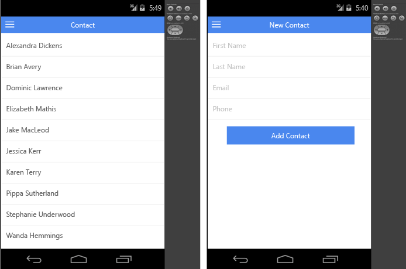
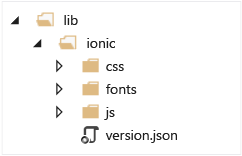
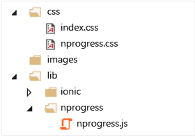
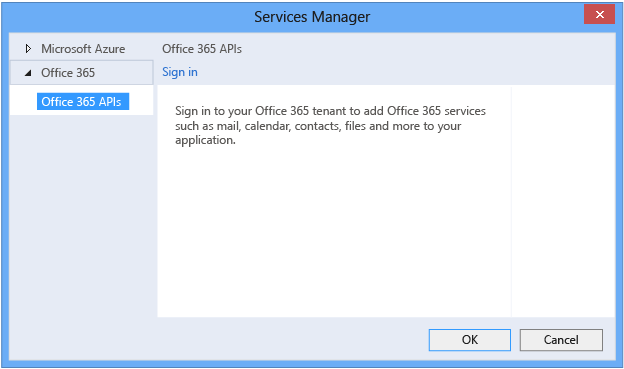
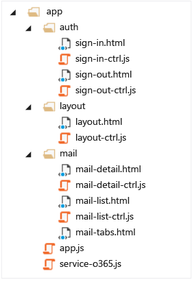

<properties
   pageTitle="Cordova sample app with O365 Outlook Services and Ionic | Cordova"
   description="description"
   services="na"
   documentationCenter=""
   authors="kirupa"
   tags=""/>
<tags
   ms.service="na"
   ms.devlang="javascript"
   ms.topic="article"
   ms.tgt_pltfrm="mobile-multiple"
   ms.workload="na"
   ms.date="09/11/2015"
   ms.author="kirupa"/>

#Cordova sample app with O365 Outlook Services and Ionic

In this tutorial, you’ll learn how to create a mail, calendar and contact client using O365 Outlook services and the Ionic framework. This app allows users to access their mail, calendar and contact through O365 Outlook services API. This sample uses JavaScript code, but you can also write your Cordova app in TypeScript.

To build this app, you’ll
 1. Use O365 API to fetch Outlook service data:
     - For the Mail app, mails flagged as important, unread mails and All mails
     - For the Calendar app, today's meeting (event start date equals today), tomorrow's meeting (event start date equals tomorrow) and all events with start date greater or equal to today
     - For the Contacts app, all contacts
 2. Use O365 API to create and delete data :
     - Delete mail, calendar event
     - Create new calendar event, contact

The following screenshot shows the running Calendar app when completed:

The following screenshot shows the running Mail app when completed:

The following screenshot shows the running Contacts app when completed.

##Prerequisites
Before you can create a new project, make sure that you’ve met all system requirements and installed the Visual Studio Tools for Apache Cordova extension for Visual Studio. For more information, see Install Visual Studio Tools for Apache Cordova.

##Create a project
Create a new Cordova project in Visual Studio by choosing **File**, **New Project**, **JavaScript**, **Apache Cordova Apps**, and then **Blank App** template.

##Add the Ionic Framework to your project
To add the Ionic Framework:

 1. From the Ionic framework website, choose Download beta.
 2. Extract the zip file.
 3. Create a new folder named lib under your Cordova project in Solution Explorer in Visual Studio, and then copy the extracted content under lib folder.

 4. Update the script references.

In index.html, add the following Ionic references in the <head> element, after the Cordova and platformOverrides script references:

    

In index.html, add following ionic CSS reference:

    <link href="lib/ionic/css/ionic.min.css" rel="stylesheet" />

##Add NProgress to your project
NProgress will be used to show a progress bar while fetching mail, calendar and contacts from O365.

To add Nprogress to your project:

 1. From the NProgress [website](http://ricostacruz.com/nprogress/), choose Download.

 2. Extract the zip file.
 3. Create a folder named **nprogress** under the **lib** folder in Solution Explorer and copy **nprogress.js** into the folder.

 4. Copy **nprogress.css** under the css folder
 5. In index.html, add the following NProgress references in the <head> element:

    <link href="css/nprogress.css" rel="stylesheet" />
    

##Add O365 services to your app
Sign up for an Office 365 Developer Site and set up Azure Active Directory access for your Developer Site by following instructions at [Setup your Office 365 development environment](https://msdn.microsoft.com/office/office365/howto/setup-development-environment).

Once you have set up your Developer Site, follow these steps to add and configure Office 365 APIs using the Services Manager in Visual Studio.

**To add and configure Office 365 APIs:**

 1. Download and install the [Office 365 API tools](https://visualstudiogallery.msdn.microsoft.com/a15b85e6-69a7-4fdf-adda-a38066bb5155) from the Visual Studio Gallery.
 2. From the shortcut menu of the project node, choose **Add**, and then choose **Connected Service**.
 3. At the top of the Services Manager dialog box, choose the Office 365 link, and then choose Register your app. Sign in with a tenant administrator account for your Office 365 developer organization:

##Set permissions for O365 mail, calendar and contact tenet to grant appropriate access to app
After you sign in to O365 account you will see a list of O365 services like mail, calendar, contacts, and files under your tenant account. Select the service that you want to use in your app and set the permission you want your app to access, as specified below for each app.

###Mail app
Select **Mail** and click the **Permissions**... link in the right pane. Then choose to read and write to user's mail because the app will need to perform read and delete mail operations. Similarly, if you want the app to send mail, then select mail as a user option.

###Calendar app
Select **Calendar** and click the **Permissions**... link in the right pane, and then select **have full access to users' calendar**. Similarly, if you want to give only read access to the app, then select **Read users' calendar**.

###Contact app
Select **Contact** and click the **Permissions**... link in the right pane, and then select **have full access to users' contact**. Similarly, if you want to give only read access to app, select **Read users' contact**.

###Apply changes and update references
To apply changes and update references:

 1. Click **Apply** and **Ok** to set the permissions and add the O365 API to your project. Services Manager adds the services folder to your project.

 2. In index.html, add the following O365 references in the <head> element:

`
 `

##Create app folder structure, UI routing and layout using Ionic controls and navigation
Follow these steps to structure the app UI and the JavaScript code.

Create a folder named **app** under project root node. The app folder will contain files specific to the app. Each UI component that fetches and binds data to the UI will have a corresponding controller (following the UI with code behind pattern). For example, mail-list.html will show a list control to display user's mails, and mail-list-ctrl.js will contain code to fetch user's mail using the O365 API.

Here are some details about the folders and files in the project:

 - The **auth** folder contains UI and code for signing-in and sign-out.
 - The **layout** folder contains UI to display app content and navigation like ion-pane, ion-side-menus, ion-nav-bar and code to bind the user name.
 - app.js contains UI routing to navigate to different pages.
 - service-o365.js contains utility functions to get the access token, create the Outlook services client object, signout, and get the user name. This is implemented as an AngularJS factory so that these functions can be exposed as utility function across different pages.
Use AngularJS routing to navigate to different pages. For example, here is the routing for the Mail app.

Use AngularJS routing to navigate to different pages. For example, here is the routing for the Mail app:

    // Layout page
        .state('app', {
            abstract: true,
            url: "/app",
            templateUrl: "app/layout/layout.html"
        })

        // Sign-in page
         .state('sign-in', {
             url: "/sign-in",
             templateUrl: "app/auth/sign-in.html"
         })

        // Sign-out page
            .state('app.sign-out', {
                url: "/sign-out",
                views: {
                    'mainContent': {
                        templateUrl: "app/auth/sign-out.html"
                    }
                }
            })   

        // Mail list page
        .state('app.mail', {
            url: "/mail",
            views: {
                'mainContent': {
                    templateUrl: "app/mail/mail-tabs.html"
                }
            }
        })

        // Mail list containing mails flagged as important
        .state('app.mail.imp', {
            url: "/imp/id:important",
            views: {
                "tab-imp-mail": {
                    templateUrl: "app/mail/mail-list.html"
                }
            }
        })

        // Mail detail page
        .state('app.mail-detail', {
            url: "/mail/:id",
            views: {
                'mainContent': {
                    templateUrl: "app/mail/mail-detail.html"
                }
            }
        })

        // Unread mail list page
        .state('app.mail.unread', {
            url: "/unread/id:unread",
            views: {
                "tab-unread-mail": {
                    templateUrl: "app/mail/mail-list.html"
                }
            }
        })

        // All mail list page
        .state('app.mail.all', {
            url: "/all/id:all",
            views: {
                "tab-all-mail": {
                    templateUrl: "app/mail/mail-list.html"
                }
            }
        });

        // Navigate to sign-in page when app starts.
        $urlRouterProvider.otherwise('sign-in');

For app layout (menu, nav-bar), use the Ionic side-menu and pane:

    <ion-side-menus ng-controller="layoutCtrl as vm">

        <ion-pane ion-side-menu-content>
            <ion-nav-bar class="bar-positive">
                <ion-nav-back-button class="button-clear icon ion-ios7-arrow-back"></ion-nav-back-button>
                <button menu-toggle="left" class="button button-icon icon ion-navicon"></button>
            </ion-nav-bar>
            <ion-nav-view name="mainContent" animation="slide-left-right"></ion-nav-view>
        </ion-pane>

        <ion-side-menu side="left">
            <header class="bar bar-header bar-positive">
                <h1 class="title">{{vm.userName}}</h1>
            </header>
            <ion-content class="has-header">
                <ion-list>                            
                    <ion-item nav-clear menu-close ui-sref="app.sign-out">Sign-out</ion-item>
                </ion-list>
        </ion-side-menu>

    </ion-side-menus>

Use the Ionic tab to show different content in separate tabs. For example, use the Ionic controls below to create a mail tab page to show important mails, unread mails, and all mails under different tabs:

    <ion-view>
        <ion-tabs class="tabs-positive tabs-icon-top">
            <ion-tab title="Imp" icon="ion-star" ui-sref="app.mail.imp">
                <ion-nav-view name="tab-imp-mail"></ion-nav-view>
            </ion-tab>

            <ion-tab title="Unread" icon="ion-ios7-email-outline" ui-sref="app.mail.unread">
                <ion-nav-view name="tab-unread-mail"></ion-nav-view>
            </ion-tab>

            <ion-tab title="All" icon="ion-email" ui-sref="app.mail.all">
                <ion-nav-view name="tab-all-mail"></ion-nav-view>
            </ion-tab>
        </ion-tabs>
    </ion-view>

The following illustration shows the mail tab page:

##Acquire an access token and get the Outlook services client using AngularJS factory
Create an AngularJS factory to expose the O365 API to acquire an access token, create the Outlook services client, logout, and to perform other utility functions that are used by different controllers in the app.

Here is the code to acquire an access token:

        var authContext = new O365Auth.Context();
        authContext.getIdToken("https://outlook.office365.com/")
        .then((function (token) {
             // Get auth token
             authtoken = token;
             // Get user name from token object.
             userName = token.givenName + " " + token.familyName;
            }), function (error) {
              // Log sign-in error message.
              console.log('Failed to login. Error = ' + error.message);
         });

    Here is the code to create an Outlook services client object.

        var outlookClient = new Microsoft.OutlookServices.Client('https://outlook.office365.com/api/v1.0', authtoken.getAccessTokenFn('https://outlook.office365.com'));

    Here is the complete AngularJS factory code to expose the O365 API:

    (function () {
        'use strict';
        angular.module('app365').factory('app365api', [app365api]);

        function app365api() {

            var authContext;
            var authtoken;
            var outlookClient;      
            var userName;

            // Login to O365
            function login(callback) {
                if (!authContext) {
                    authContext = new O365Auth.Context();
                }

                authContext.getIdToken("https://outlook.office365.com/")
               .then((function (token) {
                   // Get auth token
                   authtoken = token;
                   // Get user name from token object.
                   userName = token.givenName + " " + token.familyName;
                   // Create Outlook client object.
                   outlookClient = new Microsoft.OutlookServices.Client('https://outlook.office365.com/api/v1.0', authtoken.getAccessTokenFn('https://outlook.office365.com'));
                   // Callback without parameter to indicate successful sign-in.
                   callback();
               }), function (error) {
                   // Log sign-in error message.
                   console.log('Failed to login. Error = ' + error.message);
                   callback(error.message);
               });
            };

            // Logout
            function logout() {
                if (!authContext) {
                    authContext = new O365Auth.Context();
                }

                authContext.logOut();
            };

            // Get signed-in user name.
            function getUserName() {
                return userName;
            };

            return {
                login: login,
                logout: logout,
                getUserName: getUserName,        
                exchangeClientObj: function () { return outlookClient; }
            };
        };
    })();

##Use Outlook client object to access O365 services like mail, calendar and contact
You can use the Outlook client object to perform read and write operations on mail, calendar and contacts.

###Use Outlook client object to read mail, calendar and contacts
The following code reads all mail flagged as important:

    // Get all mails flagged as important.
    function getImpMails() {
       NProgress.start();
       // Filter to fetch all important mails received after 2000-10-20
       var filterQuery = "Importance eq 'High' and DateTimeReceived gt 2000-10-20";
       outlookClient.me.folders.getFolder("Inbox").fetch()
       .then(function (folder) {
       // Fetch all important mails sorted by DateTimeReceived.
          folder.messages.getMessages().filter(filterQuery).orderBy('Importance,DateTimeReceived desc').fetch()
    .then(function (mails) {
    // Get current page. Use getNextPage() to fetch next set of mails.
    vm.mails = mails.currentPage;
    $scope.$apply();
    NProgress.done();
    }, function (error) {
        console.log("Error encountered while fetching mails. Error: " + error.message);
     });
    }, function (error) {
        console.log("Error encountered while fetching inbox folder. Error: " + error.message);
      });
    };

The following code reads all the events with a start date equal to today:

    var filterQuery = 'start gt ' + today.toISOString() + ' and start lt ' + tomorrow.toISOString();
    NProgress.start();
    // Get events with filter.
    outlookClient.me.calendar.events.getEvents().filter(filterQuery).fetch()
    .then(function (events) {
    // Get current page. Use getNextPage() to fetch next set of events.
        vm.events = events.currentPage;
        $scope.$apply();
        NProgress.done();
    });

The following code reads all contacts:

    function getContacts() {
    NProgress.start();

    // Fetch all the contacts.
    outlookClient.me.contacts.getContacts().fetch()
    .then(function (contacts) {
    // Get the current page. Use getNextPage() to fetch next set of contacts.
        vm.contacts = contacts.currentPage;
        $scope.$apply();
        NProgress.done();
      });
    };

###Use Outlook client object to delete mail and calendar event
The Outlook client object can be used to delete mail. To delete mail, get the mail that you want to delete using mail ID and then call delete() on the mail object to delete the particular mail.

> **Note:** `delete()` permanently deletes the mail. To move the mail to Deleted Items, use `move()` instead.

Here is the code to delete mail:

    // Fetch the mail with specified mail id.                    outlookClient.me.folders.getFolder("Inbox").messages.getMessage(mail.id).fetch()
    .then(function (mail) {
        // Delete the mail.
        mail.delete()
        .then((function (response) {
             // mail deleted successfully.                
         }), function (error) {                            
             // Log the error message when error is encountered while deleting the mail.
             console.log('fail to delete mail. Error = ' + error.message);
     });

Here is the code to delete an event:

    // Fetch event with specified event id.
    outlookClient.me.calendar.events.getEvent(event.id).fetch()
    .then(function (event) {
        // Delete event.
        event.delete()
        .then((function (response) {                            
         // Refresh event list.
         }).bind(this), function (reason) {
         // Log delete event error.
         console.log('Fail to delete event. Error = ' + reason.message);
    });

###Use Outlook client object to create new contact and calendar event
The Outlook client object can be used to create new contacts, calendar event, and to send mail.

Here is the code to add a new calendar event:

    // Event body content
    var eventBody = new Microsoft.OutlookServices.ItemBody();
    eventBody.contentType = Microsoft.OutlookServices.BodyType.HTML;
    eventBody.content = $scope.newEvent.body;
    // Event attendee.
    var attendee = new Microsoft.OutlookServices.Attendee();
    // Attendee email address.
    var emailAddress = new Microsoft.OutlookServices.EmailAddress();
    emailAddress.address = $scope.newEvent.toRecipients;
    attendee.emailAddress = emailAddress;
    // Event object.
    var event = new Microsoft.OutlookServices.Event();
    // Event start date.
    event.start = new Date($scope.newEvent.start).toISOString();
    // Event end date time
    event.end = new Date($scope.newEvent.end).toISOString();
    // Event subject.
    event.subject = $scope.newEvent.subject;
    // Event body.
    event.body = eventBody;
    // Add event attendee.
    event.attendees.push(attendee);
    // Event location.
    event.location = new Microsoft.OutlookServices.Location();
    event.location.displayName = 'Sample Location';
    // Add event
    outlookClient.me.calendar.events.addEvent(event)
    .then((function (response) {
    // New event created successfully.
    })
    .bind(this), function (reason) {
    // Log the error message encountered while adding the event.
    console.log('Fail to add event. Error = ' + reason.message);
    });

Here is the code to add a new contact:

    // Contact object
    var contact = new Microsoft.OutlookServices.Contact();

    // First and last name
    contact.givenName = $scope.newContact.firstname;
    contact.surname = $scope.newContact.lastname;

    // Mobile phone
    contact.mobilePhone1 = $scope.newContact.phone;

    // Email address
    var emailAddress = new Microsoft.OutlookServices.EmailAddress();
    emailAddress.address = $scope.newContact.email;
    contact.emailAddresses.push(emailAddress);

    // Add Contact
    outlookClient.me.contacts.addContact(contact)
    .then((function (response) {
    // Contact added successfully.

    })
    .bind(this), function (reason) {
    // Log the error message when add contact fails.
    console.log('Fail to add contact. Error = ' + reason.message);
    });

That's it! You can run the app to see everything working. For O365 authentication, you can't use Ripple. Be sure to test on an emulator or device instead.

##Give it a try
The samples of complete applications are available on [Github](https://github.com/OfficeDev?query=cordova). Please download and try the sample apps and let us know what you think. We would like to hear your opinions about the new O365 APIs and the Cordova tooling support in Visual Studio!
