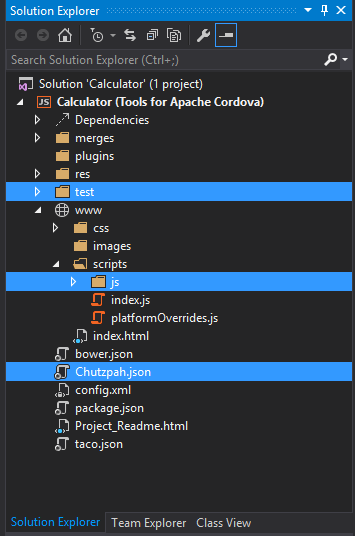
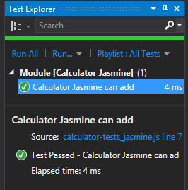

Getting Started With Chutzpah to Test Apache Cordova Applications in Visual Studio 2015  
===================

Let’s unit test a simple Apache Cordova project by using Chutzpah in Visual Studio.

There are many ways to unit test JavaScript apps. A lot of you use Jasmine, Mocha, or QUnit to test your code. Chutzpah supports each of these frameworks and displays tests in Visual Studio’s Test Explorer.

In this tutorial, you will install Chutzpah, learn how tests are organized, add references to required files through Chutzpah.json, and finally run tests through the Test Explorer. I have provided an example project (Calculator.zip) that goes along with this tutorial. Download the example file here: [Calculator.zip](chutzpah_files/Calculator.zip?raw=true)

----------

Step 1: Install Chutzpah
-------------

Chutzpah is a Visual Studio extension that you need to download and install. To do this, first navigate to “Tools” and select “Extensions and Updates.”

The Extensions and Updates dialog box will appear. In this dialog box, select the “Online” drop down menu and type “Chutzpah” into the search bar. Next, download and install both the “Chutzpah Test Adapter for the Test Explorer” and the “Chutzpah Test Runner Context Menu Extension.” Then restart Visual Studio.

Step 2: Open Calculator Project in VS
-------------

Now that Chutzpah has been installed, you can try out some of its unit-testing capabilities.  Unzip Calculator.zip and double click on the Calculator solution file (.sln).

Visual Studio opens, expands the `www` and `scripts` folder, and Solution Explorer should look like this:

From there, select Test | Windows | Test Explorer. After doing this, you will see your first discovered test in Test Explorer.

Double-click this test in Test Explorer, and the corresponding position opens in the code editor as shown in the illustration below. Before running the test, we need to make sure that the associated JavaScript files are referenced.  

Step 3: Add References by Modifying Chutzpah.json
-------------

One way of managing references is through using the Chutzpah.json file. The Chutzpah settings file is optional and if the file or any of its properties are omitted, Chutzpah will use its default values.
The project includes an incomplete version of the Chutzpah.json file. Double-click the file in Solution Explorer, and you can see that the “References” and “Tests” sections are empty.  

Let’s fill these lines! Add a reference to calculator.js and the Jasmine, Mocha, and QUnit tests:

    {
      "References": [
        { "Path": "www/scripts/js/calculator.js" }
      ],

      "Tests": [
          { "Path": "test/calculator-tests_Jasmine.js" },
          { "Path": "test/calculator-tests_Mocha.js" },
          { "Path": "test/calculator-tests_QUnit.js" }

      ]
    }

Please take note that there are many more setting options available. To learn more, please click [here](https://github.com/mmanela/chutzpah/wiki/Chutzpah.json-Settings-File).  
Settings will automatically populate as you type in keywords.

Step 4: Modify and Run Jasmine Tests
-------------

Now that we’ve added references, we can now run the test. Go to Test Explorer and choose “Run All”.

Now we want to check that all tests in calculator-tests_Jasmine.js are running correctly. Uncomment the last three tests, save the file, and notice that Chutzpah automatically detects the tests.  

Choose "Run All" once again, and all tests should pass except the “can divide” test.

In order to fix this, change the last line of code from .toEqual(0) to .toEqual(1).

    it("can divide positive integers", function () {
        expect(calculator.divide(5, 5)).toEqual(1);
    });

After doing this, all tests should pass.

Step 5: Run All Other Test Files
-------------

Now select and uncomment the tests in calculator-tests_Mocha.js and calculator-tests_QUnit.js. Eight additional tests should be discovered in Test Explorer. By default, Chutzpah detects tests in each of the three different frameworks.  

Click on "Run All" once again, and all tests will pass.

Conclusion
-------------
In this article, you learned how to set up and use Chutzpah. You first downloaded and installed Chutzpah through “Extensions and Updates.” Next, you opened the references to required files in Chutzpah.json, and then you tried running tests through the Test Explorer. Finally, you modified tests files in Jasmine, Mocha and QUnit, and now you have a starting point for testing out your apps.   
 
You can download the Calculator_Final project here: [Calculator-Final.zip](chutzpah_files/Calculator-Final.zip?raw=true)
