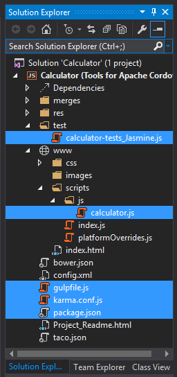
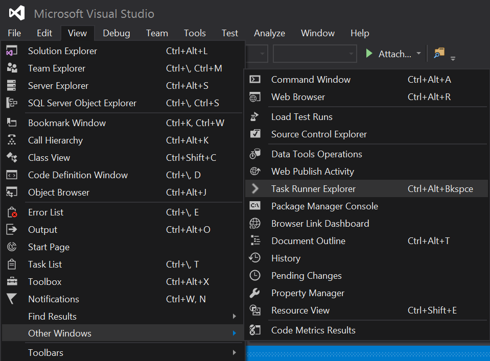
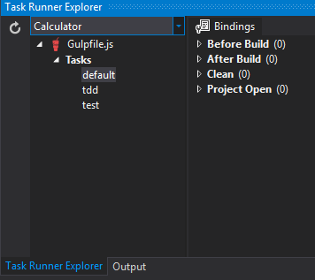
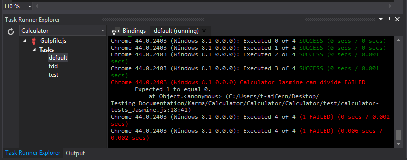
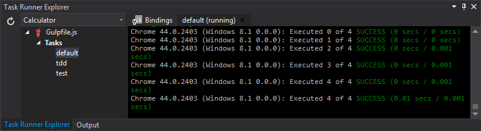

<properties pageTitle="Test Apache Cordova apps with Karma and Jasmine"
  description="Test Apache Cordova apps with Karma and Jasmine"
  services=""
  documentationCenter=""
  authors="bursteg" />

#Test Apache Cordova apps with Karma and Jasmine
===================

In this article, you will learn how to use the [Karma test runner](http://karma-runner.github.io/0.13/index.html) with the [Jasmine test framework]( http://jasmine.github.io/) in Visual Studio 2015. To help with this, we are going to look at a simple Apache Cordova project. Download the file here: [Calculator.zip](karma_files/Calculator.zip?raw=true)

Once you’ve downloaded and opened this project in Visual Studio, the folder structure of this project should look very similar to that of a new Apache Cordova project template. The difference is that there are some additional files that we’ve added, and these files are highlighted below:  

In order to test our files using Karma, we will:

 1. Modify package.json to download testing dependencies
 2. Modify karma.config.js to reference our required files
 3. Run gulpfile.js from the Task Runner Explorer  
 4. Modify calculator-test_Jasmine.js, in the “test folder”

In the following sections, we’ll walk through each step in detail and highlight any interesting things along the way!

Step 1: Modify package.json
-------------

In order to let Visual Studio know what dependencies to download, first open package.json and replace its contents with the following lines:

    {
      "name": "Calculator",
      "version": "1.0.0",
      "dependencies": {
      },
       "description": "",
      "repository": {
        "type": "git",
        "url": "https://github.com/karma-runner/gulp-karma"
      },
      "bugs": {
        "url": "https://github.com/karma-runner/gulp-karma/issues"
      },
      "homepage": "https://github.com/karma-runner/gulp-karma",
      "devDependencies": {
        "karma": "^0.13.0",
        "karma-jasmine": "^0.3.6",
        "karma-chrome-launcher": "^0.2.0",
        "gulp": "^3.9.0"
      }
    }

This will automatically install the required packages needed to test your app using Karma.  

Step 2: Modify karma.config.js
-------------
In order to use Karma, we first need to make sure that our files are correctly referenced. Take a look at the “js” folder where you will see the calculator.js file. Its associated test file can be found in the “test” folder.

To reference these files, select karma.conf.js and replace the content with the following lines of code:

    module.exports = function(config) {
      config.set({
        browsers: ['Chrome'],
        frameworks: ['jasmine'],
        files: [
          'www/scripts/js/**/*.js',
          'test/**/*js'
        ]
      });
    };

This configures Chrome as the browser, selects Jasmine as the test framework, and includes any file from the js or test folder.
To learn more about configuration options, click [here](http://karma-runner.github.io/0.8/config/configuration-file.html).

Step 3: Run gulpfile.js from the Task Runner Explorer
-------------
Now click on View | Other Windows | Task Runner Explorer).

This will open up a Task Runner Explorer window.

Right-click on “default,” which is linked to the gulp task in gulpfile.js. Select run.
This should open up a Chrome browser instance, and within the task runner, Visual Studio will show that our test case has passed.

Step 4: Modify test file
-------------
Open the file calculator-tests_Jasmine.js and uncomment the additional three tests. Save the file. You should immediately see three of the four tests passing. This is due to the “tdd” task in gulpfile.js, which watches for changes in your files.

The test “Calculator Jasmine can divide” failed. In order to solve this problem make a single-character change to the last test case ( .toEqual(1)), or simply replace it using the following line of code:

    it("can divide", function () {
        expect(calculator.divide(5, 5)).toEqual(1);
    });
When you save the files again, you should see that all tests have passed.

Note that if all files are correctly referenced, you can also run gulp tasks in the Windows Command Prompt by changing directories to the project root and then typing in “gulp.” (If you use this method, Node and gulp dependencies must be installed first.)

Conclusion:
-------------
In this article, you learned how to use Karma on Visual Studio. You first downloaded the required dependencies by modifying package.json, then you selected the files you wanted to reference in the karma.config.js file, and finally you learned about the Visual Studio Task Runner Explorer to run your tests.

If you would like to use the Visual Studio Test Explorer to test out your JavaScript code, try out Chutzpah <link to Chutzpah>!

A competed version of this project is provided for your use. Upon opening the solution file, please wait for all Node dependencies to automatically install. Once this is done, click on View | Other Windows | Task Runner Explorer, and you should see the gulp tasks ready to run. Download the completed version of this project : [Calculator_Final.zip](karma_files/Calculator_Final.zip?raw=true)
